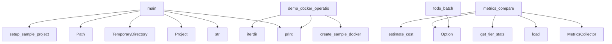

# System Architecture Analysis

## Overview

- **Project**: /home/tom/github/semcod/algitex
- **Primary Language**: python
- **Languages**: python: 404, shell: 26
- **Analysis Mode**: static
- **Total Functions**: 2843
- **Total Classes**: 414
- **Modules**: 430
- **Entry Points**: 2470

## Architecture by Module

### src.algitex.microtask.executor
- **Functions**: 29
- **Classes**: 2
- **File**: `executor.py`

### src.algitex.dashboard
- **Functions**: 24
- **Classes**: 4
- **File**: `dashboard.py`

### .algitex.backups.batch_20260328_142940.src.algitex.project
- **Functions**: 22
- **Classes**: 1
- **File**: `__init__.py`

### .algitex.backups.batch_20260328_142940.src.algitex.tools.ide
- **Functions**: 22
- **Classes**: 6
- **File**: `ide.py`

### .algitex.backups.batch_20260328_143434.src.algitex.project
- **Functions**: 22
- **Classes**: 1
- **File**: `__init__.py`

### .algitex.backups.batch_20260328_143434.src.algitex.tools.ide
- **Functions**: 22
- **Classes**: 6
- **File**: `ide.py`

### src.algitex.project
- **Functions**: 22
- **Classes**: 1
- **File**: `__init__.py`

### src.algitex.tools.ide
- **Functions**: 22
- **Classes**: 6
- **File**: `ide.py`

### .algitex.backups.batch_20260328_142940.src.algitex.tools.workspace
- **Functions**: 20
- **Classes**: 2
- **File**: `workspace.py`

### .algitex.backups.batch_20260328_142940.src.algitex.tools.docker
- **Functions**: 20
- **Classes**: 3
- **File**: `docker.py`

### .algitex.backups.batch_20260328_142940.src.algitex.tools.services
- **Functions**: 20
- **Classes**: 3
- **File**: `services.py`

### .algitex.backups.batch_20260328_142940.src.algitex.tools.batch
- **Functions**: 20
- **Classes**: 4
- **File**: `batch.py`

### .algitex.backups.batch_20260328_143434.src.algitex.tools.workspace
- **Functions**: 20
- **Classes**: 2
- **File**: `workspace.py`

### .algitex.backups.batch_20260328_143434.src.algitex.tools.docker
- **Functions**: 20
- **Classes**: 3
- **File**: `docker.py`

### .algitex.backups.batch_20260328_143434.src.algitex.tools.services
- **Functions**: 20
- **Classes**: 3
- **File**: `services.py`

### .algitex.backups.batch_20260328_143434.src.algitex.tools.batch
- **Functions**: 20
- **Classes**: 4
- **File**: `batch.py`

### src.algitex.tools.workspace
- **Functions**: 20
- **Classes**: 2
- **File**: `workspace.py`

### src.algitex.tools.docker
- **Functions**: 20
- **Classes**: 3
- **File**: `docker.py`

### src.algitex.tools.services
- **Functions**: 20
- **Classes**: 3
- **File**: `services.py`

### src.algitex.tools.batch
- **Functions**: 20
- **Classes**: 4
- **File**: `batch.py`

## Key Entry Points

Main execution flows into the system:

### .algitex.backups.batch_20260328_142940.examples.31-abpr-workflow.main.main
> Demonstrate ABPR pipeline: Execute → Trace → Conflict → Rule → Validate → Repeat.
- **Calls**: print, print, print, print, print, print, str, Project

### .algitex.backups.batch_20260328_143434.examples.31-abpr-workflow.main.main
> Demonstrate ABPR pipeline: Execute → Trace → Conflict → Rule → Validate → Repeat.
- **Calls**: print, print, print, print, print, print, str, Project

### examples.31-abpr-workflow.main.main
> Demonstrate ABPR pipeline: Execute → Trace → Conflict → Rule → Validate → Repeat.
- **Calls**: print, print, print, print, print, print, str, Project

### .algitex.backups.batch_20260328_142940.examples.30-parallel-execution.main.main
> Demonstrate parallel execution with region-based coordination.
- **Calls**: print, print, print, str, Project, print, p.analyze, print

### .algitex.backups.batch_20260328_143434.examples.30-parallel-execution.main.main
> Demonstrate parallel execution with region-based coordination.
- **Calls**: print, print, print, str, Project, print, p.analyze, print

### examples.30-parallel-execution.main.main
> Demonstrate parallel execution with region-based coordination.
- **Calls**: print, print, print, str, Project, print, p.analyze, print

### src.algitex.cli.metrics.metrics_compare
> Compare tier performance (algorithm vs micro vs big LLM).
- **Calls**: typer.Option, MetricsCollector, collector.load, collector.get_tier_stats, collector.estimate_cost, Table, table.add_column, table.add_column

### .algitex.backups.batch_20260328_142940.examples.20-self-hosted-pipeline.main.main
> Main demo function.
- **Calls**: print, print, print, print, print, print, print, print

### .algitex.backups.batch_20260328_143434.examples.20-self-hosted-pipeline.main.main
> Main demo function.
- **Calls**: print, print, print, print, print, print, print, print

### examples.20-self-hosted-pipeline.main.main
> Main demo function.
- **Calls**: print, print, print, print, print, print, print, print

### .algitex.backups.batch_20260328_142940.examples.30-parallel-execution.parallel_real_world.main
> Demonstrate parallel refactoring of a real-world project.
- **Calls**: tempfile.TemporaryDirectory, Path, print, .algitex.backups.batch_20260328_142940.examples.30-parallel-execution.parallel_real_world.setup_sample_project, Project, print, p.analyze, print

### .algitex.backups.batch_20260328_143434.examples.30-parallel-execution.parallel_real_world.main
> Demonstrate parallel refactoring of a real-world project.
- **Calls**: tempfile.TemporaryDirectory, Path, print, .algitex.backups.batch_20260328_143434.examples.30-parallel-execution.parallel_real_world.setup_sample_project, Project, print, p.analyze, print

### src.algitex.cli.todo.todo_batch
> BatchFix: grupowanie i optymalizacja podobnych zadań.

Zamiast wykonywać każde zadanie osobno, BatchFix grupuje podobne problemy
(np. "f-string", "mag
- **Calls**: typer.Option, typer.Option, typer.Option, typer.Option, typer.Option, typer.Option, typer.Option, typer.Option

### examples.30-parallel-execution.parallel_real_world.main
> Demonstrate parallel refactoring of a real-world project.
- **Calls**: tempfile.TemporaryDirectory, Path, print, examples.30-parallel-execution.parallel_real_world.setup_sample_project, Project, print, p.analyze, print

### .algitex.backups.batch_20260328_142940.examples.14-docker-mcp.main.demo_docker_operations
> Demonstrate real Docker operations.
- **Calls**: print, .algitex.backups.batch_20260328_142940.examples.14-docker-mcp.main.create_sample_docker_project, print, print, project_dir.iterdir, print, print, print

### .algitex.backups.batch_20260328_142940.examples.05-cost-tracking.main.main
- **Calls**: print, Tickets, print, print, print, sorted, print, Loop

### .algitex.backups.batch_20260328_143434.examples.14-docker-mcp.main.demo_docker_operations
> Demonstrate real Docker operations.
- **Calls**: print, .algitex.backups.batch_20260328_143434.examples.14-docker-mcp.main.create_sample_docker_project, print, print, project_dir.iterdir, print, print, print

### .algitex.backups.batch_20260328_143434.examples.05-cost-tracking.main.main
- **Calls**: print, Tickets, print, print, print, sorted, print, Loop

### src.algitex.tools.autofix.batch_backend.BatchFixBackend._parse_batch_response
> Parsuj odpowiedź batch i zastosuj fixy.
- **Calls**: print, print, re.findall, print, enumerate, sum, print, filepath.strip

### examples.14-docker-mcp.main.demo_docker_operations
> Demonstrate real Docker operations.
- **Calls**: print, examples.14-docker-mcp.main.create_sample_docker_project, print, print, project_dir.iterdir, print, print, print

### examples.05-cost-tracking.main.main
- **Calls**: print, Tickets, print, print, print, sorted, print, Loop

### .algitex.backups.batch_20260328_142940.examples.18-ollama-local.main.main
- **Calls**: print, print, print, print, print, .algitex.backups.batch_20260328_142940.examples.18-ollama-local.main.list_models, .algitex.backups.batch_20260328_142940.examples.18-ollama-local.main.demo_code_generation, .algitex.backups.batch_20260328_142940.examples.18-ollama-local.main.demo_code_analysis

### .algitex.backups.batch_20260328_143434.src.algitex.cli.todo.todo_batch
> BatchFix: grupowanie i optymalizacja podobnych zadań.

Zamiast wykonywać każde zadanie osobno, BatchFix grupuje podobne problemy
(np. "f-string", "mag
- **Calls**: typer.Option, typer.Option, typer.Option, typer.Option, typer.Option, typer.Option, typer.Option, typer.Option

### .algitex.backups.batch_20260328_143434.examples.18-ollama-local.main.main
- **Calls**: print, print, print, print, print, .algitex.backups.batch_20260328_143434.examples.18-ollama-local.main.list_models, .algitex.backups.batch_20260328_143434.examples.18-ollama-local.main.demo_code_generation, .algitex.backups.batch_20260328_143434.examples.18-ollama-local.main.demo_code_analysis

### examples.18-ollama-local.main.main
- **Calls**: print, print, print, print, print, examples.18-ollama-local.main.list_models, examples.18-ollama-local.main.demo_code_generation, examples.18-ollama-local.main.demo_code_analysis

### src.algitex.cli.todo.todo_hybrid
> Autofix: LLM-based code fixes (use --hybrid for mechanical + LLM).
- **Calls**: typer.Argument, typer.Option, typer.Option, typer.Option, typer.Option, typer.Option, typer.Option, typer.Option

### .algitex.backups.batch_20260328_142940.examples.31-abpr-workflow.abpr_pipeline.abpr_pipeline
> ABPR loop: Execute → Trace → Conflict → Rule → Validate → Repeat.
- **Calls**: Project, Loop, print, loop.discover, print, p.analyze, print, print

### .algitex.backups.batch_20260328_143434.examples.31-abpr-workflow.abpr_pipeline.abpr_pipeline
> ABPR loop: Execute → Trace → Conflict → Rule → Validate → Repeat.
- **Calls**: Project, Loop, print, loop.discover, print, p.analyze, print, print

### examples.31-abpr-workflow.abpr_pipeline.abpr_pipeline
> ABPR loop: Execute → Trace → Conflict → Rule → Validate → Repeat.
- **Calls**: Project, Loop, print, loop.discover, print, p.analyze, print, print

### .algitex.backups.batch_20260328_142940.src.algitex.cli.todo.todo_hybrid
> Autofix: LLM-based code fixes (use --hybrid for mechanical + LLM).
- **Calls**: typer.Argument, typer.Option, typer.Option, typer.Option, typer.Option, typer.Option, typer.Option, typer.Option

## Process Flows

Key execution flows identified:

### Flow 1: main
```
main [.algitex.backups.batch_20260328_142940.examples.31-abpr-workflow.main]
```

### Flow 2: metrics_compare
```
metrics_compare [src.algitex.cli.metrics]
```

### Flow 3: todo_batch
```
todo_batch [src.algitex.cli.todo]
```

### Flow 4: demo_docker_operations
```
demo_docker_operations [.algitex.backups.batch_20260328_142940.examples.14-docker-mcp.main]
  └─> create_sample_docker_project
```

### Flow 5: _parse_batch_response
```
_parse_batch_response [src.algitex.tools.autofix.batch_backend.BatchFixBackend]
```

## Key Classes

### src.algitex.microtask.executor.MicroTaskExecutor
> Execute micro tasks in three tiers: algorithmic, small LLM, big LLM.
- **Methods**: 28
- **Key Methods**: src.algitex.microtask.executor.MicroTaskExecutor.__init__, src.algitex.microtask.executor.MicroTaskExecutor.execute, src.algitex.microtask.executor.MicroTaskExecutor.group_by_file, src.algitex.microtask.executor.MicroTaskExecutor._phase_algorithmic, src.algitex.microtask.executor.MicroTaskExecutor._process_algorithmic_batch, src.algitex.microtask.executor.MicroTaskExecutor._handle_unused_import, src.algitex.microtask.executor.MicroTaskExecutor._handle_return_type, src.algitex.microtask.executor.MicroTaskExecutor._handle_known_magic, src.algitex.microtask.executor.MicroTaskExecutor._handle_fstring, src.algitex.microtask.executor.MicroTaskExecutor._handle_sort_imports

### .algitex.backups.batch_20260328_142940.src.algitex.project.Project
> One project, all tools, zero boilerplate.
- **Methods**: 25
- **Key Methods**: .algitex.backups.batch_20260328_142940.src.algitex.project.Project.__init__, .algitex.backups.batch_20260328_142940.src.algitex.project.Project._analyzer, .algitex.backups.batch_20260328_142940.src.algitex.project.Project._tickets, .algitex.backups.batch_20260328_142940.src.algitex.project.Project._ollama_service, .algitex.backups.batch_20260328_142940.src.algitex.project.Project.analyze, .algitex.backups.batch_20260328_142940.src.algitex.project.Project.plan, .algitex.backups.batch_20260328_142940.src.algitex.project.Project.execute, .algitex.backups.batch_20260328_142940.src.algitex.project.Project.status, .algitex.backups.batch_20260328_142940.src.algitex.project.Project._status_health, .algitex.backups.batch_20260328_142940.src.algitex.project.Project._status_tickets
- **Inherits**: ServiceMixin, AutoFixMixin, OllamaMixin, BatchMixin, BenchmarkMixin, IDEMixin, ConfigMixin, MCPMixin

### .algitex.backups.batch_20260328_143434.src.algitex.project.Project
> One project, all tools, zero boilerplate.
- **Methods**: 25
- **Key Methods**: .algitex.backups.batch_20260328_143434.src.algitex.project.Project.__init__, .algitex.backups.batch_20260328_143434.src.algitex.project.Project._analyzer, .algitex.backups.batch_20260328_143434.src.algitex.project.Project._tickets, .algitex.backups.batch_20260328_143434.src.algitex.project.Project._ollama_service, .algitex.backups.batch_20260328_143434.src.algitex.project.Project.analyze, .algitex.backups.batch_20260328_143434.src.algitex.project.Project.plan, .algitex.backups.batch_20260328_143434.src.algitex.project.Project.execute, .algitex.backups.batch_20260328_143434.src.algitex.project.Project.status, .algitex.backups.batch_20260328_143434.src.algitex.project.Project._status_health, .algitex.backups.batch_20260328_143434.src.algitex.project.Project._status_tickets
- **Inherits**: ServiceMixin, AutoFixMixin, OllamaMixin, BatchMixin, BenchmarkMixin, IDEMixin, ConfigMixin, MCPMixin

### src.algitex.project.Project
> One project, all tools, zero boilerplate.
- **Methods**: 25
- **Key Methods**: src.algitex.project.Project.__init__, src.algitex.project.Project._analyzer, src.algitex.project.Project._tickets, src.algitex.project.Project._ollama_service, src.algitex.project.Project.analyze, src.algitex.project.Project.plan, src.algitex.project.Project.execute, src.algitex.project.Project.status, src.algitex.project.Project._status_health, src.algitex.project.Project._status_tickets
- **Inherits**: ServiceMixin, AutoFixMixin, OllamaMixin, BatchMixin, BenchmarkMixin, IDEMixin, ConfigMixin, MCPMixin

### .algitex.backups.batch_20260328_142940.src.algitex.tools.docker.DockerToolManager
> Spawn Docker containers, connect via MCP/REST, call tools, teardown.
- **Methods**: 20
- **Key Methods**: .algitex.backups.batch_20260328_142940.src.algitex.tools.docker.DockerToolManager.__init__, .algitex.backups.batch_20260328_142940.src.algitex.tools.docker.DockerToolManager.__enter__, .algitex.backups.batch_20260328_142940.src.algitex.tools.docker.DockerToolManager.__exit__, .algitex.backups.batch_20260328_142940.src.algitex.tools.docker.DockerToolManager._load_tools, .algitex.backups.batch_20260328_142940.src.algitex.tools.docker.DockerToolManager._read_yaml_with_expansion, .algitex.backups.batch_20260328_142940.src.algitex.tools.docker.DockerToolManager._expand_tool_spec, .algitex.backups.batch_20260328_142940.src.algitex.tools.docker.DockerToolManager._expand_env_vars, .algitex.backups.batch_20260328_142940.src.algitex.tools.docker.DockerToolManager._expand_volumes, .algitex.backups.batch_20260328_142940.src.algitex.tools.docker.DockerToolManager._load_state, .algitex.backups.batch_20260328_142940.src.algitex.tools.docker.DockerToolManager._save_state

### .algitex.backups.batch_20260328_143434.src.algitex.tools.docker.DockerToolManager
> Spawn Docker containers, connect via MCP/REST, call tools, teardown.
- **Methods**: 20
- **Key Methods**: .algitex.backups.batch_20260328_143434.src.algitex.tools.docker.DockerToolManager.__init__, .algitex.backups.batch_20260328_143434.src.algitex.tools.docker.DockerToolManager.__enter__, .algitex.backups.batch_20260328_143434.src.algitex.tools.docker.DockerToolManager.__exit__, .algitex.backups.batch_20260328_143434.src.algitex.tools.docker.DockerToolManager._load_tools, .algitex.backups.batch_20260328_143434.src.algitex.tools.docker.DockerToolManager._read_yaml_with_expansion, .algitex.backups.batch_20260328_143434.src.algitex.tools.docker.DockerToolManager._expand_tool_spec, .algitex.backups.batch_20260328_143434.src.algitex.tools.docker.DockerToolManager._expand_env_vars, .algitex.backups.batch_20260328_143434.src.algitex.tools.docker.DockerToolManager._expand_volumes, .algitex.backups.batch_20260328_143434.src.algitex.tools.docker.DockerToolManager._load_state, .algitex.backups.batch_20260328_143434.src.algitex.tools.docker.DockerToolManager._save_state

### src.algitex.tools.docker.DockerToolManager
> Spawn Docker containers, connect via MCP/REST, call tools, teardown.
- **Methods**: 20
- **Key Methods**: src.algitex.tools.docker.DockerToolManager.__init__, src.algitex.tools.docker.DockerToolManager.__enter__, src.algitex.tools.docker.DockerToolManager.__exit__, src.algitex.tools.docker.DockerToolManager._load_tools, src.algitex.tools.docker.DockerToolManager._read_yaml_with_expansion, src.algitex.tools.docker.DockerToolManager._expand_tool_spec, src.algitex.tools.docker.DockerToolManager._expand_env_vars, src.algitex.tools.docker.DockerToolManager._expand_volumes, src.algitex.tools.docker.DockerToolManager._load_state, src.algitex.tools.docker.DockerToolManager._save_state

### .algitex.backups.batch_20260328_142940.src.algitex.tools.autofix.AutoFix
> Automated code fixing using various backends.
- **Methods**: 18
- **Key Methods**: .algitex.backups.batch_20260328_142940.src.algitex.tools.autofix.AutoFix.__init__, .algitex.backups.batch_20260328_142940.src.algitex.tools.autofix.AutoFix.ollama_service, .algitex.backups.batch_20260328_142940.src.algitex.tools.autofix.AutoFix.ollama_backend, .algitex.backups.batch_20260328_142940.src.algitex.tools.autofix.AutoFix.aider_backend, .algitex.backups.batch_20260328_142940.src.algitex.tools.autofix.AutoFix.proxy_backend, .algitex.backups.batch_20260328_142940.src.algitex.tools.autofix.AutoFix.check_backends, .algitex.backups.batch_20260328_142940.src.algitex.tools.autofix.AutoFix.choose_backend, .algitex.backups.batch_20260328_142940.src.algitex.tools.autofix.AutoFix._convert_task, .algitex.backups.batch_20260328_142940.src.algitex.tools.autofix.AutoFix.mark_task_done, .algitex.backups.batch_20260328_142940.src.algitex.tools.autofix.AutoFix.fix_with_ollama

### .algitex.backups.batch_20260328_143434.src.algitex.tools.autofix.AutoFix
> Automated code fixing using various backends.
- **Methods**: 18
- **Key Methods**: .algitex.backups.batch_20260328_143434.src.algitex.tools.autofix.AutoFix.__init__, .algitex.backups.batch_20260328_143434.src.algitex.tools.autofix.AutoFix.ollama_service, .algitex.backups.batch_20260328_143434.src.algitex.tools.autofix.AutoFix.ollama_backend, .algitex.backups.batch_20260328_143434.src.algitex.tools.autofix.AutoFix.aider_backend, .algitex.backups.batch_20260328_143434.src.algitex.tools.autofix.AutoFix.proxy_backend, .algitex.backups.batch_20260328_143434.src.algitex.tools.autofix.AutoFix.check_backends, .algitex.backups.batch_20260328_143434.src.algitex.tools.autofix.AutoFix.choose_backend, .algitex.backups.batch_20260328_143434.src.algitex.tools.autofix.AutoFix._convert_task, .algitex.backups.batch_20260328_143434.src.algitex.tools.autofix.AutoFix.mark_task_done, .algitex.backups.batch_20260328_143434.src.algitex.tools.autofix.AutoFix.fix_with_ollama

### src.algitex.tools.autofix.AutoFix
> Automated code fixing using various backends.
- **Methods**: 18
- **Key Methods**: src.algitex.tools.autofix.AutoFix.__init__, src.algitex.tools.autofix.AutoFix.ollama_service, src.algitex.tools.autofix.AutoFix.ollama_backend, src.algitex.tools.autofix.AutoFix.aider_backend, src.algitex.tools.autofix.AutoFix.proxy_backend, src.algitex.tools.autofix.AutoFix.check_backends, src.algitex.tools.autofix.AutoFix.choose_backend, src.algitex.tools.autofix.AutoFix._convert_task, src.algitex.tools.autofix.AutoFix.mark_task_done, src.algitex.tools.autofix.AutoFix.fix_with_ollama

### .algitex.backups.batch_20260328_142940.src.algitex.tools.mcp.MCPOrchestrator
> Orchestrates multiple MCP services.
- **Methods**: 17
- **Key Methods**: .algitex.backups.batch_20260328_142940.src.algitex.tools.mcp.MCPOrchestrator.__init__, .algitex.backups.batch_20260328_142940.src.algitex.tools.mcp.MCPOrchestrator._setup_signal_handlers, .algitex.backups.batch_20260328_142940.src.algitex.tools.mcp.MCPOrchestrator._register_default_services, .algitex.backups.batch_20260328_142940.src.algitex.tools.mcp.MCPOrchestrator.add_service, .algitex.backups.batch_20260328_142940.src.algitex.tools.mcp.MCPOrchestrator.add_custom_service, .algitex.backups.batch_20260328_142940.src.algitex.tools.mcp.MCPOrchestrator.start_service, .algitex.backups.batch_20260328_142940.src.algitex.tools.mcp.MCPOrchestrator.stop_service, .algitex.backups.batch_20260328_142940.src.algitex.tools.mcp.MCPOrchestrator.restart_service, .algitex.backups.batch_20260328_142940.src.algitex.tools.mcp.MCPOrchestrator.start_all, .algitex.backups.batch_20260328_142940.src.algitex.tools.mcp.MCPOrchestrator.stop_all

### .algitex.backups.batch_20260328_142940.src.algitex.tools.workspace.Workspace
> Manage multiple repos as a single workspace.
- **Methods**: 17
- **Key Methods**: .algitex.backups.batch_20260328_142940.src.algitex.tools.workspace.Workspace.__init__, .algitex.backups.batch_20260328_142940.src.algitex.tools.workspace.Workspace._load_config, .algitex.backups.batch_20260328_142940.src.algitex.tools.workspace.Workspace._validate_dependencies, .algitex.backups.batch_20260328_142940.src.algitex.tools.workspace.Workspace._topo_sort, .algitex.backups.batch_20260328_142940.src.algitex.tools.workspace.Workspace.clone_all, .algitex.backups.batch_20260328_142940.src.algitex.tools.workspace.Workspace.pull_all, .algitex.backups.batch_20260328_142940.src.algitex.tools.workspace.Workspace.analyze_all, .algitex.backups.batch_20260328_142940.src.algitex.tools.workspace.Workspace.plan_all, .algitex.backups.batch_20260328_142940.src.algitex.tools.workspace.Workspace.execute_all, .algitex.backups.batch_20260328_142940.src.algitex.tools.workspace.Workspace.validate_all

### .algitex.backups.batch_20260328_142940.src.algitex.propact.Workflow
> Parse and execute Propact Markdown workflows.
- **Methods**: 17
- **Key Methods**: .algitex.backups.batch_20260328_142940.src.algitex.propact.Workflow.__init__, .algitex.backups.batch_20260328_142940.src.algitex.propact.Workflow.parse, .algitex.backups.batch_20260328_142940.src.algitex.propact.Workflow._extract_steps_from_content, .algitex.backups.batch_20260328_142940.src.algitex.propact.Workflow.validate, .algitex.backups.batch_20260328_142940.src.algitex.propact.Workflow._execute_step, .algitex.backups.batch_20260328_142940.src.algitex.propact.Workflow._update_result, .algitex.backups.batch_20260328_142940.src.algitex.propact.Workflow._handle_step_failure, .algitex.backups.batch_20260328_142940.src.algitex.propact.Workflow.execute, .algitex.backups.batch_20260328_142940.src.algitex.propact.Workflow.status, .algitex.backups.batch_20260328_142940.src.algitex.propact.Workflow._exec_shell

### .algitex.backups.batch_20260328_143434.src.algitex.tools.mcp.MCPOrchestrator
> Orchestrates multiple MCP services.
- **Methods**: 17
- **Key Methods**: .algitex.backups.batch_20260328_143434.src.algitex.tools.mcp.MCPOrchestrator.__init__, .algitex.backups.batch_20260328_143434.src.algitex.tools.mcp.MCPOrchestrator._setup_signal_handlers, .algitex.backups.batch_20260328_143434.src.algitex.tools.mcp.MCPOrchestrator._register_default_services, .algitex.backups.batch_20260328_143434.src.algitex.tools.mcp.MCPOrchestrator.add_service, .algitex.backups.batch_20260328_143434.src.algitex.tools.mcp.MCPOrchestrator.add_custom_service, .algitex.backups.batch_20260328_143434.src.algitex.tools.mcp.MCPOrchestrator.start_service, .algitex.backups.batch_20260328_143434.src.algitex.tools.mcp.MCPOrchestrator.stop_service, .algitex.backups.batch_20260328_143434.src.algitex.tools.mcp.MCPOrchestrator.restart_service, .algitex.backups.batch_20260328_143434.src.algitex.tools.mcp.MCPOrchestrator.start_all, .algitex.backups.batch_20260328_143434.src.algitex.tools.mcp.MCPOrchestrator.stop_all

### .algitex.backups.batch_20260328_143434.src.algitex.tools.workspace.Workspace
> Manage multiple repos as a single workspace.
- **Methods**: 17
- **Key Methods**: .algitex.backups.batch_20260328_143434.src.algitex.tools.workspace.Workspace.__init__, .algitex.backups.batch_20260328_143434.src.algitex.tools.workspace.Workspace._load_config, .algitex.backups.batch_20260328_143434.src.algitex.tools.workspace.Workspace._validate_dependencies, .algitex.backups.batch_20260328_143434.src.algitex.tools.workspace.Workspace._topo_sort, .algitex.backups.batch_20260328_143434.src.algitex.tools.workspace.Workspace.clone_all, .algitex.backups.batch_20260328_143434.src.algitex.tools.workspace.Workspace.pull_all, .algitex.backups.batch_20260328_143434.src.algitex.tools.workspace.Workspace.analyze_all, .algitex.backups.batch_20260328_143434.src.algitex.tools.workspace.Workspace.plan_all, .algitex.backups.batch_20260328_143434.src.algitex.tools.workspace.Workspace.execute_all, .algitex.backups.batch_20260328_143434.src.algitex.tools.workspace.Workspace.validate_all

### .algitex.backups.batch_20260328_143434.src.algitex.propact.Workflow
> Parse and execute Propact Markdown workflows.
- **Methods**: 17
- **Key Methods**: .algitex.backups.batch_20260328_143434.src.algitex.propact.Workflow.__init__, .algitex.backups.batch_20260328_143434.src.algitex.propact.Workflow.parse, .algitex.backups.batch_20260328_143434.src.algitex.propact.Workflow._extract_steps_from_content, .algitex.backups.batch_20260328_143434.src.algitex.propact.Workflow.validate, .algitex.backups.batch_20260328_143434.src.algitex.propact.Workflow._execute_step, .algitex.backups.batch_20260328_143434.src.algitex.propact.Workflow._update_result, .algitex.backups.batch_20260328_143434.src.algitex.propact.Workflow._handle_step_failure, .algitex.backups.batch_20260328_143434.src.algitex.propact.Workflow.execute, .algitex.backups.batch_20260328_143434.src.algitex.propact.Workflow.status, .algitex.backups.batch_20260328_143434.src.algitex.propact.Workflow._exec_shell

### src.algitex.tools.workspace.Workspace
> Manage multiple repos as a single workspace.
- **Methods**: 17
- **Key Methods**: src.algitex.tools.workspace.Workspace.__init__, src.algitex.tools.workspace.Workspace._load_config, src.algitex.tools.workspace.Workspace._validate_dependencies, src.algitex.tools.workspace.Workspace._topo_sort, src.algitex.tools.workspace.Workspace.clone_all, src.algitex.tools.workspace.Workspace.pull_all, src.algitex.tools.workspace.Workspace.analyze_all, src.algitex.tools.workspace.Workspace.plan_all, src.algitex.tools.workspace.Workspace.execute_all, src.algitex.tools.workspace.Workspace.validate_all

### src.algitex.tools.mcp.MCPOrchestrator
> Orchestrates multiple MCP services.
- **Methods**: 17
- **Key Methods**: src.algitex.tools.mcp.MCPOrchestrator.__init__, src.algitex.tools.mcp.MCPOrchestrator._setup_signal_handlers, src.algitex.tools.mcp.MCPOrchestrator._register_default_services, src.algitex.tools.mcp.MCPOrchestrator.add_service, src.algitex.tools.mcp.MCPOrchestrator.add_custom_service, src.algitex.tools.mcp.MCPOrchestrator.start_service, src.algitex.tools.mcp.MCPOrchestrator.stop_service, src.algitex.tools.mcp.MCPOrchestrator.restart_service, src.algitex.tools.mcp.MCPOrchestrator.start_all, src.algitex.tools.mcp.MCPOrchestrator.stop_all

### src.algitex.propact.Workflow
> Parse and execute Propact Markdown workflows.
- **Methods**: 17
- **Key Methods**: src.algitex.propact.Workflow.__init__, src.algitex.propact.Workflow.parse, src.algitex.propact.Workflow._extract_steps_from_content, src.algitex.propact.Workflow.validate, src.algitex.propact.Workflow._execute_step, src.algitex.propact.Workflow._update_result, src.algitex.propact.Workflow._handle_step_failure, src.algitex.propact.Workflow.execute, src.algitex.propact.Workflow.status, src.algitex.propact.Workflow._exec_shell

### .algitex.backups.batch_20260328_142940.src.algitex.tools.config.ConfigManager
> Manages configuration files for various IDEs and tools.
- **Methods**: 16
- **Key Methods**: .algitex.backups.batch_20260328_142940.src.algitex.tools.config.ConfigManager.__init__, .algitex.backups.batch_20260328_142940.src.algitex.tools.config.ConfigManager._ensure_dir, .algitex.backups.batch_20260328_142940.src.algitex.tools.config.ConfigManager._backup_file, .algitex.backups.batch_20260328_142940.src.algitex.tools.config.ConfigManager.install_config, .algitex.backups.batch_20260328_142940.src.algitex.tools.config.ConfigManager.generate_continue_config, .algitex.backups.batch_20260328_142940.src.algitex.tools.config.ConfigManager.install_continue_config, .algitex.backups.batch_20260328_142940.src.algitex.tools.config.ConfigManager.generate_vscode_settings, .algitex.backups.batch_20260328_142940.src.algitex.tools.config.ConfigManager.install_vscode_settings, .algitex.backups.batch_20260328_142940.src.algitex.tools.config.ConfigManager.generate_env_file, .algitex.backups.batch_20260328_142940.src.algitex.tools.config.ConfigManager.generate_docker_compose

## Data Transformation Functions

Key functions that process and transform data:

### .algitex.backups.batch_20260328_142940.docker.vallm.vallm_server.VallmServer._run_validate
> Core logic to run static, runtime, and security validations.
- **Output to**: all, self._validate_static, self._validate_runtime, self._validate_security, static_result.get

### .algitex.backups.batch_20260328_142940.docker.vallm.vallm_server.VallmServer._validate_static
> Static analysis with pylint, mypy, ruff.
- **Output to**: subprocess.run, subprocess.run, max, json.loads, errors.extend

### .algitex.backups.batch_20260328_142940.docker.vallm.vallm_server.VallmServer._validate_runtime
> Run tests with pytest.
- **Output to**: subprocess.run, result.stdout.split, line.split, str, int

### .algitex.backups.batch_20260328_142940.docker.vallm.vallm_server.VallmServer._validate_security
> Security scan with bandit.
- **Output to**: subprocess.run, max, len, logger.warning, json.loads

### .algitex.backups.batch_20260328_142940.docker.vallm.vallm_server.VallmServer._parse_radon_complexities
> Parse radon tool stdout and structure the complexity metric calculations.
- **Output to**: stdout.split, max, round, len, sum

### .algitex.backups.batch_20260328_142940.src.algitex.tools.docker_transport.StdioTransport._serialize
> Serialize JSON-RPC request with MCP protocol headers.
- **Output to**: json.dumps, len

### .algitex.backups.batch_20260328_142940.src.algitex.tools.docker_transport.StdioTransport._check_process_alive
> Raise RuntimeError if the process associated with stdout has exited.
- **Output to**: hasattr, RuntimeError, stdout._proc.poll, stdout._proc.poll

### .algitex.backups.batch_20260328_142940.src.algitex.tools.docker_transport.StdioTransport._parse
> Parse JSON response with error handling.
- **Output to**: json.loads, RuntimeError, str

### .algitex.backups.batch_20260328_142940.src.algitex.tools.todo_parser.TodoParser.parse
> Parse file and return list of pending tasks.
- **Output to**: self.file_path.read_text, tasks.extend, tasks.extend, tasks.extend, self.file_path.exists

### .algitex.backups.batch_20260328_142940.src.algitex.tools.todo_parser.TodoParser._parse_prefact
> Parse prefact-style: `file.py:10 - description`.
- **Output to**: src.algitex.tools.ollama_cache.LLMCache.set, self.PREFACT_PATTERN.finditer, match.group, int, None.strip

### .algitex.backups.batch_20260328_142940.src.algitex.tools.todo_parser.TodoParser._parse_github
> Parse GitHub-style checkboxes.
- **Output to**: src.algitex.tools.ollama_cache.LLMCache.set, self.GITHUB_PATTERN.finditer, None.lower, None.strip, seen.add

### .algitex.backups.batch_20260328_142940.src.algitex.tools.todo_parser.TodoParser._parse_generic
> Parse generic list items.
- **Output to**: src.algitex.tools.ollama_cache.LLMCache.set, self.GENERIC_PATTERN.finditer, match.group, None.strip, seen.add

### .algitex.backups.batch_20260328_142940.src.algitex.tools.workspace.Workspace._validate_dependencies
> Validate that all dependencies exist.
- **Output to**: src.algitex.tools.ollama_cache.LLMCache.set, self.repos.items, self.repos.keys, ValueError

### .algitex.backups.batch_20260328_142940.src.algitex.tools.workspace.Workspace.validate_all
> Run validation across all repositories.
- **Output to**: self._topo_sort, print, Pipeline, pipeline.validate, pipeline._results.get

### .algitex.backups.batch_20260328_142940.src.algitex.tools.context.ContextBuilder._format_ticket
> Format ticket information.
- **Output to**: ticket.get, ticket.get, ticket.get, ticket.get

### .algitex.backups.batch_20260328_142940.src.algitex.tools.services.ServiceChecker._format_status_line
> Format a single status line.

### .algitex.backups.batch_20260328_142940.src.algitex.tools.todo_executor.TodoExecutor._parse_action
> Parse task description to determine MCP action and arguments.
- **Output to**: task.description.lower, any, any, any, any

### .algitex.backups.batch_20260328_142940.src.algitex.tools.todo_executor.TodoExecutor._parse_fix_action
> Parse a fix/correction task.
- **Output to**: re.search, str, str, None.strip, match.group

### .algitex.backups.batch_20260328_142940.src.algitex.tools.todo_executor.TodoExecutor._parse_create_action
> Parse a create/add task.
- **Output to**: re.search, file_match.group, str

### .algitex.backups.batch_20260328_142940.src.algitex.tools.todo_executor.TodoExecutor._parse_delete_action
> Parse a remove/delete task.
- **Output to**: str, str

### .algitex.backups.batch_20260328_142940.src.algitex.tools.todo_executor.TodoExecutor._parse_read_action
> Parse a read/view task.
- **Output to**: str, str

### .algitex.backups.batch_20260328_142940.src.algitex.tools.logging.format_args
> Format arguments for display.
- **Output to**: kwargs.items, None.join, parts.append, parts.append, .algitex.backups.batch_20260328_142940.src.algitex.tools.logging.format_value

### .algitex.backups.batch_20260328_142940.src.algitex.tools.logging.format_value
> Format a value for display.
- **Output to**: repr, len

### .algitex.backups.batch_20260328_142940.src.algitex.tools.logging.format_result
> Format a result for display.
- **Output to**: repr, len

### .algitex.backups.batch_20260328_142940.src.algitex.tools.todo_runner.TodoRunner._format_output
> Extract meaningful output from MCP result.
- **Output to**: isinstance, isinstance, json.dumps, str, str

## Behavioral Patterns

### recursion_list
- **Type**: recursion
- **Confidence**: 0.90
- **Functions**: .algitex.backups.batch_20260328_142940.src.algitex.tools.tickets.Tickets.list

### recursion_complex_logic
- **Type**: recursion
- **Confidence**: 0.90
- **Functions**: .algitex.backups.batch_20260328_142940.examples.24-ollama-batch.file3.complex_logic

### recursion_list
- **Type**: recursion
- **Confidence**: 0.90
- **Functions**: .algitex.backups.batch_20260328_143434.src.algitex.tools.tickets.Tickets.list

### recursion_complex_logic
- **Type**: recursion
- **Confidence**: 0.90
- **Functions**: .algitex.backups.batch_20260328_143434.examples.24-ollama-batch.file3.complex_logic

### recursion_list
- **Type**: recursion
- **Confidence**: 0.90
- **Functions**: src.algitex.tools.tickets.Tickets.list

### recursion_complex_logic
- **Type**: recursion
- **Confidence**: 0.90
- **Functions**: examples.24-ollama-batch.file3.complex_logic

### state_machine_VallmServer
- **Type**: state_machine
- **Confidence**: 0.70
- **Functions**: .algitex.backups.batch_20260328_142940.docker.vallm.vallm_server.VallmServer.__init__, .algitex.backups.batch_20260328_142940.docker.vallm.vallm_server.VallmServer.create_fastapi_app, .algitex.backups.batch_20260328_142940.docker.vallm.vallm_server.VallmServer._run_validate, .algitex.backups.batch_20260328_142940.docker.vallm.vallm_server.VallmServer._validate_static, .algitex.backups.batch_20260328_142940.docker.vallm.vallm_server.VallmServer._validate_runtime

### state_machine_Proxy
- **Type**: state_machine
- **Confidence**: 0.70
- **Functions**: .algitex.backups.batch_20260328_142940.src.algitex.tools.proxy.Proxy.__init__, .algitex.backups.batch_20260328_142940.src.algitex.tools.proxy.Proxy.ask, .algitex.backups.batch_20260328_142940.src.algitex.tools.proxy.Proxy.budget, .algitex.backups.batch_20260328_142940.src.algitex.tools.proxy.Proxy.models, .algitex.backups.batch_20260328_142940.src.algitex.tools.proxy.Proxy.health

### state_machine_DockerToolManager
- **Type**: state_machine
- **Confidence**: 0.70
- **Functions**: .algitex.backups.batch_20260328_142940.src.algitex.tools.docker.DockerToolManager.__init__, .algitex.backups.batch_20260328_142940.src.algitex.tools.docker.DockerToolManager.__enter__, .algitex.backups.batch_20260328_142940.src.algitex.tools.docker.DockerToolManager.__exit__, .algitex.backups.batch_20260328_142940.src.algitex.tools.docker.DockerToolManager._load_tools, .algitex.backups.batch_20260328_142940.src.algitex.tools.docker.DockerToolManager._read_yaml_with_expansion

### state_machine_LoopState
- **Type**: state_machine
- **Confidence**: 0.70
- **Functions**: .algitex.backups.batch_20260328_142940.src.algitex.algo.LoopState.deterministic_ratio, .algitex.backups.batch_20260328_142940.src.algitex.algo.LoopState.stage_name

### state_machine_TraceSpan
- **Type**: state_machine
- **Confidence**: 0.70
- **Functions**: .algitex.backups.batch_20260328_142940.src.algitex.tools.telemetry.TraceSpan.duration_s, .algitex.backups.batch_20260328_142940.src.algitex.tools.telemetry.TraceSpan.finish, .algitex.backups.batch_20260328_142940.src.algitex.tools.telemetry.TraceSpan.__enter__, .algitex.backups.batch_20260328_142940.src.algitex.tools.telemetry.TraceSpan.__exit__

### state_machine_OllamaClient
- **Type**: state_machine
- **Confidence**: 0.70
- **Functions**: .algitex.backups.batch_20260328_142940.src.algitex.tools.ollama.OllamaClient.__init__, .algitex.backups.batch_20260328_142940.src.algitex.tools.ollama.OllamaClient.health, .algitex.backups.batch_20260328_142940.src.algitex.tools.ollama.OllamaClient.list_models, .algitex.backups.batch_20260328_142940.src.algitex.tools.ollama.OllamaClient.pull_model, .algitex.backups.batch_20260328_142940.src.algitex.tools.ollama.OllamaClient.generate

### state_machine_ServiceChecker
- **Type**: state_machine
- **Confidence**: 0.70
- **Functions**: .algitex.backups.batch_20260328_142940.src.algitex.tools.services.ServiceChecker.__init__, .algitex.backups.batch_20260328_142940.src.algitex.tools.services.ServiceChecker.check_http_service, .algitex.backups.batch_20260328_142940.src.algitex.tools.services.ServiceChecker.check_ollama, .algitex.backups.batch_20260328_142940.src.algitex.tools.services.ServiceChecker.check_litellm_proxy, .algitex.backups.batch_20260328_142940.src.algitex.tools.services.ServiceChecker.check_mcp_service

### state_machine_TodoExecutor
- **Type**: state_machine
- **Confidence**: 0.70
- **Functions**: .algitex.backups.batch_20260328_142940.src.algitex.tools.todo_executor.TodoExecutor.__init__, .algitex.backups.batch_20260328_142940.src.algitex.tools.todo_executor.TodoExecutor.__enter__, .algitex.backups.batch_20260328_142940.src.algitex.tools.todo_executor.TodoExecutor.__exit__, .algitex.backups.batch_20260328_142940.src.algitex.tools.todo_executor.TodoExecutor.run, .algitex.backups.batch_20260328_142940.src.algitex.tools.todo_executor.TodoExecutor._execute_task

### state_machine_VerboseContext
- **Type**: state_machine
- **Confidence**: 0.70
- **Functions**: .algitex.backups.batch_20260328_142940.src.algitex.tools.logging.VerboseContext.__init__, .algitex.backups.batch_20260328_142940.src.algitex.tools.logging.VerboseContext.__enter__, .algitex.backups.batch_20260328_142940.src.algitex.tools.logging.VerboseContext.__exit__

## Public API Surface

Functions exposed as public API (no underscore prefix):

- `.algitex.backups.batch_20260328_142940.examples.31-abpr-workflow.main.main` - 77 calls
- `.algitex.backups.batch_20260328_143434.examples.31-abpr-workflow.main.main` - 77 calls
- `examples.31-abpr-workflow.main.main` - 77 calls
- `.algitex.backups.batch_20260328_142940.examples.30-parallel-execution.main.main` - 55 calls
- `.algitex.backups.batch_20260328_143434.examples.30-parallel-execution.main.main` - 55 calls
- `examples.30-parallel-execution.main.main` - 55 calls
- `src.algitex.cli.metrics.metrics_compare` - 53 calls
- `.algitex.backups.batch_20260328_142940.examples.20-self-hosted-pipeline.main.main` - 49 calls
- `.algitex.backups.batch_20260328_143434.src.algitex.cli.todo.todo_verify_prefact` - 49 calls
- `.algitex.backups.batch_20260328_143434.examples.20-self-hosted-pipeline.main.main` - 49 calls
- `src.algitex.cli.todo.todo_verify_prefact` - 49 calls
- `examples.20-self-hosted-pipeline.main.main` - 49 calls
- `.algitex.backups.batch_20260328_142940.examples.30-parallel-execution.parallel_real_world.main` - 43 calls
- `.algitex.backups.batch_20260328_143434.examples.30-parallel-execution.parallel_real_world.main` - 43 calls
- `src.algitex.cli.todo.todo_batch` - 43 calls
- `examples.30-parallel-execution.parallel_real_world.main` - 43 calls
- `.algitex.backups.batch_20260328_142940.examples.14-docker-mcp.main.demo_docker_operations` - 40 calls
- `.algitex.backups.batch_20260328_142940.examples.05-cost-tracking.main.main` - 40 calls
- `.algitex.backups.batch_20260328_143434.examples.14-docker-mcp.main.demo_docker_operations` - 40 calls
- `.algitex.backups.batch_20260328_143434.examples.05-cost-tracking.main.main` - 40 calls
- `examples.14-docker-mcp.main.demo_docker_operations` - 40 calls
- `examples.05-cost-tracking.main.main` - 40 calls
- `.algitex.backups.batch_20260328_142940.examples.18-ollama-local.main.main` - 39 calls
- `.algitex.backups.batch_20260328_143434.src.algitex.cli.todo.todo_batch` - 39 calls
- `.algitex.backups.batch_20260328_143434.examples.18-ollama-local.main.main` - 39 calls
- `examples.18-ollama-local.main.main` - 39 calls
- `src.algitex.cli.todo.todo_hybrid` - 37 calls
- `.algitex.backups.batch_20260328_142940.examples.31-abpr-workflow.abpr_pipeline.abpr_pipeline` - 36 calls
- `.algitex.backups.batch_20260328_143434.examples.31-abpr-workflow.abpr_pipeline.abpr_pipeline` - 36 calls
- `examples.31-abpr-workflow.abpr_pipeline.abpr_pipeline` - 36 calls
- `.algitex.backups.batch_20260328_142940.src.algitex.cli.todo.todo_hybrid` - 35 calls
- `.algitex.backups.batch_20260328_142940.examples.13-vallm.main.demo_validation` - 35 calls
- `.algitex.backups.batch_20260328_143434.src.algitex.cli.todo.todo_hybrid` - 35 calls
- `.algitex.backups.batch_20260328_143434.examples.13-vallm.main.demo_validation` - 35 calls
- `src.algitex.tools.autofix.batch_backend.BatchFixBackend.fix_batch` - 35 calls
- `examples.13-vallm.main.demo_validation` - 35 calls
- `.algitex.backups.batch_20260328_142940.examples.07-context.main.basic_context_example` - 34 calls
- `.algitex.backups.batch_20260328_143434.examples.07-context.main.basic_context_example` - 34 calls
- `examples.07-context.main.basic_context_example` - 34 calls
- `.algitex.backups.batch_20260328_142940.examples.02-algo-loop.main.main` - 33 calls

## System Interactions

How components interact:



## Reverse Engineering Guidelines

1. **Entry Points**: Start analysis from the entry points listed above
2. **Core Logic**: Focus on classes with many methods
3. **Data Flow**: Follow data transformation functions
4. **Process Flows**: Use the flow diagrams for execution paths
5. **API Surface**: Public API functions reveal the interface

## Context for LLM

Maintain the identified architectural patterns and public API surface when suggesting changes.