# System Architecture Analysis

## Overview

- **Project**: /home/tom/github/semcod/algitex
- **Primary Language**: python
- **Languages**: python: 23, shell: 6
- **Analysis Mode**: static
- **Total Functions**: 185
- **Total Classes**: 36
- **Modules**: 29
- **Entry Points**: 174

## Architecture by Module

### src.algitex.tools.docker
- **Functions**: 23
- **Classes**: 3
- **File**: `docker.py`

### src.algitex.cli
- **Functions**: 22
- **File**: `cli.py`

### src.algitex.workflows
- **Functions**: 20
- **Classes**: 3
- **File**: `__init__.py`

### src.algitex.tools.context
- **Functions**: 14
- **Classes**: 3
- **File**: `context.py`

### src.algitex.project
- **Functions**: 12
- **Classes**: 1
- **File**: `project.py`

### src.algitex.algo
- **Functions**: 12
- **Classes**: 5
- **File**: `__init__.py`

### src.algitex.propact
- **Functions**: 12
- **Classes**: 3
- **File**: `__init__.py`

### src.algitex.tools.feedback
- **Functions**: 12
- **Classes**: 4
- **File**: `feedback.py`

### src.algitex.tools.tickets
- **Functions**: 11
- **Classes**: 2
- **File**: `tickets.py`

### src.algitex.tools.proxy
- **Functions**: 9
- **Classes**: 2
- **File**: `proxy.py`

### src.algitex.tools.analysis
- **Functions**: 8
- **Classes**: 3
- **File**: `analysis.py`

### examples.04-ide-integration.main
- **Functions**: 8
- **File**: `main.py`

### src.algitex.config
- **Functions**: 7
- **Classes**: 4
- **File**: `config.py`

### src.algitex.tools.telemetry
- **Functions**: 7
- **Classes**: 2
- **File**: `telemetry.py`

### src.algitex.tools
- **Functions**: 4
- **Classes**: 1
- **File**: `__init__.py`

### examples.01-quickstart.main
- **Functions**: 1
- **File**: `main.py`

### examples.03-pipeline.main
- **Functions**: 1
- **File**: `main.py`

### examples.02-algo-loop.main
- **Functions**: 1
- **File**: `main.py`

### examples.05-cost-tracking.main
- **Functions**: 1
- **File**: `main.py`

## Key Entry Points

Main execution flows into the system:

### examples.05-cost-tracking.main.main
- **Calls**: print, Tickets, print, print, print, sorted, print, Loop

### examples.02-algo-loop.main.main
- **Calls**: print, Loop, print, loop.discover, loop.report, print, print, print

### src.algitex.project.Project.status
> Full project status: health + tickets + budget + algo progress.
- **Calls**: self._tickets.board, Proxy, proxy.budget, proxy.health, proxy.close, src.algitex.tools.discover_tools, self.algo.report, sum

### examples.03-pipeline.main.main
- **Calls**: print, print, None.report, print, None.report, None.get, hasattr, print

### examples.04-ide-integration.main.main
- **Calls**: print, print, None.items, print, None.items, print, print, print

### src.algitex.cli.init
> Initialize algitex for a project.
- **Calls**: app.command, typer.Argument, None.resolve, project_path.mkdir, None.mkdir, Config.load, cfg.save, console.print

### examples.01-quickstart.main.main
- **Calls**: print, print, src.algitex.tools.discover_tools, tools.items, Project, print, p.analyze, print

### src.algitex.tools.feedback.FeedbackLoop.execute_with_feedback
> Execute a ticket with automatic retry/replan/escalate logic.
- **Calls**: self.controller.needs_approval, self.tickets.add, self._execute_single, self._validate_result, validation.get, self.controller.on_validation_failure, ticket.get, ticket.get

### src.algitex.cli.go
> Full pipeline: analyze → plan → execute → validate.
- **Calls**: app.command, typer.Option, typer.Option, console.print, Pipeline, console.print, console.print, pipeline.report

### src.algitex.cli.plan
> Generate sprint plan with auto-tickets.
- **Calls**: app.command, typer.Option, typer.Option, typer.Option, console.print, console.print, console.print, console.status

### src.algitex.tools.docker.DockerToolManager._call_stdio
> Send JSON-RPC over stdin, read from stdout.
- **Calls**: json.dumps, rt.process.stdin.write, rt.process.stdin.flush, RuntimeError, time.time, None.join, rt.process.stdout.readline, response_lines.append

### src.algitex.tools.docker.DockerToolManager.get_capabilities
> List MCP tools available on a running container.
- **Calls**: self._running.get, json.dumps, rt.process.stdin.write, rt.process.stdin.flush, rt.process.stdout.readline, int, rt.process.stdout.readline, rt.process.stdout.read

### src.algitex.propact.Workflow.execute
> Execute all steps in the workflow.
- **Calls**: WorkflowResult, self.parse, str, len, time.time, result.steps.append, docker_mgr.teardown_all, result.steps.append

### src.algitex.tools.proxy.Proxy.ask
> Send a prompt to the LLM via proxym.

Args:
    prompt: Your question or instruction.
    tier: Force a tier (trivial/operational/standard/complex/dee
- **Calls**: messages.append, data.get, data.get, LLMResponse, messages.append, self._client.post, resp.raise_for_status, resp.json

### src.algitex.tools.docker.DockerToolManager._load_tools
> Load tool declarations from docker-tools.yaml.
- **Calls**: path.read_text, os.path.expandvars, yaml.safe_load, None.items, Path, path.exists, DockerTool, data.get

### src.algitex.propact.Workflow._exec_rest
> Execute a REST API call.
- **Calls**: None.split, None.strip, method_line.split, None.upper, url.startswith, None.strip, httpx.Client, client.request

### src.algitex.cli.algo_extract
> Stage 2: Extract repeating patterns from traces.
- **Calls**: algo_app.command, typer.Option, typer.Option, Loop, loop.extract, Table, table.add_column, table.add_column

### src.algitex.project.Project.execute
> Execute work with planfile-aware headers and cost tracking.
- **Calls**: Proxy, proxy.close, self._tickets.list, self._tickets.update, self._build_prompt, self._select_tier, proxy.ask, len

### src.algitex.algo.Loop.extract
> Stage 2: Identify repeating patterns from traces.

Groups traces by prompt similarity, ranks by frequency and cost.
- **Calls**: max, hash_groups.items, patterns.sort, self._save, None.append, len, Pattern, patterns.append

### src.algitex.workflows.TicketExecutor._execute_single_ticket
> Execute a single ticket with full context and telemetry.
- **Calls**: self.telemetry.span, self.context_builder.build, self._call_tool_with_context, hasattr, self.feedback_loop.execute_with_feedback, span.finish, self.docker_mgr.list_running, self.docker_mgr.spawn

### src.algitex.propact.Workflow.parse
> Parse Markdown into executable steps.
- **Calls**: self.path.read_text, HEADING_PATTERN.search, enumerate, self.path.exists, FileNotFoundError, heading.group, STEP_PATTERN.finditer, match.group

### src.algitex.cli.ticket_list
> List tickets.
- **Calls**: ticket_app.command, typer.Option, None.list, Table, table.add_column, table.add_column, table.add_column, table.add_column

### src.algitex.tools.analysis.Analyzer._run_code2llm
> Run code2llm for static analysis.
- **Calls**: src.algitex.tools.analysis._run_cli, report.tools_used.append, data.get, data.get, data.get, data.get, data.get, data.get

### src.algitex.propact.Workflow._exec_docker
> Execute a step using a Docker tool from docker-tools.yaml.

Propact syntax:
    ```propact:docker
    tool: aider-mcp
    action: aider_ai_code
    in
- **Calls**: params.get, params.get, env_overrides.items, Config.load, yaml.safe_load, self._execute_with_manager, json.loads, isinstance

### src.algitex.cli.docker_list
> List available Docker tools from docker-tools.yaml.
- **Calls**: docker_app.command, DockerToolManager, mgr.list_running, Table, table.add_column, table.add_column, table.add_column, table.add_column

### src.algitex.tools.context.ContextBuilder._find_related
> Find related files via imports + test files.
- **Calls**: self._resolve_targets, set, path.exists, src.algitex.tools.tickets.Tickets.list, path.read_text, content.splitlines, test.exists, line.startswith

### src.algitex.tools.tickets.Tickets.from_analysis
> Auto-generate tickets from a HealthReport.
- **Calls**: getattr, getattr, self.add, created.append, getattr, self.add, created.append, getattr

### src.algitex.cli.analyze
> Analyze project health.
- **Calls**: app.command, typer.Option, typer.Option, console.print, console.print, console.status, Project, p.analyze

### src.algitex.cli.tools
> Show available tools and their status.
- **Calls**: app.command, src.algitex.tools.discover_tools, Table, table.add_column, table.add_column, table.add_column, table.add_column, table.add_column

### src.algitex.cli.workflow_run
> Execute a Propact Markdown workflow.
- **Calls**: workflow_app.command, typer.Argument, typer.Option, Project, console.status, p.run_workflow, console.print, console.print

## Process Flows

Key execution flows identified:

### Flow 1: main
```
main [examples.05-cost-tracking.main]
```

### Flow 2: status
```
status [src.algitex.project.Project]
```

### Flow 3: init
```
init [src.algitex.cli]
```

### Flow 4: execute_with_feedback
```
execute_with_feedback [src.algitex.tools.feedback.FeedbackLoop]
```

### Flow 5: go
```
go [src.algitex.cli]
```

### Flow 6: plan
```
plan [src.algitex.cli]
```

### Flow 7: _call_stdio
```
_call_stdio [src.algitex.tools.docker.DockerToolManager]
```

### Flow 8: get_capabilities
```
get_capabilities [src.algitex.tools.docker.DockerToolManager]
```

### Flow 9: execute
```
execute [src.algitex.propact.Workflow]
```

### Flow 10: ask
```
ask [src.algitex.tools.proxy.Proxy]
```

## Key Classes

### src.algitex.tools.docker.DockerToolManager
> Spawn Docker containers, connect via MCP/REST, call tools, teardown.
- **Methods**: 23
- **Key Methods**: src.algitex.tools.docker.DockerToolManager.__init__, src.algitex.tools.docker.DockerToolManager.__enter__, src.algitex.tools.docker.DockerToolManager.__exit__, src.algitex.tools.docker.DockerToolManager._load_tools, src.algitex.tools.docker.DockerToolManager._load_state, src.algitex.tools.docker.DockerToolManager._save_state, src.algitex.tools.docker.DockerToolManager.spawn, src.algitex.tools.docker.DockerToolManager._spawn_stdio, src.algitex.tools.docker.DockerToolManager._spawn_sse, src.algitex.tools.docker.DockerToolManager._spawn_rest

### src.algitex.project.Project
> One project, all tools, zero boilerplate.
- **Methods**: 12
- **Key Methods**: src.algitex.project.Project.__init__, src.algitex.project.Project.analyze, src.algitex.project.Project.plan, src.algitex.project.Project.execute, src.algitex.project.Project.status, src.algitex.project.Project.run_workflow, src.algitex.project.Project.ask, src.algitex.project.Project.add_ticket, src.algitex.project.Project.sync, src.algitex.project.Project._build_prompt

### src.algitex.algo.Loop
> The progressive algorithmization engine.
- **Methods**: 11
- **Key Methods**: src.algitex.algo.Loop.__init__, src.algitex.algo.Loop.discover, src.algitex.algo.Loop.add_trace, src.algitex.algo.Loop.extract, src.algitex.algo.Loop.generate_rules, src.algitex.algo.Loop._llm_generate_rule, src.algitex.algo.Loop.route, src.algitex.algo.Loop.optimize, src.algitex.algo.Loop.report, src.algitex.algo.Loop._load

### src.algitex.propact.Workflow
> Parse and execute Propact Markdown workflows.
- **Methods**: 11
- **Key Methods**: src.algitex.propact.Workflow.__init__, src.algitex.propact.Workflow.parse, src.algitex.propact.Workflow.validate, src.algitex.propact.Workflow.execute, src.algitex.propact.Workflow.status, src.algitex.propact.Workflow._exec_shell, src.algitex.propact.Workflow._exec_rest, src.algitex.propact.Workflow._exec_mcp, src.algitex.propact.Workflow._exec_docker, src.algitex.propact.Workflow._execute_with_manager

### src.algitex.tools.telemetry.Telemetry
> Track costs, tokens, time across an algitex pipeline run.
- **Methods**: 10
- **Key Methods**: src.algitex.tools.telemetry.Telemetry.__init__, src.algitex.tools.telemetry.Telemetry.span, src.algitex.tools.telemetry.Telemetry.total_cost, src.algitex.tools.telemetry.Telemetry.total_tokens, src.algitex.tools.telemetry.Telemetry.total_duration, src.algitex.tools.telemetry.Telemetry.error_count, src.algitex.tools.telemetry.Telemetry.summary, src.algitex.tools.telemetry.Telemetry.push_to_langfuse, src.algitex.tools.telemetry.Telemetry.save, src.algitex.tools.telemetry.Telemetry.report

### src.algitex.tools.tickets.Tickets
> Manage project tickets via planfile or local YAML.
- **Methods**: 10
- **Key Methods**: src.algitex.tools.tickets.Tickets.__init__, src.algitex.tools.tickets.Tickets.add, src.algitex.tools.tickets.Tickets.from_analysis, src.algitex.tools.tickets.Tickets.list, src.algitex.tools.tickets.Tickets.update, src.algitex.tools.tickets.Tickets.sync, src.algitex.tools.tickets.Tickets.board, src.algitex.tools.tickets.Tickets._load, src.algitex.tools.tickets.Tickets._save, src.algitex.tools.tickets.Tickets._planfile_add

### src.algitex.tools.context.ContextBuilder
> Build rich context for LLM coding tasks from .toon files + git + planfile.
- **Methods**: 9
- **Key Methods**: src.algitex.tools.context.ContextBuilder.__init__, src.algitex.tools.context.ContextBuilder.build, src.algitex.tools.context.ContextBuilder._load_toon_summary, src.algitex.tools.context.ContextBuilder._load_architecture, src.algitex.tools.context.ContextBuilder._resolve_targets, src.algitex.tools.context.ContextBuilder._find_related, src.algitex.tools.context.ContextBuilder._load_conventions, src.algitex.tools.context.ContextBuilder._git_recent, src.algitex.tools.context.ContextBuilder._format_ticket

### src.algitex.workflows.Pipeline
> Composable workflow: chain steps fluently.
- **Methods**: 9
- **Key Methods**: src.algitex.workflows.Pipeline.__init__, src.algitex.workflows.Pipeline.analyze, src.algitex.workflows.Pipeline.create_tickets, src.algitex.workflows.Pipeline.execute, src.algitex.workflows.Pipeline.validate, src.algitex.workflows.Pipeline.sync, src.algitex.workflows.Pipeline.report, src.algitex.workflows.Pipeline.finish, src.algitex.workflows.Pipeline._build_fix_prompt

### src.algitex.tools.proxy.Proxy
> Simple wrapper around proxym gateway.
- **Methods**: 8
- **Key Methods**: src.algitex.tools.proxy.Proxy.__init__, src.algitex.tools.proxy.Proxy.ask, src.algitex.tools.proxy.Proxy.budget, src.algitex.tools.proxy.Proxy.models, src.algitex.tools.proxy.Proxy.health, src.algitex.tools.proxy.Proxy.close, src.algitex.tools.proxy.Proxy.__enter__, src.algitex.tools.proxy.Proxy.__exit__

### src.algitex.workflows.TicketExecutor
> Handles ticket execution with Docker tools, telemetry, context, and feedback.
- **Methods**: 8
- **Key Methods**: src.algitex.workflows.TicketExecutor.__init__, src.algitex.workflows.TicketExecutor.execute_tickets, src.algitex.workflows.TicketExecutor._get_open_tickets, src.algitex.workflows.TicketExecutor._execute_single_ticket, src.algitex.workflows.TicketExecutor._call_tool_with_context, src.algitex.workflows.TicketExecutor._validate_with_vallm, src.algitex.workflows.TicketExecutor._mark_ticket_done, src.algitex.workflows.TicketExecutor._build_fix_prompt

### src.algitex.tools.analysis.Analyzer
> Unified interface for code analysis tools.
- **Methods**: 6
- **Key Methods**: src.algitex.tools.analysis.Analyzer.__init__, src.algitex.tools.analysis.Analyzer.health, src.algitex.tools.analysis.Analyzer.full, src.algitex.tools.analysis.Analyzer._run_code2llm, src.algitex.tools.analysis.Analyzer._run_vallm, src.algitex.tools.analysis.Analyzer._run_redup

### src.algitex.tools.feedback.FeedbackLoop
> Integrates feedback controller into the pipeline execution.
- **Methods**: 6
- **Key Methods**: src.algitex.tools.feedback.FeedbackLoop.__init__, src.algitex.tools.feedback.FeedbackLoop.execute_with_feedback, src.algitex.tools.feedback.FeedbackLoop._execute_single, src.algitex.tools.feedback.FeedbackLoop._validate_result, src.algitex.tools.feedback.FeedbackLoop._mark_ticket_done, src.algitex.tools.feedback.FeedbackLoop._mark_ticket_skipped

### src.algitex.tools.feedback.FeedbackController
> Orchestrate retry/replan/escalate decisions.
- **Methods**: 5
- **Key Methods**: src.algitex.tools.feedback.FeedbackController.__init__, src.algitex.tools.feedback.FeedbackController.on_validation_failure, src.algitex.tools.feedback.FeedbackController.on_success, src.algitex.tools.feedback.FeedbackController.needs_approval, src.algitex.tools.feedback.FeedbackController._extract_feedback

### src.algitex.tools.context.SemanticCache
> Optional semantic caching using Qdrant for context retrieval.
- **Methods**: 4
- **Key Methods**: src.algitex.tools.context.SemanticCache.__init__, src.algitex.tools.context.SemanticCache._get_client, src.algitex.tools.context.SemanticCache.search_similar_context, src.algitex.tools.context.SemanticCache.store_context

### src.algitex.tools.analysis.HealthReport
> Combined analysis result from all tools.
- **Methods**: 3
- **Key Methods**: src.algitex.tools.analysis.HealthReport.passed, src.algitex.tools.analysis.HealthReport.grade, src.algitex.tools.analysis.HealthReport.summary

### src.algitex.workflows.TicketValidator
> Multi-level validation: static analysis, runtime tests, security scanning.
- **Methods**: 3
- **Key Methods**: src.algitex.workflows.TicketValidator.__init__, src.algitex.workflows.TicketValidator.validate_all, src.algitex.workflows.TicketValidator._run_security_scan

### src.algitex.config.Config
> Unified config for the entire algitex stack.
- **Methods**: 2
- **Key Methods**: src.algitex.config.Config.load, src.algitex.config.Config.save

### src.algitex.algo.LoopState
> Current state of the progressive algorithmization loop.
- **Methods**: 2
- **Key Methods**: src.algitex.algo.LoopState.deterministic_ratio, src.algitex.algo.LoopState.stage_name

### src.algitex.tools.telemetry.TraceSpan
> Single operation span.
- **Methods**: 2
- **Key Methods**: src.algitex.tools.telemetry.TraceSpan.duration_s, src.algitex.tools.telemetry.TraceSpan.finish

### src.algitex.tools.ToolStatus
- **Methods**: 2
- **Key Methods**: src.algitex.tools.ToolStatus.emoji, src.algitex.tools.ToolStatus.__str__

## Data Transformation Functions

Key functions that process and transform data:

### src.algitex.cli.workflow_validate
> Check a Propact workflow for errors.
- **Output to**: workflow_app.command, typer.Argument, Workflow, wf.validate, console.print

### src.algitex.tools.context.ContextBuilder._format_ticket
> Format ticket information.
- **Output to**: ticket.get, ticket.get, ticket.get, ticket.get

### src.algitex.workflows.Pipeline.validate
> Step: multi-level validation (static + runtime + security).
- **Output to**: TicketValidator, validator.validate_all, self._steps.append, DockerToolManager, validation_results.get

### src.algitex.workflows.TicketExecutor._validate_with_vallm
> Validate ticket execution with vallm.
- **Output to**: self.docker_mgr.call_tool, validation.get, self._mark_ticket_done

### src.algitex.workflows.TicketValidator.validate_all
> Run all validation levels.
- **Output to**: all, self.docker_mgr.list_tools, self.docker_mgr.call_tool, static.get, self.docker_mgr.list_tools

### src.algitex.propact.Workflow.parse
> Parse Markdown into executable steps.
- **Output to**: self.path.read_text, HEADING_PATTERN.search, enumerate, self.path.exists, FileNotFoundError

### src.algitex.propact.Workflow.validate
> Check workflow for errors without executing.
- **Output to**: self.parse, None.split, errors.append, step.content.strip, None.strip

### src.algitex.tools.feedback.FeedbackLoop._validate_result
> Validate the execution result.
- **Output to**: self.docker_mgr.list_tools, self.docker_mgr.call_tool

## Behavioral Patterns

### recursion_list
- **Type**: recursion
- **Confidence**: 0.90
- **Functions**: src.algitex.tools.tickets.Tickets.list

### state_machine_Proxy
- **Type**: state_machine
- **Confidence**: 0.70
- **Functions**: src.algitex.tools.proxy.Proxy.__init__, src.algitex.tools.proxy.Proxy.ask, src.algitex.tools.proxy.Proxy.budget, src.algitex.tools.proxy.Proxy.models, src.algitex.tools.proxy.Proxy.health

### state_machine_LoopState
- **Type**: state_machine
- **Confidence**: 0.70
- **Functions**: src.algitex.algo.LoopState.deterministic_ratio, src.algitex.algo.LoopState.stage_name

### state_machine_DockerToolManager
- **Type**: state_machine
- **Confidence**: 0.70
- **Functions**: src.algitex.tools.docker.DockerToolManager.__init__, src.algitex.tools.docker.DockerToolManager.__enter__, src.algitex.tools.docker.DockerToolManager.__exit__, src.algitex.tools.docker.DockerToolManager._load_tools, src.algitex.tools.docker.DockerToolManager._load_state

## Public API Surface

Functions exposed as public API (no underscore prefix):

- `examples.05-cost-tracking.main.main` - 40 calls
- `examples.02-algo-loop.main.main` - 33 calls
- `src.algitex.project.Project.status` - 27 calls
- `examples.03-pipeline.main.main` - 27 calls
- `examples.04-ide-integration.main.main` - 26 calls
- `src.algitex.cli.init` - 23 calls
- `examples.01-quickstart.main.main` - 21 calls
- `src.algitex.tools.feedback.FeedbackLoop.execute_with_feedback` - 21 calls
- `src.algitex.cli.go` - 19 calls
- `src.algitex.cli.plan` - 17 calls
- `src.algitex.tools.docker.DockerToolManager.get_capabilities` - 17 calls
- `src.algitex.propact.Workflow.execute` - 17 calls
- `src.algitex.tools.proxy.Proxy.ask` - 15 calls
- `src.algitex.cli.algo_extract` - 14 calls
- `src.algitex.project.Project.execute` - 14 calls
- `src.algitex.algo.Loop.extract` - 14 calls
- `src.algitex.propact.Workflow.parse` - 14 calls
- `src.algitex.cli.ticket_list` - 13 calls
- `src.algitex.cli.docker_list` - 12 calls
- `src.algitex.tools.tickets.Tickets.from_analysis` - 12 calls
- `src.algitex.cli.analyze` - 11 calls
- `src.algitex.cli.tools` - 11 calls
- `src.algitex.cli.workflow_run` - 11 calls
- `src.algitex.cli.docker_call` - 11 calls
- `src.algitex.algo.Loop.add_trace` - 11 calls
- `src.algitex.cli.status` - 10 calls
- `src.algitex.cli.algo_report` - 10 calls
- `src.algitex.cli.workflow_validate` - 10 calls
- `src.algitex.workflows.TicketValidator.validate_all` - 10 calls
- `src.algitex.propact.Workflow.validate` - 10 calls
- `src.algitex.cli.algo_rules` - 9 calls
- `src.algitex.cli.docker_caps` - 9 calls
- `src.algitex.config.ProxyConfig.from_env` - 9 calls
- `src.algitex.cli.ask` - 8 calls
- `src.algitex.cli.ticket_board` - 8 calls
- `src.algitex.cli.docker_spawn` - 8 calls
- `src.algitex.cli.docker_teardown` - 8 calls
- `src.algitex.config.TicketConfig.from_env` - 8 calls
- `src.algitex.config.Config.load` - 8 calls
- `src.algitex.tools.context.ContextBuilder.build` - 8 calls

## System Interactions

How components interact:

```mermaid
graph TD
    main --> print
    main --> Tickets
    main --> Loop
    main --> discover
    main --> report
    status --> board
    status --> Proxy
    status --> budget
    status --> health
    status --> close
    main --> items
    init --> command
    init --> Argument
    init --> resolve
    init --> mkdir
    main --> discover_tools
    main --> Project
    execute_with_feedbac --> needs_approval
    execute_with_feedbac --> add
    execute_with_feedbac --> _execute_single
    execute_with_feedbac --> _validate_result
    execute_with_feedbac --> get
    go --> command
    go --> Option
    go --> print
    go --> Pipeline
    plan --> command
    plan --> Option
    plan --> print
    _call_stdio --> dumps
```



## Reverse Engineering Guidelines

1. **Entry Points**: Start analysis from the entry points listed above
2. **Core Logic**: Focus on classes with many methods
3. **Data Flow**: Follow data transformation functions
4. **Process Flows**: Use the flow diagrams for execution paths
5. **API Surface**: Public API functions reveal the interface

## Context for LLM

Maintain the identified architectural patterns and public API surface when suggesting changes.