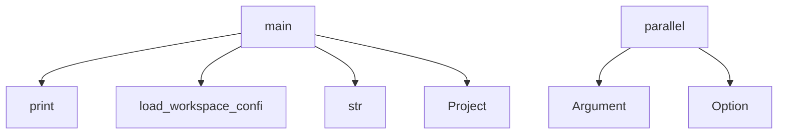

# System Architecture Analysis

## Overview

- **Project**: /home/tom/github/semcod/algitex
- **Primary Language**: python
- **Languages**: python: 456, shell: 104
- **Analysis Mode**: static
- **Total Functions**: 2913
- **Total Classes**: 416
- **Modules**: 560
- **Entry Points**: 2621

## Architecture by Module

### src.algitex.tools.ide
- **Functions**: 22
- **Classes**: 6
- **File**: `ide.py`

### my-app.my-app..algitex.worktrees.agent-0.src.algitex.tools.ide
- **Functions**: 22
- **Classes**: 6
- **File**: `ide.py`

### my-app.my-app..algitex.worktrees.agent-2.src.algitex.tools.ide
- **Functions**: 22
- **Classes**: 6
- **File**: `ide.py`

### my-app.my-app..algitex.worktrees.agent-1.src.algitex.tools.ide
- **Functions**: 22
- **Classes**: 6
- **File**: `ide.py`

### my-app.my-app..algitex.worktrees.agent-0.src.algitex.tools.parallel
- **Functions**: 21
- **Classes**: 7
- **File**: `parallel.py`

### my-app.my-app..algitex.worktrees.agent-2.src.algitex.tools.parallel
- **Functions**: 21
- **Classes**: 7
- **File**: `parallel.py`

### my-app.my-app..algitex.worktrees.agent-1.src.algitex.tools.parallel
- **Functions**: 21
- **Classes**: 7
- **File**: `parallel.py`

### src.algitex.tools.services
- **Functions**: 20
- **Classes**: 3
- **File**: `services.py`

### src.algitex.tools.batch
- **Functions**: 20
- **Classes**: 4
- **File**: `batch.py`

### my-app.my-app..algitex.worktrees.agent-0.src.algitex.tools.services
- **Functions**: 20
- **Classes**: 3
- **File**: `services.py`

### my-app.my-app..algitex.worktrees.agent-0.src.algitex.tools.batch
- **Functions**: 20
- **Classes**: 4
- **File**: `batch.py`

### my-app.my-app..algitex.worktrees.agent-2.src.algitex.tools.services
- **Functions**: 20
- **Classes**: 3
- **File**: `services.py`

### my-app.my-app..algitex.worktrees.agent-2.src.algitex.tools.batch
- **Functions**: 20
- **Classes**: 4
- **File**: `batch.py`

### my-app.my-app..algitex.worktrees.agent-1.src.algitex.tools.services
- **Functions**: 20
- **Classes**: 3
- **File**: `services.py`

### my-app.my-app..algitex.worktrees.agent-1.src.algitex.tools.batch
- **Functions**: 20
- **Classes**: 4
- **File**: `batch.py`

### src.algitex.tools.benchmark
- **Functions**: 19
- **Classes**: 4
- **File**: `benchmark.py`

### src.algitex.workflows
- **Functions**: 19
- **Classes**: 3
- **File**: `__init__.py`

### my-app.my-app..algitex.worktrees.agent-0.src.algitex.tools.benchmark
- **Functions**: 19
- **Classes**: 4
- **File**: `benchmark.py`

### my-app.my-app..algitex.worktrees.agent-0.src.algitex.workflows
- **Functions**: 19
- **Classes**: 3
- **File**: `__init__.py`

### my-app.my-app..algitex.worktrees.agent-2.src.algitex.tools.benchmark
- **Functions**: 19
- **Classes**: 4
- **File**: `benchmark.py`

## Key Entry Points

Main execution flows into the system:

### examples.32-workspace-coordination.main.main
> Demonstrate workspace coordination across multiple repositories.
- **Calls**: print, print, print, examples.32-workspace-coordination.main.load_workspace_config, print, print, print, print

### my-app.my-app..algitex.worktrees.agent-0.examples.32-workspace-coordination.main.main
> Demonstrate workspace coordination across multiple repositories.
- **Calls**: print, print, print, my-app.my-app..algitex.worktrees.agent-0.examples.32-workspace-coordination.main.load_workspace_config, print, print, print, print

### my-app.my-app..algitex.worktrees.agent-2.examples.32-workspace-coordination.main.main
> Demonstrate workspace coordination across multiple repositories.
- **Calls**: print, print, print, my-app.my-app..algitex.worktrees.agent-2.examples.32-workspace-coordination.main.load_workspace_config, print, print, print, print

### my-app.my-app..algitex.worktrees.agent-1.examples.32-workspace-coordination.main.main
> Demonstrate workspace coordination across multiple repositories.
- **Calls**: print, print, print, my-app.my-app..algitex.worktrees.agent-1.examples.32-workspace-coordination.main.load_workspace_config, print, print, print, print

### examples.31-abpr-workflow.main.main
> Demonstrate ABPR pipeline: Execute → Trace → Conflict → Rule → Validate → Repeat.
- **Calls**: print, print, print, print, print, print, str, Project

### my-app.my-app..algitex.worktrees.agent-0.examples.31-abpr-workflow.main.main
> Demonstrate ABPR pipeline: Execute → Trace → Conflict → Rule → Validate → Repeat.
- **Calls**: print, print, print, print, print, print, str, Project

### my-app.my-app..algitex.worktrees.agent-2.examples.31-abpr-workflow.main.main
> Demonstrate ABPR pipeline: Execute → Trace → Conflict → Rule → Validate → Repeat.
- **Calls**: print, print, print, print, print, print, str, Project

### my-app.my-app..algitex.worktrees.agent-1.examples.31-abpr-workflow.main.main
> Demonstrate ABPR pipeline: Execute → Trace → Conflict → Rule → Validate → Repeat.
- **Calls**: print, print, print, print, print, print, str, Project

### my-app.my-app..algitex.worktrees.agent-0.src.algitex.cli.parallel.parallel
> Execute tickets in parallel with conflict-free coordination.
- **Calls**: typer.Argument, typer.Option, typer.Option, typer.Option, typer.Option, None.resolve, console.print, console.print

### my-app.my-app..algitex.worktrees.agent-2.src.algitex.cli.parallel.parallel
> Execute tickets in parallel with conflict-free coordination.
- **Calls**: typer.Argument, typer.Option, typer.Option, typer.Option, typer.Option, None.resolve, console.print, console.print

### my-app.my-app..algitex.worktrees.agent-1.src.algitex.cli.parallel.parallel
> Execute tickets in parallel with conflict-free coordination.
- **Calls**: typer.Argument, typer.Option, typer.Option, typer.Option, typer.Option, None.resolve, console.print, console.print

### examples.30-parallel-execution.main.main
> Demonstrate parallel execution with region-based coordination.
- **Calls**: print, print, print, str, Project, print, p.analyze, print

### my-app.my-app..algitex.worktrees.agent-0.examples.30-parallel-execution.main.main
> Demonstrate parallel execution with region-based coordination.
- **Calls**: print, print, print, str, Project, print, p.analyze, print

### my-app.my-app..algitex.worktrees.agent-2.examples.30-parallel-execution.main.main
> Demonstrate parallel execution with region-based coordination.
- **Calls**: print, print, print, str, Project, print, p.analyze, print

### my-app.my-app..algitex.worktrees.agent-1.examples.30-parallel-execution.main.main
> Demonstrate parallel execution with region-based coordination.
- **Calls**: print, print, print, str, Project, print, p.analyze, print

### examples.20-self-hosted-pipeline.main.main
> Main demo function.
- **Calls**: print, print, print, print, print, print, print, print

### my-app.my-app..algitex.worktrees.agent-0.examples.20-self-hosted-pipeline.main.main
> Main demo function.
- **Calls**: print, print, print, print, print, print, print, print

### my-app.my-app..algitex.worktrees.agent-2.examples.20-self-hosted-pipeline.main.main
> Main demo function.
- **Calls**: print, print, print, print, print, print, print, print

### my-app.my-app..algitex.worktrees.agent-1.examples.20-self-hosted-pipeline.main.main
> Main demo function.
- **Calls**: print, print, print, print, print, print, print, print

### examples.30-parallel-execution.parallel_real_world.main
> Demonstrate parallel refactoring of a real-world project.
- **Calls**: tempfile.TemporaryDirectory, Path, print, examples.30-parallel-execution.parallel_real_world.setup_sample_project, Project, print, p.analyze, print

### my-app.my-app..algitex.worktrees.agent-0.examples.30-parallel-execution.parallel_real_world.main
> Demonstrate parallel refactoring of a real-world project.
- **Calls**: tempfile.TemporaryDirectory, Path, print, my-app.my-app..algitex.worktrees.agent-0.examples.30-parallel-execution.parallel_real_world.setup_sample_project, Project, print, p.analyze, print

### my-app.my-app..algitex.worktrees.agent-2.examples.30-parallel-execution.parallel_real_world.main
> Demonstrate parallel refactoring of a real-world project.
- **Calls**: tempfile.TemporaryDirectory, Path, print, my-app.my-app..algitex.worktrees.agent-2.examples.30-parallel-execution.parallel_real_world.setup_sample_project, Project, print, p.analyze, print

### my-app.my-app..algitex.worktrees.agent-1.examples.30-parallel-execution.parallel_real_world.main
> Demonstrate parallel refactoring of a real-world project.
- **Calls**: tempfile.TemporaryDirectory, Path, print, my-app.my-app..algitex.worktrees.agent-1.examples.30-parallel-execution.parallel_real_world.setup_sample_project, Project, print, p.analyze, print

### examples.14-docker-mcp.main.demo_docker_operations
> Demonstrate real Docker operations.
- **Calls**: print, examples.14-docker-mcp.main.create_sample_docker_project, print, print, project_dir.iterdir, print, print, print

### examples.05-cost-tracking.main.main
- **Calls**: print, Tickets, print, print, print, sorted, print, Loop

### my-app.my-app..algitex.worktrees.agent-0.examples.14-docker-mcp.main.demo_docker_operations
> Demonstrate real Docker operations.
- **Calls**: print, my-app.my-app..algitex.worktrees.agent-0.examples.14-docker-mcp.main.create_sample_docker_project, print, print, project_dir.iterdir, print, print, print

### my-app.my-app..algitex.worktrees.agent-0.examples.05-cost-tracking.main.main
- **Calls**: print, Tickets, print, print, print, sorted, print, Loop

### my-app.my-app..algitex.worktrees.agent-2.examples.14-docker-mcp.main.demo_docker_operations
> Demonstrate real Docker operations.
- **Calls**: print, my-app.my-app..algitex.worktrees.agent-2.examples.14-docker-mcp.main.create_sample_docker_project, print, print, project_dir.iterdir, print, print, print

### my-app.my-app..algitex.worktrees.agent-2.examples.05-cost-tracking.main.main
- **Calls**: print, Tickets, print, print, print, sorted, print, Loop

### my-app.my-app..algitex.worktrees.agent-1.examples.14-docker-mcp.main.demo_docker_operations
> Demonstrate real Docker operations.
- **Calls**: print, my-app.my-app..algitex.worktrees.agent-1.examples.14-docker-mcp.main.create_sample_docker_project, print, print, project_dir.iterdir, print, print, print

## Process Flows

Key execution flows identified:

### Flow 1: main
```
main [examples.32-workspace-coordination.main]
  └─> load_workspace_config
```

### Flow 2: parallel
```
parallel [my-app.my-app..algitex.worktrees.agent-0.src.algitex.cli.parallel]
```

## Key Classes

### src.algitex.project.Project
> One project, all tools, zero boilerplate.
- **Methods**: 19
- **Key Methods**: src.algitex.project.Project.__init__, src.algitex.project.Project._analyzer, src.algitex.project.Project._tickets, src.algitex.project.Project._ollama_service, src.algitex.project.Project.analyze, src.algitex.project.Project.plan, src.algitex.project.Project.execute, src.algitex.project.Project.status, src.algitex.project.Project._status_health, src.algitex.project.Project._status_tickets
- **Inherits**: ServiceMixin, AutoFixMixin, OllamaMixin, BatchMixin, BenchmarkMixin, IDEMixin, ConfigMixin, MCPMixin

### my-app.my-app..algitex.worktrees.agent-0.src.algitex.project.Project
> One project, all tools, zero boilerplate.
- **Methods**: 19
- **Key Methods**: my-app.my-app..algitex.worktrees.agent-0.src.algitex.project.Project.__init__, my-app.my-app..algitex.worktrees.agent-0.src.algitex.project.Project._analyzer, my-app.my-app..algitex.worktrees.agent-0.src.algitex.project.Project._tickets, my-app.my-app..algitex.worktrees.agent-0.src.algitex.project.Project._ollama_service, my-app.my-app..algitex.worktrees.agent-0.src.algitex.project.Project.analyze, my-app.my-app..algitex.worktrees.agent-0.src.algitex.project.Project.plan, my-app.my-app..algitex.worktrees.agent-0.src.algitex.project.Project.execute, my-app.my-app..algitex.worktrees.agent-0.src.algitex.project.Project.status, my-app.my-app..algitex.worktrees.agent-0.src.algitex.project.Project._status_health, my-app.my-app..algitex.worktrees.agent-0.src.algitex.project.Project._status_tickets
- **Inherits**: ServiceMixin, AutoFixMixin, OllamaMixin, BatchMixin, BenchmarkMixin, IDEMixin, ConfigMixin, MCPMixin

### my-app.my-app..algitex.worktrees.agent-2.src.algitex.project.Project
> One project, all tools, zero boilerplate.
- **Methods**: 19
- **Key Methods**: my-app.my-app..algitex.worktrees.agent-2.src.algitex.project.Project.__init__, my-app.my-app..algitex.worktrees.agent-2.src.algitex.project.Project._analyzer, my-app.my-app..algitex.worktrees.agent-2.src.algitex.project.Project._tickets, my-app.my-app..algitex.worktrees.agent-2.src.algitex.project.Project._ollama_service, my-app.my-app..algitex.worktrees.agent-2.src.algitex.project.Project.analyze, my-app.my-app..algitex.worktrees.agent-2.src.algitex.project.Project.plan, my-app.my-app..algitex.worktrees.agent-2.src.algitex.project.Project.execute, my-app.my-app..algitex.worktrees.agent-2.src.algitex.project.Project.status, my-app.my-app..algitex.worktrees.agent-2.src.algitex.project.Project._status_health, my-app.my-app..algitex.worktrees.agent-2.src.algitex.project.Project._status_tickets
- **Inherits**: ServiceMixin, AutoFixMixin, OllamaMixin, BatchMixin, BenchmarkMixin, IDEMixin, ConfigMixin, MCPMixin

### my-app.my-app..algitex.worktrees.agent-1.src.algitex.project.Project
> One project, all tools, zero boilerplate.
- **Methods**: 19
- **Key Methods**: my-app.my-app..algitex.worktrees.agent-1.src.algitex.project.Project.__init__, my-app.my-app..algitex.worktrees.agent-1.src.algitex.project.Project._analyzer, my-app.my-app..algitex.worktrees.agent-1.src.algitex.project.Project._tickets, my-app.my-app..algitex.worktrees.agent-1.src.algitex.project.Project._ollama_service, my-app.my-app..algitex.worktrees.agent-1.src.algitex.project.Project.analyze, my-app.my-app..algitex.worktrees.agent-1.src.algitex.project.Project.plan, my-app.my-app..algitex.worktrees.agent-1.src.algitex.project.Project.execute, my-app.my-app..algitex.worktrees.agent-1.src.algitex.project.Project.status, my-app.my-app..algitex.worktrees.agent-1.src.algitex.project.Project._status_health, my-app.my-app..algitex.worktrees.agent-1.src.algitex.project.Project._status_tickets
- **Inherits**: ServiceMixin, AutoFixMixin, OllamaMixin, BatchMixin, BenchmarkMixin, IDEMixin, ConfigMixin, MCPMixin

### src.algitex.tools.autofix.AutoFix
> Automated code fixing using various backends.
- **Methods**: 18
- **Key Methods**: src.algitex.tools.autofix.AutoFix.__init__, src.algitex.tools.autofix.AutoFix.ollama_service, src.algitex.tools.autofix.AutoFix.ollama_backend, src.algitex.tools.autofix.AutoFix.aider_backend, src.algitex.tools.autofix.AutoFix.proxy_backend, src.algitex.tools.autofix.AutoFix.check_backends, src.algitex.tools.autofix.AutoFix.choose_backend, src.algitex.tools.autofix.AutoFix._convert_task, src.algitex.tools.autofix.AutoFix.mark_task_done, src.algitex.tools.autofix.AutoFix.fix_with_ollama

### my-app.my-app..algitex.worktrees.agent-0.src.algitex.tools.autofix.AutoFix
> Automated code fixing using various backends.
- **Methods**: 18
- **Key Methods**: my-app.my-app..algitex.worktrees.agent-0.src.algitex.tools.autofix.AutoFix.__init__, my-app.my-app..algitex.worktrees.agent-0.src.algitex.tools.autofix.AutoFix.ollama_service, my-app.my-app..algitex.worktrees.agent-0.src.algitex.tools.autofix.AutoFix.ollama_backend, my-app.my-app..algitex.worktrees.agent-0.src.algitex.tools.autofix.AutoFix.aider_backend, my-app.my-app..algitex.worktrees.agent-0.src.algitex.tools.autofix.AutoFix.proxy_backend, my-app.my-app..algitex.worktrees.agent-0.src.algitex.tools.autofix.AutoFix.check_backends, my-app.my-app..algitex.worktrees.agent-0.src.algitex.tools.autofix.AutoFix.choose_backend, my-app.my-app..algitex.worktrees.agent-0.src.algitex.tools.autofix.AutoFix._convert_task, my-app.my-app..algitex.worktrees.agent-0.src.algitex.tools.autofix.AutoFix.mark_task_done, my-app.my-app..algitex.worktrees.agent-0.src.algitex.tools.autofix.AutoFix.fix_with_ollama

### my-app.my-app..algitex.worktrees.agent-2.src.algitex.tools.autofix.AutoFix
> Automated code fixing using various backends.
- **Methods**: 18
- **Key Methods**: my-app.my-app..algitex.worktrees.agent-2.src.algitex.tools.autofix.AutoFix.__init__, my-app.my-app..algitex.worktrees.agent-2.src.algitex.tools.autofix.AutoFix.ollama_service, my-app.my-app..algitex.worktrees.agent-2.src.algitex.tools.autofix.AutoFix.ollama_backend, my-app.my-app..algitex.worktrees.agent-2.src.algitex.tools.autofix.AutoFix.aider_backend, my-app.my-app..algitex.worktrees.agent-2.src.algitex.tools.autofix.AutoFix.proxy_backend, my-app.my-app..algitex.worktrees.agent-2.src.algitex.tools.autofix.AutoFix.check_backends, my-app.my-app..algitex.worktrees.agent-2.src.algitex.tools.autofix.AutoFix.choose_backend, my-app.my-app..algitex.worktrees.agent-2.src.algitex.tools.autofix.AutoFix._convert_task, my-app.my-app..algitex.worktrees.agent-2.src.algitex.tools.autofix.AutoFix.mark_task_done, my-app.my-app..algitex.worktrees.agent-2.src.algitex.tools.autofix.AutoFix.fix_with_ollama

### my-app.my-app..algitex.worktrees.agent-1.src.algitex.tools.autofix.AutoFix
> Automated code fixing using various backends.
- **Methods**: 18
- **Key Methods**: my-app.my-app..algitex.worktrees.agent-1.src.algitex.tools.autofix.AutoFix.__init__, my-app.my-app..algitex.worktrees.agent-1.src.algitex.tools.autofix.AutoFix.ollama_service, my-app.my-app..algitex.worktrees.agent-1.src.algitex.tools.autofix.AutoFix.ollama_backend, my-app.my-app..algitex.worktrees.agent-1.src.algitex.tools.autofix.AutoFix.aider_backend, my-app.my-app..algitex.worktrees.agent-1.src.algitex.tools.autofix.AutoFix.proxy_backend, my-app.my-app..algitex.worktrees.agent-1.src.algitex.tools.autofix.AutoFix.check_backends, my-app.my-app..algitex.worktrees.agent-1.src.algitex.tools.autofix.AutoFix.choose_backend, my-app.my-app..algitex.worktrees.agent-1.src.algitex.tools.autofix.AutoFix._convert_task, my-app.my-app..algitex.worktrees.agent-1.src.algitex.tools.autofix.AutoFix.mark_task_done, my-app.my-app..algitex.worktrees.agent-1.src.algitex.tools.autofix.AutoFix.fix_with_ollama

### src.algitex.tools.mcp.MCPOrchestrator
> Orchestrates multiple MCP services.
- **Methods**: 17
- **Key Methods**: src.algitex.tools.mcp.MCPOrchestrator.__init__, src.algitex.tools.mcp.MCPOrchestrator._setup_signal_handlers, src.algitex.tools.mcp.MCPOrchestrator._register_default_services, src.algitex.tools.mcp.MCPOrchestrator.add_service, src.algitex.tools.mcp.MCPOrchestrator.add_custom_service, src.algitex.tools.mcp.MCPOrchestrator.start_service, src.algitex.tools.mcp.MCPOrchestrator.stop_service, src.algitex.tools.mcp.MCPOrchestrator.restart_service, src.algitex.tools.mcp.MCPOrchestrator.start_all, src.algitex.tools.mcp.MCPOrchestrator.stop_all

### my-app.my-app..algitex.worktrees.agent-0.src.algitex.tools.mcp.MCPOrchestrator
> Orchestrates multiple MCP services.
- **Methods**: 17
- **Key Methods**: my-app.my-app..algitex.worktrees.agent-0.src.algitex.tools.mcp.MCPOrchestrator.__init__, my-app.my-app..algitex.worktrees.agent-0.src.algitex.tools.mcp.MCPOrchestrator._setup_signal_handlers, my-app.my-app..algitex.worktrees.agent-0.src.algitex.tools.mcp.MCPOrchestrator._register_default_services, my-app.my-app..algitex.worktrees.agent-0.src.algitex.tools.mcp.MCPOrchestrator.add_service, my-app.my-app..algitex.worktrees.agent-0.src.algitex.tools.mcp.MCPOrchestrator.add_custom_service, my-app.my-app..algitex.worktrees.agent-0.src.algitex.tools.mcp.MCPOrchestrator.start_service, my-app.my-app..algitex.worktrees.agent-0.src.algitex.tools.mcp.MCPOrchestrator.stop_service, my-app.my-app..algitex.worktrees.agent-0.src.algitex.tools.mcp.MCPOrchestrator.restart_service, my-app.my-app..algitex.worktrees.agent-0.src.algitex.tools.mcp.MCPOrchestrator.start_all, my-app.my-app..algitex.worktrees.agent-0.src.algitex.tools.mcp.MCPOrchestrator.stop_all

### my-app.my-app..algitex.worktrees.agent-2.src.algitex.tools.mcp.MCPOrchestrator
> Orchestrates multiple MCP services.
- **Methods**: 17
- **Key Methods**: my-app.my-app..algitex.worktrees.agent-2.src.algitex.tools.mcp.MCPOrchestrator.__init__, my-app.my-app..algitex.worktrees.agent-2.src.algitex.tools.mcp.MCPOrchestrator._setup_signal_handlers, my-app.my-app..algitex.worktrees.agent-2.src.algitex.tools.mcp.MCPOrchestrator._register_default_services, my-app.my-app..algitex.worktrees.agent-2.src.algitex.tools.mcp.MCPOrchestrator.add_service, my-app.my-app..algitex.worktrees.agent-2.src.algitex.tools.mcp.MCPOrchestrator.add_custom_service, my-app.my-app..algitex.worktrees.agent-2.src.algitex.tools.mcp.MCPOrchestrator.start_service, my-app.my-app..algitex.worktrees.agent-2.src.algitex.tools.mcp.MCPOrchestrator.stop_service, my-app.my-app..algitex.worktrees.agent-2.src.algitex.tools.mcp.MCPOrchestrator.restart_service, my-app.my-app..algitex.worktrees.agent-2.src.algitex.tools.mcp.MCPOrchestrator.start_all, my-app.my-app..algitex.worktrees.agent-2.src.algitex.tools.mcp.MCPOrchestrator.stop_all

### my-app.my-app..algitex.worktrees.agent-1.src.algitex.tools.mcp.MCPOrchestrator
> Orchestrates multiple MCP services.
- **Methods**: 17
- **Key Methods**: my-app.my-app..algitex.worktrees.agent-1.src.algitex.tools.mcp.MCPOrchestrator.__init__, my-app.my-app..algitex.worktrees.agent-1.src.algitex.tools.mcp.MCPOrchestrator._setup_signal_handlers, my-app.my-app..algitex.worktrees.agent-1.src.algitex.tools.mcp.MCPOrchestrator._register_default_services, my-app.my-app..algitex.worktrees.agent-1.src.algitex.tools.mcp.MCPOrchestrator.add_service, my-app.my-app..algitex.worktrees.agent-1.src.algitex.tools.mcp.MCPOrchestrator.add_custom_service, my-app.my-app..algitex.worktrees.agent-1.src.algitex.tools.mcp.MCPOrchestrator.start_service, my-app.my-app..algitex.worktrees.agent-1.src.algitex.tools.mcp.MCPOrchestrator.stop_service, my-app.my-app..algitex.worktrees.agent-1.src.algitex.tools.mcp.MCPOrchestrator.restart_service, my-app.my-app..algitex.worktrees.agent-1.src.algitex.tools.mcp.MCPOrchestrator.start_all, my-app.my-app..algitex.worktrees.agent-1.src.algitex.tools.mcp.MCPOrchestrator.stop_all

### src.algitex.tools.services.ServiceChecker
> Checker for various services used by algitex.
- **Methods**: 16
- **Key Methods**: src.algitex.tools.services.ServiceChecker.__init__, src.algitex.tools.services.ServiceChecker.check_http_service, src.algitex.tools.services.ServiceChecker.check_ollama, src.algitex.tools.services.ServiceChecker.check_litellm_proxy, src.algitex.tools.services.ServiceChecker.check_mcp_service, src.algitex.tools.services.ServiceChecker.check_command_exists, src.algitex.tools.services.ServiceChecker.check_file_exists, src.algitex.tools.services.ServiceChecker.check_all, src.algitex.tools.services.ServiceChecker._format_status_line, src.algitex.tools.services.ServiceChecker._print_status_details

### my-app.my-app..algitex.worktrees.agent-0.src.algitex.tools.services.ServiceChecker
> Checker for various services used by algitex.
- **Methods**: 16
- **Key Methods**: my-app.my-app..algitex.worktrees.agent-0.src.algitex.tools.services.ServiceChecker.__init__, my-app.my-app..algitex.worktrees.agent-0.src.algitex.tools.services.ServiceChecker.check_http_service, my-app.my-app..algitex.worktrees.agent-0.src.algitex.tools.services.ServiceChecker.check_ollama, my-app.my-app..algitex.worktrees.agent-0.src.algitex.tools.services.ServiceChecker.check_litellm_proxy, my-app.my-app..algitex.worktrees.agent-0.src.algitex.tools.services.ServiceChecker.check_mcp_service, my-app.my-app..algitex.worktrees.agent-0.src.algitex.tools.services.ServiceChecker.check_command_exists, my-app.my-app..algitex.worktrees.agent-0.src.algitex.tools.services.ServiceChecker.check_file_exists, my-app.my-app..algitex.worktrees.agent-0.src.algitex.tools.services.ServiceChecker.check_all, my-app.my-app..algitex.worktrees.agent-0.src.algitex.tools.services.ServiceChecker._format_status_line, my-app.my-app..algitex.worktrees.agent-0.src.algitex.tools.services.ServiceChecker._print_status_details

### my-app.my-app..algitex.worktrees.agent-2.src.algitex.tools.services.ServiceChecker
> Checker for various services used by algitex.
- **Methods**: 16
- **Key Methods**: my-app.my-app..algitex.worktrees.agent-2.src.algitex.tools.services.ServiceChecker.__init__, my-app.my-app..algitex.worktrees.agent-2.src.algitex.tools.services.ServiceChecker.check_http_service, my-app.my-app..algitex.worktrees.agent-2.src.algitex.tools.services.ServiceChecker.check_ollama, my-app.my-app..algitex.worktrees.agent-2.src.algitex.tools.services.ServiceChecker.check_litellm_proxy, my-app.my-app..algitex.worktrees.agent-2.src.algitex.tools.services.ServiceChecker.check_mcp_service, my-app.my-app..algitex.worktrees.agent-2.src.algitex.tools.services.ServiceChecker.check_command_exists, my-app.my-app..algitex.worktrees.agent-2.src.algitex.tools.services.ServiceChecker.check_file_exists, my-app.my-app..algitex.worktrees.agent-2.src.algitex.tools.services.ServiceChecker.check_all, my-app.my-app..algitex.worktrees.agent-2.src.algitex.tools.services.ServiceChecker._format_status_line, my-app.my-app..algitex.worktrees.agent-2.src.algitex.tools.services.ServiceChecker._print_status_details

### my-app.my-app..algitex.worktrees.agent-1.src.algitex.tools.services.ServiceChecker
> Checker for various services used by algitex.
- **Methods**: 16
- **Key Methods**: my-app.my-app..algitex.worktrees.agent-1.src.algitex.tools.services.ServiceChecker.__init__, my-app.my-app..algitex.worktrees.agent-1.src.algitex.tools.services.ServiceChecker.check_http_service, my-app.my-app..algitex.worktrees.agent-1.src.algitex.tools.services.ServiceChecker.check_ollama, my-app.my-app..algitex.worktrees.agent-1.src.algitex.tools.services.ServiceChecker.check_litellm_proxy, my-app.my-app..algitex.worktrees.agent-1.src.algitex.tools.services.ServiceChecker.check_mcp_service, my-app.my-app..algitex.worktrees.agent-1.src.algitex.tools.services.ServiceChecker.check_command_exists, my-app.my-app..algitex.worktrees.agent-1.src.algitex.tools.services.ServiceChecker.check_file_exists, my-app.my-app..algitex.worktrees.agent-1.src.algitex.tools.services.ServiceChecker.check_all, my-app.my-app..algitex.worktrees.agent-1.src.algitex.tools.services.ServiceChecker._format_status_line, my-app.my-app..algitex.worktrees.agent-1.src.algitex.tools.services.ServiceChecker._print_status_details

### src.algitex.tools.docker.DockerToolManager
> Spawn Docker containers, connect via MCP/REST, call tools, teardown.
- **Methods**: 15
- **Key Methods**: src.algitex.tools.docker.DockerToolManager.__init__, src.algitex.tools.docker.DockerToolManager.__enter__, src.algitex.tools.docker.DockerToolManager.__exit__, src.algitex.tools.docker.DockerToolManager._load_tools, src.algitex.tools.docker.DockerToolManager._load_state, src.algitex.tools.docker.DockerToolManager._save_state, src.algitex.tools.docker.DockerToolManager.spawn, src.algitex.tools.docker.DockerToolManager._wait_healthy, src.algitex.tools.docker.DockerToolManager._get_http_client, src.algitex.tools.docker.DockerToolManager.call_tool

### src.algitex.tools.batch.BatchProcessor
> Generic batch processor with rate limiting and retries.
- **Methods**: 15
- **Key Methods**: src.algitex.tools.batch.BatchProcessor.__init__, src.algitex.tools.batch.BatchProcessor._rate_limit, src.algitex.tools.batch.BatchProcessor._process_item, src.algitex.tools.batch.BatchProcessor.process, src.algitex.tools.batch.BatchProcessor._prepare, src.algitex.tools.batch.BatchProcessor._execute, src.algitex.tools.batch.BatchProcessor._collect, src.algitex.tools.batch.BatchProcessor._setup_progress_bar, src.algitex.tools.batch.BatchProcessor._collect_results, src.algitex.tools.batch.BatchProcessor._get_start_time

### my-app.my-app..algitex.worktrees.agent-0.src.algitex.tools.docker.DockerToolManager
> Spawn Docker containers, connect via MCP/REST, call tools, teardown.
- **Methods**: 15
- **Key Methods**: my-app.my-app..algitex.worktrees.agent-0.src.algitex.tools.docker.DockerToolManager.__init__, my-app.my-app..algitex.worktrees.agent-0.src.algitex.tools.docker.DockerToolManager.__enter__, my-app.my-app..algitex.worktrees.agent-0.src.algitex.tools.docker.DockerToolManager.__exit__, my-app.my-app..algitex.worktrees.agent-0.src.algitex.tools.docker.DockerToolManager._load_tools, my-app.my-app..algitex.worktrees.agent-0.src.algitex.tools.docker.DockerToolManager._load_state, my-app.my-app..algitex.worktrees.agent-0.src.algitex.tools.docker.DockerToolManager._save_state, my-app.my-app..algitex.worktrees.agent-0.src.algitex.tools.docker.DockerToolManager.spawn, my-app.my-app..algitex.worktrees.agent-0.src.algitex.tools.docker.DockerToolManager._wait_healthy, my-app.my-app..algitex.worktrees.agent-0.src.algitex.tools.docker.DockerToolManager._get_http_client, my-app.my-app..algitex.worktrees.agent-0.src.algitex.tools.docker.DockerToolManager.call_tool

### my-app.my-app..algitex.worktrees.agent-0.src.algitex.tools.batch.BatchProcessor
> Generic batch processor with rate limiting and retries.
- **Methods**: 15
- **Key Methods**: my-app.my-app..algitex.worktrees.agent-0.src.algitex.tools.batch.BatchProcessor.__init__, my-app.my-app..algitex.worktrees.agent-0.src.algitex.tools.batch.BatchProcessor._rate_limit, my-app.my-app..algitex.worktrees.agent-0.src.algitex.tools.batch.BatchProcessor._process_item, my-app.my-app..algitex.worktrees.agent-0.src.algitex.tools.batch.BatchProcessor.process, my-app.my-app..algitex.worktrees.agent-0.src.algitex.tools.batch.BatchProcessor._prepare, my-app.my-app..algitex.worktrees.agent-0.src.algitex.tools.batch.BatchProcessor._execute, my-app.my-app..algitex.worktrees.agent-0.src.algitex.tools.batch.BatchProcessor._collect, my-app.my-app..algitex.worktrees.agent-0.src.algitex.tools.batch.BatchProcessor._setup_progress_bar, my-app.my-app..algitex.worktrees.agent-0.src.algitex.tools.batch.BatchProcessor._collect_results, my-app.my-app..algitex.worktrees.agent-0.src.algitex.tools.batch.BatchProcessor._get_start_time

## Data Transformation Functions

Key functions that process and transform data:

### docker.vallm.vallm_server.VallmServer._validate_static
> Static analysis with pylint, mypy, ruff.
- **Output to**: subprocess.run, subprocess.run, max, json.loads, errors.extend

### docker.vallm.vallm_server.VallmServer._validate_runtime
> Run tests with pytest.
- **Output to**: subprocess.run, result.stdout.split, line.split, str, int

### docker.vallm.vallm_server.VallmServer._validate_security
> Security scan with bandit.
- **Output to**: subprocess.run, max, len, logger.warning, json.loads

### docker.vallm.vallm_mcp_server.validate_static
> Run static analysis with ruff, mypy on the project.

Args:
    path: Path to the project directory
 
- **Output to**: mcp.tool, subprocess.run, subprocess.run, max, None.isoformat

### docker.vallm.vallm_mcp_server.validate_runtime
> Run runtime tests with pytest.

Args:
    path: Path to the project directory
    
Returns:
    Dict
- **Output to**: mcp.tool, subprocess.run, result.stdout.split, None.isoformat, line.split

### docker.vallm.vallm_mcp_server.validate_security
> Run security scan with bandit.

Args:
    path: Path to the project directory
    
Returns:
    Dict
- **Output to**: mcp.tool, subprocess.run, max, len, None.isoformat

### docker.vallm.vallm_mcp_server.validate_all
> Run all validation levels: static, runtime, and security.

Args:
    path: Path to the project direc
- **Output to**: mcp.tool, docker.vallm.vallm_mcp_server.validate_static, docker.vallm.vallm_mcp_server.validate_runtime, docker.vallm.vallm_mcp_server.validate_security, all

### src.algitex.tools.docker_transport.StdioTransport._serialize
> Serialize JSON-RPC request with MCP protocol headers.
- **Output to**: json.dumps, len

### src.algitex.tools.docker_transport.StdioTransport._parse
> Parse JSON response with error handling.
- **Output to**: json.loads, RuntimeError, str

### src.algitex.tools.todo_parser.TodoParser.parse
> Parse file and return list of pending tasks.
- **Output to**: self.file_path.read_text, tasks.extend, tasks.extend, tasks.extend, self.file_path.exists

### src.algitex.tools.todo_parser.TodoParser._parse_prefact
> Parse prefact-style: `file.py:10 - description`.
- **Output to**: set, self.PREFACT_PATTERN.finditer, match.group, int, None.strip

### src.algitex.tools.todo_parser.TodoParser._parse_github
> Parse GitHub-style checkboxes.
- **Output to**: set, self.GITHUB_PATTERN.finditer, None.lower, None.strip, seen.add

### src.algitex.tools.todo_parser.TodoParser._parse_generic
> Parse generic list items.
- **Output to**: set, self.GENERIC_PATTERN.finditer, match.group, None.strip, seen.add

### src.algitex.tools.context.ContextBuilder._format_ticket
> Format ticket information.
- **Output to**: ticket.get, ticket.get, ticket.get, ticket.get

### src.algitex.tools.workspace.Workspace._validate_dependencies
> Validate that all dependencies exist.
- **Output to**: set, self.repos.items, self.repos.keys, ValueError

### src.algitex.tools.workspace.Workspace.validate_all
> Run validation across all repositories.
- **Output to**: self._topo_sort, print, Pipeline, pipeline.validate, pipeline._results.get

### src.algitex.tools.services.ServiceChecker._format_status_line
> Format a single status line.

### src.algitex.tools.todo_executor.TodoExecutor._parse_action
> Parse task description to determine MCP action and arguments.
- **Output to**: task.description.lower, any, any, any, any

### src.algitex.tools.todo_executor.TodoExecutor._parse_fix_action
> Parse a fix/correction task.
- **Output to**: re.search, str, str, None.strip, match.group

### src.algitex.tools.todo_executor.TodoExecutor._parse_create_action
> Parse a create/add task.
- **Output to**: re.search, file_match.group, str

### src.algitex.tools.todo_executor.TodoExecutor._parse_delete_action
> Parse a remove/delete task.
- **Output to**: str, str

### src.algitex.tools.todo_executor.TodoExecutor._parse_read_action
> Parse a read/view task.
- **Output to**: str, str

### src.algitex.tools.todo_runner.TodoRunner._format_output
> Extract meaningful output from MCP result.
- **Output to**: isinstance, isinstance, json.dumps, str, str

### src.algitex.tools.batch.BatchProcessor._process_item
> Process single item with retry logic.
- **Output to**: time.time, self._rate_limit, self.worker_func, BatchResult, BatchResult

### src.algitex.tools.batch.BatchProcessor.process
> Process items in parallel using 3-stage pipeline.
- **Output to**: self._prepare, self._execute, self._collect

## Behavioral Patterns

### recursion_list
- **Type**: recursion
- **Confidence**: 0.90
- **Functions**: src.algitex.tools.tickets.Tickets.list

### recursion_complex_logic
- **Type**: recursion
- **Confidence**: 0.90
- **Functions**: examples.24-ollama-batch.file3.complex_logic

### recursion_recursive_function
- **Type**: recursion
- **Confidence**: 0.90
- **Functions**: examples.19-local-mcp-tools.buggy_code.recursive_function

### recursion_list
- **Type**: recursion
- **Confidence**: 0.90
- **Functions**: my-app.my-app..algitex.worktrees.agent-0.src.algitex.tools.tickets.Tickets.list

### recursion_complex_logic
- **Type**: recursion
- **Confidence**: 0.90
- **Functions**: my-app.my-app..algitex.worktrees.agent-0.examples.24-ollama-batch.file3.complex_logic

### recursion_recursive_function
- **Type**: recursion
- **Confidence**: 0.90
- **Functions**: my-app.my-app..algitex.worktrees.agent-0.examples.19-local-mcp-tools.buggy_code.recursive_function

### recursion_list
- **Type**: recursion
- **Confidence**: 0.90
- **Functions**: my-app.my-app..algitex.worktrees.agent-2.src.algitex.tools.tickets.Tickets.list

### recursion_complex_logic
- **Type**: recursion
- **Confidence**: 0.90
- **Functions**: my-app.my-app..algitex.worktrees.agent-2.examples.24-ollama-batch.file3.complex_logic

### recursion_recursive_function
- **Type**: recursion
- **Confidence**: 0.90
- **Functions**: my-app.my-app..algitex.worktrees.agent-2.examples.19-local-mcp-tools.buggy_code.recursive_function

### recursion_list
- **Type**: recursion
- **Confidence**: 0.90
- **Functions**: my-app.my-app..algitex.worktrees.agent-1.src.algitex.tools.tickets.Tickets.list

### recursion_complex_logic
- **Type**: recursion
- **Confidence**: 0.90
- **Functions**: my-app.my-app..algitex.worktrees.agent-1.examples.24-ollama-batch.file3.complex_logic

### recursion_recursive_function
- **Type**: recursion
- **Confidence**: 0.90
- **Functions**: my-app.my-app..algitex.worktrees.agent-1.examples.19-local-mcp-tools.buggy_code.recursive_function

### state_machine_Proxy
- **Type**: state_machine
- **Confidence**: 0.70
- **Functions**: src.algitex.tools.proxy.Proxy.__init__, src.algitex.tools.proxy.Proxy.ask, src.algitex.tools.proxy.Proxy.budget, src.algitex.tools.proxy.Proxy.models, src.algitex.tools.proxy.Proxy.health

### state_machine_LoopState
- **Type**: state_machine
- **Confidence**: 0.70
- **Functions**: src.algitex.algo.LoopState.deterministic_ratio, src.algitex.algo.LoopState.stage_name

### state_machine_OllamaClient
- **Type**: state_machine
- **Confidence**: 0.70
- **Functions**: src.algitex.tools.ollama.OllamaClient.__init__, src.algitex.tools.ollama.OllamaClient.health, src.algitex.tools.ollama.OllamaClient.list_models, src.algitex.tools.ollama.OllamaClient.pull_model, src.algitex.tools.ollama.OllamaClient.generate

## Public API Surface

Functions exposed as public API (no underscore prefix):

- `examples.32-workspace-coordination.main.main` - 94 calls
- `my-app.my-app..algitex.worktrees.agent-0.examples.32-workspace-coordination.main.main` - 94 calls
- `my-app.my-app..algitex.worktrees.agent-2.examples.32-workspace-coordination.main.main` - 94 calls
- `my-app.my-app..algitex.worktrees.agent-1.examples.32-workspace-coordination.main.main` - 94 calls
- `examples.31-abpr-workflow.main.main` - 77 calls
- `my-app.my-app..algitex.worktrees.agent-0.examples.31-abpr-workflow.main.main` - 77 calls
- `my-app.my-app..algitex.worktrees.agent-2.examples.31-abpr-workflow.main.main` - 77 calls
- `my-app.my-app..algitex.worktrees.agent-1.examples.31-abpr-workflow.main.main` - 77 calls
- `my-app.my-app..algitex.worktrees.agent-0.src.algitex.cli.parallel.parallel` - 65 calls
- `my-app.my-app..algitex.worktrees.agent-2.src.algitex.cli.parallel.parallel` - 65 calls
- `my-app.my-app..algitex.worktrees.agent-1.src.algitex.cli.parallel.parallel` - 65 calls
- `examples.30-parallel-execution.main.main` - 56 calls
- `my-app.my-app..algitex.worktrees.agent-0.examples.30-parallel-execution.main.main` - 56 calls
- `my-app.my-app..algitex.worktrees.agent-2.examples.30-parallel-execution.main.main` - 56 calls
- `my-app.my-app..algitex.worktrees.agent-1.examples.30-parallel-execution.main.main` - 56 calls
- `examples.20-self-hosted-pipeline.main.main` - 49 calls
- `my-app.my-app..algitex.worktrees.agent-0.examples.20-self-hosted-pipeline.main.main` - 49 calls
- `my-app.my-app..algitex.worktrees.agent-2.examples.20-self-hosted-pipeline.main.main` - 49 calls
- `my-app.my-app..algitex.worktrees.agent-1.examples.20-self-hosted-pipeline.main.main` - 49 calls
- `examples.30-parallel-execution.parallel_real_world.main` - 43 calls
- `my-app.my-app..algitex.worktrees.agent-0.examples.30-parallel-execution.parallel_real_world.main` - 43 calls
- `my-app.my-app..algitex.worktrees.agent-2.examples.30-parallel-execution.parallel_real_world.main` - 43 calls
- `my-app.my-app..algitex.worktrees.agent-1.examples.30-parallel-execution.parallel_real_world.main` - 43 calls
- `examples.14-docker-mcp.main.demo_docker_operations` - 40 calls
- `examples.05-cost-tracking.main.main` - 40 calls
- `my-app.my-app..algitex.worktrees.agent-0.examples.14-docker-mcp.main.demo_docker_operations` - 40 calls
- `my-app.my-app..algitex.worktrees.agent-0.examples.05-cost-tracking.main.main` - 40 calls
- `my-app.my-app..algitex.worktrees.agent-2.examples.14-docker-mcp.main.demo_docker_operations` - 40 calls
- `my-app.my-app..algitex.worktrees.agent-2.examples.05-cost-tracking.main.main` - 40 calls
- `my-app.my-app..algitex.worktrees.agent-1.examples.14-docker-mcp.main.demo_docker_operations` - 40 calls
- `my-app.my-app..algitex.worktrees.agent-1.examples.05-cost-tracking.main.main` - 40 calls
- `examples.18-ollama-local.main.main` - 39 calls
- `my-app.my-app..algitex.worktrees.agent-0.examples.18-ollama-local.main.main` - 39 calls
- `my-app.my-app..algitex.worktrees.agent-2.examples.18-ollama-local.main.main` - 39 calls
- `my-app.my-app..algitex.worktrees.agent-1.examples.18-ollama-local.main.main` - 39 calls
- `examples.31-abpr-workflow.abpr_pipeline.abpr_pipeline` - 36 calls
- `examples.13-vallm.main.demo_validation` - 35 calls
- `my-app.my-app..algitex.worktrees.agent-0.examples.13-vallm.main.demo_validation` - 35 calls
- `my-app.my-app..algitex.worktrees.agent-2.examples.13-vallm.main.demo_validation` - 35 calls
- `my-app.my-app..algitex.worktrees.agent-1.examples.13-vallm.main.demo_validation` - 35 calls

## System Interactions

How components interact:



## Reverse Engineering Guidelines

1. **Entry Points**: Start analysis from the entry points listed above
2. **Core Logic**: Focus on classes with many methods
3. **Data Flow**: Follow data transformation functions
4. **Process Flows**: Use the flow diagrams for execution paths
5. **API Surface**: Public API functions reveal the interface

## Context for LLM

Maintain the identified architectural patterns and public API surface when suggesting changes.