# System Architecture Analysis

## Overview

- **Project**: /home/tom/github/semcod/algitex
- **Primary Language**: python
- **Languages**: python: 111, shell: 26
- **Analysis Mode**: static
- **Total Functions**: 614
- **Total Classes**: 86
- **Modules**: 137
- **Entry Points**: 518

## Architecture by Module

### src.algitex.tools.ide
- **Functions**: 22
- **Classes**: 6
- **File**: `ide.py`

### src.algitex.workflows
- **Functions**: 19
- **Classes**: 3
- **File**: `__init__.py`

### src.algitex.tools.mcp
- **Functions**: 18
- **Classes**: 2
- **File**: `mcp.py`

### src.algitex.tools.workspace
- **Functions**: 17
- **Classes**: 2
- **File**: `workspace.py`

### src.algitex.project
- **Functions**: 16
- **Classes**: 1
- **File**: `__init__.py`

### src.algitex.tools.ollama
- **Functions**: 16
- **Classes**: 4
- **File**: `ollama.py`

### src.algitex.propact
- **Functions**: 15
- **Classes**: 3
- **File**: `__init__.py`

### src.algitex.tools.autofix
- **Functions**: 14
- **Classes**: 1
- **File**: `__init__.py`

### src.algitex.algo
- **Functions**: 12
- **Classes**: 5
- **File**: `__init__.py`

### src.algitex.tools.feedback
- **Functions**: 12
- **Classes**: 4
- **File**: `feedback.py`

### src.algitex.tools.autofix.proxy_backend
- **Functions**: 12
- **Classes**: 1
- **File**: `proxy_backend.py`

### examples.20-self-hosted-pipeline.buggy_code
- **Functions**: 12
- **Classes**: 1
- **File**: `buggy_code.py`

### src.algitex.tools.cicd
- **Functions**: 11
- **Classes**: 1
- **File**: `cicd.py`

### src.algitex.tools.autofix.aider_backend
- **Functions**: 11
- **Classes**: 1
- **File**: `aider_backend.py`

### examples.09-workspace.main
- **Functions**: 11
- **File**: `main.py`

### docker.proxym.proxym_mcp_server
- **Functions**: 10
- **File**: `proxym_mcp_server.py`

### docker.planfile-mcp.planfile_mcp_server
- **Functions**: 10
- **File**: `planfile_mcp_server.py`

### src.algitex.todo.hybrid
- **Functions**: 10
- **Classes**: 4
- **File**: `hybrid.py`

### src.algitex.tools.parallel.executor
- **Functions**: 10
- **Classes**: 1
- **File**: `executor.py`

### examples.21-aider-cli-ollama.buggy_code
- **Functions**: 10
- **Classes**: 1
- **File**: `buggy_code.py`

## Key Entry Points

Main execution flows into the system:

### examples.32-workspace-coordination.main.main
> Demonstrate workspace coordination across multiple repositories.
- **Calls**: print, print, print, examples.32-workspace-coordination.main.load_workspace_config, print, print, print, print

### examples.31-abpr-workflow.main.main
> Demonstrate ABPR pipeline: Execute → Trace → Conflict → Rule → Validate → Repeat.
- **Calls**: print, print, print, print, print, print, str, Project

### examples.30-parallel-execution.main.main
> Demonstrate parallel execution with region-based coordination.
- **Calls**: print, print, print, str, Project, print, p.analyze, print

### examples.33-hybrid-autofix.main.main
- **Calls**: argparse.ArgumentParser, parser.add_argument, parser.add_argument, parser.add_argument, parser.add_argument, parser.add_argument, parser.add_argument, parser.add_argument

### examples.20-self-hosted-pipeline.main.main
> Main demo function.
- **Calls**: print, print, print, print, print, print, print, print

### examples.30-parallel-execution.parallel_real_world.main
> Demonstrate parallel refactoring of a real-world project.
- **Calls**: tempfile.TemporaryDirectory, Path, print, examples.30-parallel-execution.parallel_real_world.setup_sample_project, Project, print, p.analyze, print

### examples.14-docker-mcp.main.demo_docker_operations
> Demonstrate real Docker operations.
- **Calls**: print, examples.14-docker-mcp.main.create_sample_docker_project, print, print, project_dir.iterdir, print, print, print

### examples.05-cost-tracking.main.main
- **Calls**: print, Tickets, print, print, print, sorted, print, Loop

### examples.18-ollama-local.main.main
- **Calls**: print, print, print, print, print, examples.18-ollama-local.main.list_models, examples.18-ollama-local.main.demo_code_generation, examples.18-ollama-local.main.demo_code_analysis

### examples.31-abpr-workflow.abpr_pipeline.abpr_pipeline
> ABPR loop: Execute → Trace → Conflict → Rule → Validate → Repeat.
- **Calls**: Project, Loop, print, loop.discover, print, p.analyze, print, print

### examples.13-vallm.main.demo_validation
> Demonstrate real code validation.
- **Calls**: print, examples.13-vallm.main.create_sample_code, print, print, print, print, print, print

### examples.07-context.main.basic_context_example
> Basic context building example.
- **Calls**: print, Path, project_dir.mkdir, None.write_text, None.write_text, None.mkdir, None.write_text, None.write_text

### examples.02-algo-loop.main.main
- **Calls**: print, Loop, print, loop.discover, loop.report, print, print, print

### examples.27-unified-autofix.main.main
- **Calls**: argparse.ArgumentParser, parser.add_argument, parser.add_argument, parser.add_argument, parser.parse_args, print, print, print

### examples.06-telemetry.main.basic_telemetry_example
> Basic telemetry tracking example.
- **Calls**: print, Telemetry, print, tel.span, time.sleep, span1.finish, tel.span, time.sleep

### examples.15-github-mcp.main.demo_github_workflow
> Demonstrate GitHub workflow.
- **Calls**: print, examples.15-github-mcp.main.create_sample_project, print, print, project_dir.iterdir, print, print, print

### examples.12-filesystem-mcp.main.demo_file_operations
> Demonstrate real filesystem operations.
- **Calls**: print, examples.12-filesystem-mcp.main.create_sample_files, print, print, files_dir.rglob, print, print, print

### examples.10-cicd.main.complete_ci_cd_setup
> Example of complete CI/CD setup.
- **Calls**: print, Path, project_dir.mkdir, None.write_text, CICDGenerator, generator.generate_all, print, print

### examples.19-local-mcp-tools.main.main
- **Calls**: print, print, print, print, print, print, print, print

### src.algitex.project.Project.generate_todo
> Generate TODO.md from analysis results.

Creates a TODO.md file with code issues found during analysis.
Uses the last analysis report if available, ot
- **Calls**: self.analyze, getattr, getattr, isinstance, open, f.write, f.write, f.write

### src.algitex.todo.hybrid.HybridAutofix.print_summary
> Print formatted summary of hybrid fix results.
- **Calls**: print, print, print, print, print, print, print, print

### examples.30-parallel-execution.parallel_refactoring.main
- **Calls**: Project, p.analyze, print, RegionExtractor, extractor.extract_all, print, TaskPartitioner, partitioner.partition

### examples.03-pipeline.main.main
- **Calls**: print, print, None.report, print, None.report, None.get, hasattr, print

### examples.04-ide-integration.main.main
- **Calls**: print, print, None.items, print, None.items, print, print, print

### examples.07-context.main.prompt_engineering_example
> Example of how context improves prompt engineering.
- **Calls**: print, Path, project_dir.mkdir, None.write_text, None.write_text, None.write_text, ContextBuilder, builder.build

### docker.vallm.vallm_server.VallmServer.create_fastapi_app
> Create FastAPI application.
- **Calls**: FastAPI, app.get, app.post, app.post, app.post, request.get, all, request.get

### examples.07-context.main.context_optimization_example
> Example of optimizing context for different use cases.
- **Calls**: print, Path, project_dir.mkdir, None.mkdir, None.write_text, None.write_text, None.mkdir, None.write_text

### docker.proxym.proxym_server.ProxymServer._call_anthropic
> Call Anthropic Claude API.
- **Calls**: resp.raise_for_status, resp.json, self._mock_response, self.http_client.post, data.get, logger.error, msg.get, msg.get

### examples.32-workspace-coordination.workspace_parallel.main
- **Calls**: Workspace, print, ws.analyze_all, print, print, sorted, print, ws.plan_all

### examples.08-feedback.main.feedback_loop_simulation
> Simulate complete feedback loop with mock execution.
- **Calls**: print, MockDockerManager, MockTickets, FeedbackController, FeedbackLoop, print, print, loop.execute_with_feedback

## Process Flows

Key execution flows identified:

### Flow 1: main
```
main [examples.32-workspace-coordination.main]
  └─> load_workspace_config
```

### Flow 2: demo_docker_operations
```
demo_docker_operations [examples.14-docker-mcp.main]
  └─> create_sample_docker_project
```

### Flow 3: abpr_pipeline
```
abpr_pipeline [examples.31-abpr-workflow.abpr_pipeline]
```

### Flow 4: demo_validation
```
demo_validation [examples.13-vallm.main]
  └─> create_sample_code
```

### Flow 5: basic_context_example
```
basic_context_example [examples.07-context.main]
```

### Flow 6: basic_telemetry_example
```
basic_telemetry_example [examples.06-telemetry.main]
```

### Flow 7: demo_github_workflow
```
demo_github_workflow [examples.15-github-mcp.main]
  └─> create_sample_project
```

### Flow 8: demo_file_operations
```
demo_file_operations [examples.12-filesystem-mcp.main]
  └─> create_sample_files
```

### Flow 9: complete_ci_cd_setup
```
complete_ci_cd_setup [examples.10-cicd.main]
```

### Flow 10: generate_todo
```
generate_todo [src.algitex.project.Project]
```

## Key Classes

### src.algitex.project.Project
> One project, all tools, zero boilerplate.
- **Methods**: 19
- **Key Methods**: src.algitex.project.Project.__init__, src.algitex.project.Project._analyzer, src.algitex.project.Project._tickets, src.algitex.project.Project._ollama_service, src.algitex.project.Project.analyze, src.algitex.project.Project.plan, src.algitex.project.Project.execute, src.algitex.project.Project.status, src.algitex.project.Project._status_health, src.algitex.project.Project._status_tickets
- **Inherits**: ServiceMixin, AutoFixMixin, OllamaMixin, BatchMixin, BenchmarkMixin, IDEMixin, ConfigMixin, MCPMixin

### src.algitex.tools.autofix.AutoFix
> Automated code fixing using various backends.
- **Methods**: 18
- **Key Methods**: src.algitex.tools.autofix.AutoFix.__init__, src.algitex.tools.autofix.AutoFix.ollama_service, src.algitex.tools.autofix.AutoFix.ollama_backend, src.algitex.tools.autofix.AutoFix.aider_backend, src.algitex.tools.autofix.AutoFix.proxy_backend, src.algitex.tools.autofix.AutoFix.check_backends, src.algitex.tools.autofix.AutoFix.choose_backend, src.algitex.tools.autofix.AutoFix._convert_task, src.algitex.tools.autofix.AutoFix.mark_task_done, src.algitex.tools.autofix.AutoFix.fix_with_ollama

### src.algitex.tools.mcp.MCPOrchestrator
> Orchestrates multiple MCP services.
- **Methods**: 17
- **Key Methods**: src.algitex.tools.mcp.MCPOrchestrator.__init__, src.algitex.tools.mcp.MCPOrchestrator._setup_signal_handlers, src.algitex.tools.mcp.MCPOrchestrator._register_default_services, src.algitex.tools.mcp.MCPOrchestrator.add_service, src.algitex.tools.mcp.MCPOrchestrator.add_custom_service, src.algitex.tools.mcp.MCPOrchestrator.start_service, src.algitex.tools.mcp.MCPOrchestrator.stop_service, src.algitex.tools.mcp.MCPOrchestrator.restart_service, src.algitex.tools.mcp.MCPOrchestrator.start_all, src.algitex.tools.mcp.MCPOrchestrator.stop_all

### src.algitex.tools.workspace.Workspace
> Manage multiple repos as a single workspace.
- **Methods**: 14
- **Key Methods**: src.algitex.tools.workspace.Workspace.__init__, src.algitex.tools.workspace.Workspace._load_config, src.algitex.tools.workspace.Workspace._validate_dependencies, src.algitex.tools.workspace.Workspace._topo_sort, src.algitex.tools.workspace.Workspace.clone_all, src.algitex.tools.workspace.Workspace.pull_all, src.algitex.tools.workspace.Workspace.analyze_all, src.algitex.tools.workspace.Workspace.plan_all, src.algitex.tools.workspace.Workspace.execute_all, src.algitex.tools.workspace.Workspace.validate_all

### src.algitex.propact.Workflow
> Parse and execute Propact Markdown workflows.
- **Methods**: 14
- **Key Methods**: src.algitex.propact.Workflow.__init__, src.algitex.propact.Workflow.parse, src.algitex.propact.Workflow.validate, src.algitex.propact.Workflow._execute_step, src.algitex.propact.Workflow._update_result, src.algitex.propact.Workflow._handle_step_failure, src.algitex.propact.Workflow.execute, src.algitex.propact.Workflow.status, src.algitex.propact.Workflow._exec_shell, src.algitex.propact.Workflow._exec_rest

### src.algitex.tools.autofix.proxy_backend.ProxyBackend
> Fix issues using LiteLLM proxy.
- **Methods**: 12
- **Key Methods**: src.algitex.tools.autofix.proxy_backend.ProxyBackend.__init__, src.algitex.tools.autofix.proxy_backend.ProxyBackend.fix, src.algitex.tools.autofix.proxy_backend.ProxyBackend._validate, src.algitex.tools.autofix.proxy_backend.ProxyBackend._execute_fix, src.algitex.tools.autofix.proxy_backend.ProxyBackend._read_file, src.algitex.tools.autofix.proxy_backend.ProxyBackend._build_prompt, src.algitex.tools.autofix.proxy_backend.ProxyBackend._call_api, src.algitex.tools.autofix.proxy_backend.ProxyBackend._extract_code, src.algitex.tools.autofix.proxy_backend.ProxyBackend._write_file, src.algitex.tools.autofix.proxy_backend.ProxyBackend._success_result

### src.algitex.algo.Loop
> The progressive algorithmization engine.
- **Methods**: 11
- **Key Methods**: src.algitex.algo.Loop.__init__, src.algitex.algo.Loop.discover, src.algitex.algo.Loop.add_trace, src.algitex.algo.Loop.extract, src.algitex.algo.Loop.generate_rules, src.algitex.algo.Loop._llm_generate_rule, src.algitex.algo.Loop.route, src.algitex.algo.Loop.optimize, src.algitex.algo.Loop.report, src.algitex.algo.Loop._load

### src.algitex.tools.ollama.OllamaClient
> Client for interacting with Ollama API.
- **Methods**: 11
- **Key Methods**: src.algitex.tools.ollama.OllamaClient.__init__, src.algitex.tools.ollama.OllamaClient.health, src.algitex.tools.ollama.OllamaClient.list_models, src.algitex.tools.ollama.OllamaClient.pull_model, src.algitex.tools.ollama.OllamaClient.generate, src.algitex.tools.ollama.OllamaClient.chat, src.algitex.tools.ollama.OllamaClient.fix_code, src.algitex.tools.ollama.OllamaClient.analyze_code, src.algitex.tools.ollama.OllamaClient.close, src.algitex.tools.ollama.OllamaClient.__enter__

### src.algitex.tools.autofix.aider_backend.AiderBackend
> Fix issues using Aider CLI.
- **Methods**: 11
- **Key Methods**: src.algitex.tools.autofix.aider_backend.AiderBackend.__init__, src.algitex.tools.autofix.aider_backend.AiderBackend.fix, src.algitex.tools.autofix.aider_backend.AiderBackend._validate_task, src.algitex.tools.autofix.aider_backend.AiderBackend._ensure_git_repo, src.algitex.tools.autofix.aider_backend.AiderBackend._build_command, src.algitex.tools.autofix.aider_backend.AiderBackend._build_prompt, src.algitex.tools.autofix.aider_backend.AiderBackend._execute_aider, src.algitex.tools.autofix.aider_backend.AiderBackend._process_result, src.algitex.tools.autofix.aider_backend.AiderBackend._dry_run_result, src.algitex.tools.autofix.aider_backend.AiderBackend._timeout_result

### src.algitex.tools.telemetry.Telemetry
> Track costs, tokens, time across an algitex pipeline run.
- **Methods**: 10
- **Key Methods**: src.algitex.tools.telemetry.Telemetry.__init__, src.algitex.tools.telemetry.Telemetry.span, src.algitex.tools.telemetry.Telemetry.total_cost, src.algitex.tools.telemetry.Telemetry.total_tokens, src.algitex.tools.telemetry.Telemetry.total_duration, src.algitex.tools.telemetry.Telemetry.error_count, src.algitex.tools.telemetry.Telemetry.summary, src.algitex.tools.telemetry.Telemetry.push_to_langfuse, src.algitex.tools.telemetry.Telemetry.save, src.algitex.tools.telemetry.Telemetry.report

### src.algitex.tools.parallel.executor.ParallelExecutor
> Execute tickets in parallel using git worktrees + region locking.
- **Methods**: 10
- **Key Methods**: src.algitex.tools.parallel.executor.ParallelExecutor.__init__, src.algitex.tools.parallel.executor.ParallelExecutor.execute, src.algitex.tools.parallel.executor.ParallelExecutor._create_worktree, src.algitex.tools.parallel.executor.ParallelExecutor._run_agent, src.algitex.tools.parallel.executor.ParallelExecutor._merge_all, src.algitex.tools.parallel.executor.ParallelExecutor._detect_line_drift, src.algitex.tools.parallel.executor.ParallelExecutor._resolve_conflict, src.algitex.tools.parallel.executor.ParallelExecutor._changes_are_disjoint, src.algitex.tools.parallel.executor.ParallelExecutor._parse_diff_ranges, src.algitex.tools.parallel.executor.ParallelExecutor._cleanup_worktrees

### docker.code2llm.code2llm_server.Code2LLMServer
> Code analysis server for LLM context generation.
- **Methods**: 9
- **Key Methods**: docker.code2llm.code2llm_server.Code2LLMServer.__init__, docker.code2llm.code2llm_server.Code2LLMServer.create_fastapi_app, docker.code2llm.code2llm_server.Code2LLMServer._analyze_python_file, docker.code2llm.code2llm_server.Code2LLMServer._calculate_complexity_metrics, docker.code2llm.code2llm_server.Code2LLMServer._collect_project_metrics, docker.code2llm.code2llm_server.Code2LLMServer._analyze_project, docker.code2llm.code2llm_server.Code2LLMServer._generate_toon, docker.code2llm.code2llm_server.Code2LLMServer._generate_readme, docker.code2llm.code2llm_server.Code2LLMServer.run

### src.algitex.tools.cicd.CICDGenerator
> Generate CI/CD pipelines for algitex projects.
- **Methods**: 9
- **Key Methods**: src.algitex.tools.cicd.CICDGenerator.__init__, src.algitex.tools.cicd.CICDGenerator._load_config, src.algitex.tools.cicd.CICDGenerator.generate_github_actions, src.algitex.tools.cicd.CICDGenerator.generate_gitlab_ci, src.algitex.tools.cicd.CICDGenerator._get_complexity_check, src.algitex.tools.cicd.CICDGenerator.generate_dockerfile, src.algitex.tools.cicd.CICDGenerator.generate_precommit_config, src.algitex.tools.cicd.CICDGenerator.generate_all, src.algitex.tools.cicd.CICDGenerator.update_config

### src.algitex.tools.proxy.Proxy
> Simple wrapper around proxym gateway.
- **Methods**: 8
- **Key Methods**: src.algitex.tools.proxy.Proxy.__init__, src.algitex.tools.proxy.Proxy.ask, src.algitex.tools.proxy.Proxy.budget, src.algitex.tools.proxy.Proxy.models, src.algitex.tools.proxy.Proxy.health, src.algitex.tools.proxy.Proxy.close, src.algitex.tools.proxy.Proxy.__enter__, src.algitex.tools.proxy.Proxy.__exit__

### src.algitex.project.mcp.MCPMixin
> MCP service orchestration functionality for Project.
- **Methods**: 8
- **Key Methods**: src.algitex.project.mcp.MCPMixin.__init__, src.algitex.project.mcp.MCPMixin.start_mcp_services, src.algitex.project.mcp.MCPMixin.stop_mcp_services, src.algitex.project.mcp.MCPMixin.restart_mcp_service, src.algitex.project.mcp.MCPMixin.wait_for_mcp_ready, src.algitex.project.mcp.MCPMixin.get_mcp_status, src.algitex.project.mcp.MCPMixin.print_mcp_status, src.algitex.project.mcp.MCPMixin.generate_mcp_config

### src.algitex.workflows.Pipeline
> Composable workflow: chain steps fluently.
- **Methods**: 8
- **Key Methods**: src.algitex.workflows.Pipeline.__init__, src.algitex.workflows.Pipeline.analyze, src.algitex.workflows.Pipeline.create_tickets, src.algitex.workflows.Pipeline.execute, src.algitex.workflows.Pipeline.validate, src.algitex.workflows.Pipeline.sync, src.algitex.workflows.Pipeline.report, src.algitex.workflows.Pipeline.finish

### src.algitex.workflows.TicketExecutor
> Handles ticket execution with Docker tools, telemetry, context, and feedback.
- **Methods**: 8
- **Key Methods**: src.algitex.workflows.TicketExecutor.__init__, src.algitex.workflows.TicketExecutor.execute_tickets, src.algitex.workflows.TicketExecutor._get_open_tickets, src.algitex.workflows.TicketExecutor._execute_single_ticket, src.algitex.workflows.TicketExecutor._call_tool_with_context, src.algitex.workflows.TicketExecutor._validate_with_vallm, src.algitex.workflows.TicketExecutor._mark_ticket_done, src.algitex.workflows.TicketExecutor._build_fix_prompt

### src.algitex.todo.hybrid.HybridAutofix
> Hybrid autofix: parallel mechanical + rate-limited parallel LLM.

Combines the speed of regex-based 
- **Methods**: 8
- **Key Methods**: src.algitex.todo.hybrid.HybridAutofix.__init__, src.algitex.todo.hybrid.HybridAutofix.fix_mechanical, src.algitex.todo.hybrid.HybridAutofix.fix_complex, src.algitex.todo.hybrid.HybridAutofix._process_llm_parallel, src.algitex.todo.hybrid.HybridAutofix._fix_file_llm, src.algitex.todo.hybrid.HybridAutofix._call_llm_backend, src.algitex.todo.hybrid.HybridAutofix.fix_all, src.algitex.todo.hybrid.HybridAutofix.print_summary

### docker.vallm.vallm_server.VallmServer
> Validation server with multiple validation levels.
- **Methods**: 7
- **Key Methods**: docker.vallm.vallm_server.VallmServer.__init__, docker.vallm.vallm_server.VallmServer.create_fastapi_app, docker.vallm.vallm_server.VallmServer._validate_static, docker.vallm.vallm_server.VallmServer._validate_runtime, docker.vallm.vallm_server.VallmServer._validate_security, docker.vallm.vallm_server.VallmServer._analyze_complexity, docker.vallm.vallm_server.VallmServer.run

### docker.proxym.proxym_server.ProxymServer
> LLM proxy with budget tracking.
- **Methods**: 7
- **Key Methods**: docker.proxym.proxym_server.ProxymServer.__init__, docker.proxym.proxym_server.ProxymServer.create_fastapi_app, docker.proxym.proxym_server.ProxymServer._call_anthropic, docker.proxym.proxym_server.ProxymServer._call_openai, docker.proxym.proxym_server.ProxymServer._mock_response, docker.proxym.proxym_server.ProxymServer._track_cost, docker.proxym.proxym_server.ProxymServer.run

## Data Transformation Functions

Key functions that process and transform data:

### docker.vallm.vallm_server.VallmServer._validate_static
> Static analysis with pylint, mypy, ruff.
- **Output to**: subprocess.run, subprocess.run, max, json.loads, errors.extend

### docker.vallm.vallm_server.VallmServer._validate_runtime
> Run tests with pytest.
- **Output to**: subprocess.run, result.stdout.split, line.split, str, int

### docker.vallm.vallm_server.VallmServer._validate_security
> Security scan with bandit.
- **Output to**: subprocess.run, max, len, logger.warning, json.loads

### docker.vallm.vallm_mcp_server.validate_static
> Run static analysis with ruff, mypy on the project.

Args:
    path: Path to the project directory
 
- **Output to**: mcp.tool, subprocess.run, subprocess.run, max, None.isoformat

### docker.vallm.vallm_mcp_server.validate_runtime
> Run runtime tests with pytest.

Args:
    path: Path to the project directory
    
Returns:
    Dict
- **Output to**: mcp.tool, subprocess.run, result.stdout.split, None.isoformat, line.split

### docker.vallm.vallm_mcp_server.validate_security
> Run security scan with bandit.

Args:
    path: Path to the project directory
    
Returns:
    Dict
- **Output to**: mcp.tool, subprocess.run, max, len, None.isoformat

### docker.vallm.vallm_mcp_server.validate_all
> Run all validation levels: static, runtime, and security.

Args:
    path: Path to the project direc
- **Output to**: mcp.tool, docker.vallm.vallm_mcp_server.validate_static, docker.vallm.vallm_mcp_server.validate_runtime, docker.vallm.vallm_mcp_server.validate_security, all

### src.algitex.tools.todo_parser.TodoParser.parse
> Parse file and return list of pending tasks.
- **Output to**: self.file_path.read_text, tasks.extend, tasks.extend, tasks.extend, self.file_path.exists

### src.algitex.tools.todo_parser.TodoParser._parse_prefact
> Parse prefact-style: `file.py:10 - description`.
- **Output to**: set, self.PREFACT_PATTERN.finditer, match.group, int, None.strip

### src.algitex.tools.todo_parser.TodoParser._parse_github
> Parse GitHub-style checkboxes.
- **Output to**: set, self.GITHUB_PATTERN.finditer, None.lower, None.strip, seen.add

### src.algitex.tools.todo_parser.TodoParser._parse_generic
> Parse generic list items.
- **Output to**: set, self.GENERIC_PATTERN.finditer, match.group, None.strip, seen.add

### src.algitex.tools.workspace.Workspace._validate_dependencies
> Validate that all dependencies exist.
- **Output to**: set, self.repos.items, self.repos.keys, ValueError

### src.algitex.tools.workspace.Workspace.validate_all
> Run validation across all repositories.
- **Output to**: self._topo_sort, print, Pipeline, pipeline.validate, pipeline._results.get

### src.algitex.cli.workflow.workflow_validate
> Check a Propact workflow for errors.
- **Output to**: typer.Argument, Workflow, wf.validate, console.print, wf.parse

### src.algitex.project.batch.BatchMixin.create_batch_processor
> Create a custom batch processor.
- **Output to**: BatchProcessor, str, Path

### src.algitex.propact.Workflow.parse
> Parse Markdown into executable steps.
- **Output to**: self.path.read_text, HEADING_PATTERN.search, enumerate, self.path.exists, FileNotFoundError

### src.algitex.propact.Workflow.validate
> Check workflow for errors without executing.
- **Output to**: self.parse, None.split, errors.append, step.content.strip, None.strip

### src.algitex.tools.feedback.FeedbackLoop._validate_result
> Validate the execution result.
- **Output to**: self.docker_mgr.list_tools, self.docker_mgr.call_tool

### src.algitex.todo.fixer.parse_todo
> Parse TODO.md → list of tasks, filtering out worktree duplicates.

File paths in tasks are resolved 
- **Output to**: None.resolve, todo_path.read_text, text.splitlines, re.match, str

### src.algitex.todo.verifier.TodoVerifier.parse
> Parse TODO.md file into list of tasks.
- **Output to**: self.todo_path.read_text, text.splitlines, self.todo_path.exists, re.match, match.group

### src.algitex.workflows.Pipeline.validate
> Step: multi-level validation (static + runtime + security).
- **Output to**: TicketValidator, validator.validate_all, self._steps.append, DockerToolManager, validation_results.get

### src.algitex.workflows.TicketExecutor._validate_with_vallm
> Validate ticket execution with vallm.
- **Output to**: self.docker_mgr.call_tool, validation.get, self._mark_ticket_done

### src.algitex.workflows.TicketValidator.validate_all
> Run all validation levels.
- **Output to**: all, self.docker_mgr.list_tools, self.docker_mgr.call_tool, static.get, self.docker_mgr.list_tools

### src.algitex.tools.autofix.aider_backend.AiderBackend._validate_task
> Validate task has required fields.
- **Output to**: self._error_result

### src.algitex.tools.autofix.aider_backend.AiderBackend._process_result
> Process subprocess result into FixResult.
- **Output to**: FixResult, FixResult, time.time

## Behavioral Patterns

### recursion_complex_logic
- **Type**: recursion
- **Confidence**: 0.90
- **Functions**: examples.24-ollama-batch.file3.complex_logic

### recursion_recursive_function
- **Type**: recursion
- **Confidence**: 0.90
- **Functions**: examples.19-local-mcp-tools.buggy_code.recursive_function

### state_machine_Proxy
- **Type**: state_machine
- **Confidence**: 0.70
- **Functions**: src.algitex.tools.proxy.Proxy.__init__, src.algitex.tools.proxy.Proxy.ask, src.algitex.tools.proxy.Proxy.budget, src.algitex.tools.proxy.Proxy.models, src.algitex.tools.proxy.Proxy.health

### state_machine_LoopState
- **Type**: state_machine
- **Confidence**: 0.70
- **Functions**: src.algitex.algo.LoopState.deterministic_ratio, src.algitex.algo.LoopState.stage_name

### state_machine_OllamaClient
- **Type**: state_machine
- **Confidence**: 0.70
- **Functions**: src.algitex.tools.ollama.OllamaClient.__init__, src.algitex.tools.ollama.OllamaClient.health, src.algitex.tools.ollama.OllamaClient.list_models, src.algitex.tools.ollama.OllamaClient.pull_model, src.algitex.tools.ollama.OllamaClient.generate

### state_machine_TraceSpan
- **Type**: state_machine
- **Confidence**: 0.70
- **Functions**: src.algitex.tools.telemetry.TraceSpan.duration_s, src.algitex.tools.telemetry.TraceSpan.finish, src.algitex.tools.telemetry.TraceSpan.__enter__, src.algitex.tools.telemetry.TraceSpan.__exit__

## Public API Surface

Functions exposed as public API (no underscore prefix):

- `examples.32-workspace-coordination.main.main` - 94 calls
- `examples.31-abpr-workflow.main.main` - 77 calls
- `examples.30-parallel-execution.main.main` - 56 calls
- `examples.33-hybrid-autofix.main.main` - 50 calls
- `examples.20-self-hosted-pipeline.main.main` - 49 calls
- `examples.30-parallel-execution.parallel_real_world.main` - 43 calls
- `examples.14-docker-mcp.main.demo_docker_operations` - 40 calls
- `examples.05-cost-tracking.main.main` - 40 calls
- `examples.18-ollama-local.main.main` - 39 calls
- `src.algitex.todo.fixer.parallel_fix` - 36 calls
- `examples.31-abpr-workflow.abpr_pipeline.abpr_pipeline` - 36 calls
- `examples.13-vallm.main.demo_validation` - 35 calls
- `examples.07-context.main.basic_context_example` - 34 calls
- `examples.02-algo-loop.main.main` - 33 calls
- `examples.27-unified-autofix.main.main` - 33 calls
- `examples.06-telemetry.main.basic_telemetry_example` - 30 calls
- `examples.15-github-mcp.main.demo_github_workflow` - 30 calls
- `examples.12-filesystem-mcp.main.demo_file_operations` - 30 calls
- `examples.10-cicd.main.complete_ci_cd_setup` - 29 calls
- `examples.19-local-mcp-tools.main.main` - 28 calls
- `src.algitex.project.Project.generate_todo` - 27 calls
- `src.algitex.todo.hybrid.HybridAutofix.print_summary` - 27 calls
- `examples.30-parallel-execution.parallel_refactoring.main` - 27 calls
- `examples.03-pipeline.main.main` - 27 calls
- `examples.04-ide-integration.main.main` - 26 calls
- `examples.07-context.main.prompt_engineering_example` - 26 calls
- `docker.vallm.vallm_server.VallmServer.create_fastapi_app` - 25 calls
- `examples.07-context.main.context_optimization_example` - 25 calls
- `examples.32-workspace-coordination.workspace_parallel.main` - 24 calls
- `examples.08-feedback.main.feedback_loop_simulation` - 24 calls
- `examples.23-continue-dev-ollama.main.main` - 23 calls
- `examples.25-local-model-comparison.main.main` - 23 calls
- `docker.code2llm.code2llm_server.Code2LLMServer.create_fastapi_app` - 22 calls
- `src.algitex.tools.ollama.OllamaClient.chat` - 22 calls
- `src.algitex.cli.parallel.parallel` - 22 calls
- `src.algitex.cli.core.init` - 22 calls
- `examples.11-aider-mcp.main.demo_refactoring` - 22 calls
- `examples.21-aider-cli-ollama.main.main` - 22 calls
- `examples.28-mcp-orchestration.main.main` - 22 calls
- `examples.08-feedback.main.basic_feedback_example` - 22 calls

## System Interactions

How components interact:

```mermaid
graph TD
    main --> print
    main --> load_workspace_confi
    main --> str
    main --> Project
    main --> ArgumentParser
    main --> add_argument
    main --> TemporaryDirectory
    main --> Path
    main --> setup_sample_project
    demo_docker_operatio --> print
    demo_docker_operatio --> create_sample_docker
    demo_docker_operatio --> iterdir
    main --> Tickets
    abpr_pipeline --> Project
    abpr_pipeline --> Loop
    abpr_pipeline --> print
    abpr_pipeline --> discover
    demo_validation --> print
    demo_validation --> create_sample_code
    basic_context_exampl --> print
    basic_context_exampl --> Path
    basic_context_exampl --> mkdir
    basic_context_exampl --> write_text
    main --> Loop
    main --> discover
    main --> report
    main --> parse_args
    basic_telemetry_exam --> print
    basic_telemetry_exam --> Telemetry
    basic_telemetry_exam --> span
```



## Reverse Engineering Guidelines

1. **Entry Points**: Start analysis from the entry points listed above
2. **Core Logic**: Focus on classes with many methods
3. **Data Flow**: Follow data transformation functions
4. **Process Flows**: Use the flow diagrams for execution paths
5. **API Surface**: Public API functions reveal the interface

## Context for LLM

Maintain the identified architectural patterns and public API surface when suggesting changes.