# System Architecture Analysis

## Overview

- **Project**: /home/tom/github/semcod/algitex
- **Primary Language**: python
- **Languages**: python: 192, shell: 27, yaml: 20, yml: 4, txt: 2
- **Analysis Mode**: static
- **Total Functions**: 1799
- **Total Classes**: 182
- **Modules**: 316
- **Entry Points**: 1523

## Architecture by Module

### project.map.toon
- **Functions**: 531
- **File**: `map.toon.yaml`

### src.algitex.cli.todo
- **Functions**: 33
- **File**: `todo.py`

### src.algitex.microtask.executor
- **Functions**: 32
- **Classes**: 2
- **File**: `executor.py`

### src.algitex.dashboard
- **Functions**: 24
- **Classes**: 4
- **File**: `dashboard.py`

### src.algitex.project
- **Functions**: 22
- **Classes**: 1
- **File**: `__init__.py`

### src.algitex.todo.fixer
- **Functions**: 21
- **Classes**: 1
- **File**: `fixer.py`

### src.algitex.tools.workspace
- **Functions**: 20
- **Classes**: 2
- **File**: `workspace.py`

### src.algitex.tools.docker
- **Functions**: 20
- **Classes**: 3
- **File**: `docker.py`

### src.algitex.tools.batch
- **Functions**: 20
- **Classes**: 4
- **File**: `batch.py`

### src.algitex.nlp
- **Functions**: 19
- **Classes**: 5
- **File**: `__init__.py`

### src.algitex.tools.benchmark
- **Functions**: 19
- **Classes**: 4
- **File**: `benchmark.py`

### src.algitex.workflows
- **Functions**: 19
- **Classes**: 3
- **File**: `__init__.py`

### src.algitex.shared_rules
- **Functions**: 18
- **Classes**: 7
- **File**: `shared_rules.py`

### src.algitex.prefact_integration
- **Functions**: 18
- **Classes**: 3
- **File**: `prefact_integration.py`

### src.algitex.propact
- **Functions**: 18
- **Classes**: 3
- **File**: `__init__.py`

### src.algitex.benchmark
- **Functions**: 17
- **Classes**: 6
- **File**: `benchmark.py`

### src.algitex.tools.mcp
- **Functions**: 17
- **Classes**: 1
- **File**: `mcp.py`

### src.algitex.tools.docker_transport
- **Functions**: 17
- **Classes**: 1
- **File**: `docker_transport.py`

### src.algitex.tools.autofix.batch_logger
- **Functions**: 17
- **Classes**: 3
- **File**: `batch_logger.py`

### src.algitex.tools.config
- **Functions**: 16
- **Classes**: 1
- **File**: `config.py`

## Key Entry Points

Main execution flows into the system:

### examples.31-abpr-workflow.main.main
> Demonstrate ABPR pipeline: Execute → Trace → Conflict → Rule → Validate → Repeat.
- **Calls**: Taskfile.print, Taskfile.print, Taskfile.print, Taskfile.print, Taskfile.print, Taskfile.print, str, Project

### examples.30-parallel-execution.main.main
> Demonstrate parallel execution with region-based coordination.
- **Calls**: Taskfile.print, Taskfile.print, Taskfile.print, str, Project, Taskfile.print, p.analyze, Taskfile.print

### src.algitex.cli.metrics.metrics_compare
> Compare tier performance (algorithm vs micro vs big LLM).
- **Calls**: command, option, MetricsCollector, collector.load, collector.get_tier_stats, collector.estimate_cost, Table, table.add_column

### examples.20-self-hosted-pipeline.main.main
> Main demo function.
- **Calls**: Taskfile.print, Taskfile.print, Taskfile.print, Taskfile.print, Taskfile.print, Taskfile.print, Taskfile.print, Taskfile.print

### examples.30-parallel-execution.parallel_real_world.main
> Demonstrate parallel refactoring of a real-world project.
- **Calls**: tempfile.TemporaryDirectory, Path, Taskfile.print, examples.30-parallel-execution.parallel_real_world.setup_sample_project, Project, Taskfile.print, p.analyze, Taskfile.print

### src.algitex.cli.todo.todo_batch
> BatchFix: grupowanie i optymalizacja podobnych zadań.

Zamiast wykonywać każde zadanie osobno, BatchFix grupuje podobne problemy
(np. "f-string", "mag
- **Calls**: command, option, option, option, option, option, option, option

### examples.14-docker-mcp.main.demo_docker_operations
> Demonstrate real Docker operations.
- **Calls**: Taskfile.print, examples.14-docker-mcp.main.create_sample_docker_project, Taskfile.print, Taskfile.print, project_dir.iterdir, Taskfile.print, Taskfile.print, Taskfile.print

### examples.05-cost-tracking.main.main
- **Calls**: Taskfile.print, Tickets, Taskfile.print, Taskfile.print, Taskfile.print, sorted, Taskfile.print, Loop

### examples.18-ollama-local.main.main
- **Calls**: Taskfile.print, Taskfile.print, Taskfile.print, Taskfile.print, Taskfile.print, examples.18-ollama-local.main.list_models, examples.18-ollama-local.main.demo_code_generation, examples.18-ollama-local.main.demo_code_analysis

### examples.16-test-workflow.main.demo_test_workflow
> Demonstrate test workflow.
- **Calls**: Taskfile.print, examples.16-test-workflow.main.create_sample_project, Taskfile.print, Taskfile.print, project_dir.rglob, Taskfile.print, Taskfile.print, Taskfile.print

### examples.31-abpr-workflow.abpr_pipeline.abpr_pipeline
> ABPR loop: Execute → Trace → Conflict → Rule → Validate → Repeat.
- **Calls**: Project, Loop, Taskfile.print, loop.discover, Taskfile.print, p.analyze, Taskfile.print, Taskfile.print

### examples.13-vallm.main.demo_validation
> Demonstrate real code validation.
- **Calls**: Taskfile.print, examples.13-vallm.main.create_sample_code, Taskfile.print, Taskfile.print, Taskfile.print, Taskfile.print, Taskfile.print, Taskfile.print

### src.algitex.tools.autofix.batch_backend.BatchFixBackend.fix_batch
> Wykonaj wszystkie zadania w batch z równoległym przetwarzaniem.

Args:
    tasks: Lista zadań do wykonania
    max_parallel: Liczba równoległych grup 
- **Calls**: time.time, self._group_tasks, len, Taskfile.print, Taskfile.print, Taskfile.print, self._verify_tasks_exist, Taskfile.print

### src.algitex.tools.autofix.batch_backend.backend.BatchFixBackend.fix_batch
- **Calls**: time.time, self._group_tasks, len, Taskfile.print, Taskfile.print, Taskfile.print, self._verify_tasks_exist, Taskfile.print

### examples.07-context.main.basic_context_example
> Basic context building example.
- **Calls**: Taskfile.print, Path, project_dir.mkdir, None.write_text, None.write_text, None.mkdir, None.write_text, None.write_text

### src.algitex.cli.dashboard.dashboard_monitor
> Monitor existing cache and metrics files.

Reads from existing cache/metrics and displays current state.
- **Calls**: command, option, option, LLMCache, cache_obj.stats, MetricsCollector, metrics_collector.load, metrics_collector.get_summary

### examples.02-algo-loop.main.main
- **Calls**: Taskfile.print, Loop, Taskfile.print, loop.discover, loop.report, Taskfile.print, Taskfile.print, Taskfile.print

### examples.27-unified-autofix.main.main
- **Calls**: argparse.ArgumentParser, parser.add_argument, parser.add_argument, parser.add_argument, parser.parse_args, Taskfile.print, Taskfile.print, Taskfile.print

### src.algitex.metrics.MetricsReporter.print_dashboard
> Print Rich dashboard to console.
- **Calls**: self.collector.get_summary, console.print, Table, table.add_column, table.add_column, table.add_column, table.add_column, table.add_column

### src.algitex.cli.dashboard.dashboard_export
> Export dashboard data to file (JSON or Prometheus format).

Collects metrics for specified duration and exports to file.
- **Calls**: command, option, option, option, console.print, time.time, LLMCache, MetricsCollector

### src.algitex.todo.hybrid.HybridAutofix.fix_all
> Run both phases with full transparency and audit logging.

Returns:
    HybridResult with audit log path for rollback capability.
- **Calls**: self.audit.start_operation, Taskfile.print, Taskfile.print, Taskfile.print, Taskfile.print, Taskfile.print, Taskfile.print, Taskfile.print

### examples.06-telemetry.main.basic_telemetry_example
> Basic telemetry tracking example.
- **Calls**: Taskfile.print, Telemetry, Taskfile.print, tel.span, time.sleep, span1.finish, tel.span, time.sleep

### examples.15-github-mcp.main.demo_github_workflow
> Demonstrate GitHub workflow.
- **Calls**: Taskfile.print, examples.15-github-mcp.main.create_sample_project, Taskfile.print, Taskfile.print, project_dir.iterdir, Taskfile.print, Taskfile.print, Taskfile.print

### examples.12-filesystem-mcp.main.demo_file_operations
> Demonstrate real filesystem operations.
- **Calls**: Taskfile.print, examples.12-filesystem-mcp.main.create_sample_files, Taskfile.print, Taskfile.print, files_dir.rglob, Taskfile.print, Taskfile.print, Taskfile.print

### examples.10-cicd.main.complete_ci_cd_setup
> Example of complete CI/CD setup.
- **Calls**: Taskfile.print, Path, project_dir.mkdir, None.write_text, CICDGenerator, generator.generate_all, Taskfile.print, Taskfile.print

### src.algitex.todo.hybrid.HybridAutofix.print_summary
> Print formatted summary of hybrid fix results.
- **Calls**: Taskfile.print, Taskfile.print, Taskfile.print, isinstance, Taskfile.print, Taskfile.print, Taskfile.print, Taskfile.print

### src.algitex.cli.todo.todo_fix
> Execute fix tasks (prefact-style) via Docker MCP.

5-step pipeline: parse → classify → execute → validate → report.
CC: 8 (5 functions + 3 branches)
W
- **Calls**: command, argument, option, option, option, option, option, option

### examples.19-local-mcp-tools.main.main
- **Calls**: Taskfile.print, Taskfile.print, Taskfile.print, Taskfile.print, Taskfile.print, Taskfile.print, Taskfile.print, Taskfile.print

### src.algitex.cli.todo_verify.todo_verify_prefact
> Verify TODO.md against actual code using prefact.
- **Calls**: console.print, console.print, Path, todo_path.read_text, todo_content.splitlines, console.print, src.algitex.cli.todo_verify._validate_tasks, console.print

### examples.30-parallel-execution.parallel_refactoring.main
- **Calls**: Project, p.analyze, Taskfile.print, RegionExtractor, extractor.extract_all, Taskfile.print, TaskPartitioner, partitioner.partition

## Process Flows

Key execution flows identified:

### Flow 1: main
```
main [examples.31-abpr-workflow.main]
  └─ →> print
  └─ →> print
```

### Flow 2: metrics_compare
```
metrics_compare [src.algitex.cli.metrics]
```

### Flow 3: todo_batch
```
todo_batch [src.algitex.cli.todo]
```

### Flow 4: demo_docker_operations
```
demo_docker_operations [examples.14-docker-mcp.main]
  └─> create_sample_docker_project
  └─ →> print
  └─ →> print
```

### Flow 5: demo_test_workflow
```
demo_test_workflow [examples.16-test-workflow.main]
  └─> create_sample_project
  └─ →> print
  └─ →> print
```

### Flow 6: abpr_pipeline
```
abpr_pipeline [examples.31-abpr-workflow.abpr_pipeline]
  └─ →> print
  └─ →> print
```

### Flow 7: demo_validation
```
demo_validation [examples.13-vallm.main]
  └─> create_sample_code
  └─ →> print
  └─ →> print
```

### Flow 8: fix_batch
```
fix_batch [src.algitex.tools.autofix.batch_backend.BatchFixBackend]
  └─ →> print
  └─ →> print
```

### Flow 9: basic_context_example
```
basic_context_example [examples.07-context.main]
  └─ →> print
```

### Flow 10: dashboard_monitor
```
dashboard_monitor [src.algitex.cli.dashboard]
```

## Key Classes

### src.algitex.microtask.executor.MicroTaskExecutor
> Execute micro tasks in three tiers: algorithmic, small LLM, big LLM.
- **Methods**: 31
- **Key Methods**: src.algitex.microtask.executor.MicroTaskExecutor.__init__, src.algitex.microtask.executor.MicroTaskExecutor.execute, src.algitex.microtask.executor.MicroTaskExecutor.group_by_file, src.algitex.microtask.executor.MicroTaskExecutor._phase_algorithmic, src.algitex.microtask.executor.MicroTaskExecutor._process_algorithmic_batch, src.algitex.microtask.executor.MicroTaskExecutor._handle_unused_import, src.algitex.microtask.executor.MicroTaskExecutor._handle_return_type, src.algitex.microtask.executor.MicroTaskExecutor._handle_known_magic, src.algitex.microtask.executor.MicroTaskExecutor._handle_fstring, src.algitex.microtask.executor.MicroTaskExecutor._handle_sort_imports

### src.algitex.project.Project
> One project, all tools, zero boilerplate.
- **Methods**: 25
- **Key Methods**: src.algitex.project.Project.__init__, src.algitex.project.Project._analyzer, src.algitex.project.Project._tickets, src.algitex.project.Project._ollama_service, src.algitex.project.Project.analyze, src.algitex.project.Project.plan, src.algitex.project.Project.execute, src.algitex.project.Project.status, src.algitex.project.Project._status_health, src.algitex.project.Project._status_tickets
- **Inherits**: ServiceMixin, AutoFixMixin, OllamaMixin, BatchMixin, BenchmarkMixin, IDEMixin, ConfigMixin, MCPMixin

### src.algitex.tools.docker.DockerToolManager
> Spawn Docker containers, connect via MCP/REST, call tools, teardown.
- **Methods**: 20
- **Key Methods**: src.algitex.tools.docker.DockerToolManager.__init__, src.algitex.tools.docker.DockerToolManager.__enter__, src.algitex.tools.docker.DockerToolManager.__exit__, src.algitex.tools.docker.DockerToolManager._load_tools, src.algitex.tools.docker.DockerToolManager._read_yaml_with_expansion, src.algitex.tools.docker.DockerToolManager._expand_tool_spec, src.algitex.tools.docker.DockerToolManager._expand_env_vars, src.algitex.tools.docker.DockerToolManager._expand_volumes, src.algitex.tools.docker.DockerToolManager._load_state, src.algitex.tools.docker.DockerToolManager._save_state

### src.algitex.tools.autofix.batch_backend.BatchFixBackend
> Backend do optymalizacji fixów przez grupowanie.

Args:
    base_url: URL do Ollama (domyślnie local
- **Methods**: 19
- **Key Methods**: src.algitex.tools.autofix.batch_backend.BatchFixBackend.__init__, src.algitex.tools.autofix.batch_backend.BatchFixBackend.fix_batch, src.algitex.tools.autofix.batch_backend.BatchFixBackend._update_todo_mark_completed, src.algitex.tools.autofix.batch_backend.BatchFixBackend._create_backup, src.algitex.tools.autofix.batch_backend.BatchFixBackend._preflight_syntax_check, src.algitex.tools.autofix.batch_backend.BatchFixBackend._verify_tasks_exist, src.algitex.tools.autofix.batch_backend.BatchFixBackend._group_tasks, src.algitex.tools.autofix.batch_backend.BatchFixBackend._process_group, src.algitex.tools.autofix.batch_backend.BatchFixBackend._fix_batch_group, src.algitex.tools.autofix.batch_backend.BatchFixBackend._fix_individual

### src.algitex.tools.autofix.AutoFix
> Automated code fixing using various backends.
- **Methods**: 18
- **Key Methods**: src.algitex.tools.autofix.AutoFix.__init__, src.algitex.tools.autofix.AutoFix.ollama_service, src.algitex.tools.autofix.AutoFix.ollama_backend, src.algitex.tools.autofix.AutoFix.aider_backend, src.algitex.tools.autofix.AutoFix.proxy_backend, src.algitex.tools.autofix.AutoFix.check_backends, src.algitex.tools.autofix.AutoFix.choose_backend, src.algitex.tools.autofix.AutoFix._convert_task, src.algitex.tools.autofix.AutoFix.mark_task_done, src.algitex.tools.autofix.AutoFix.fix_with_ollama

### src.algitex.tools.mcp.MCPOrchestrator
> Orchestrates multiple MCP services.
- **Methods**: 17
- **Key Methods**: src.algitex.tools.mcp.MCPOrchestrator.__init__, src.algitex.tools.mcp.MCPOrchestrator._setup_signal_handlers, src.algitex.tools.mcp.MCPOrchestrator._register_default_services, src.algitex.tools.mcp.MCPOrchestrator.add_service, src.algitex.tools.mcp.MCPOrchestrator.add_custom_service, src.algitex.tools.mcp.MCPOrchestrator.start_service, src.algitex.tools.mcp.MCPOrchestrator.stop_service, src.algitex.tools.mcp.MCPOrchestrator.restart_service, src.algitex.tools.mcp.MCPOrchestrator.start_all, src.algitex.tools.mcp.MCPOrchestrator.stop_all

### src.algitex.tools.workspace.Workspace
> Manage multiple repos as a single workspace.
- **Methods**: 17
- **Key Methods**: src.algitex.tools.workspace.Workspace.__init__, src.algitex.tools.workspace.Workspace._load_config, src.algitex.tools.workspace.Workspace._validate_dependencies, src.algitex.tools.workspace.Workspace._topo_sort, src.algitex.tools.workspace.Workspace.clone_all, src.algitex.tools.workspace.Workspace.pull_all, src.algitex.tools.workspace.Workspace.analyze_all, src.algitex.tools.workspace.Workspace.plan_all, src.algitex.tools.workspace.Workspace.execute_all, src.algitex.tools.workspace.Workspace.validate_all

### src.algitex.propact.Workflow
> Parse and execute Propact Markdown workflows.
- **Methods**: 17
- **Key Methods**: src.algitex.propact.Workflow.__init__, src.algitex.propact.Workflow.parse, src.algitex.propact.Workflow._extract_steps_from_content, src.algitex.propact.Workflow.validate, src.algitex.propact.Workflow._execute_step, src.algitex.propact.Workflow._update_result, src.algitex.propact.Workflow._handle_step_failure, src.algitex.propact.Workflow.execute, src.algitex.propact.Workflow.status, src.algitex.propact.Workflow._exec_shell

### src.algitex.dashboard.LiveDashboard
> Live Rich dashboard for monitoring algitex operations.
- **Methods**: 16
- **Key Methods**: src.algitex.dashboard.LiveDashboard.__init__, src.algitex.dashboard.LiveDashboard._create_layout, src.algitex.dashboard.LiveDashboard._render_header, src.algitex.dashboard.LiveDashboard._render_cache_panel, src.algitex.dashboard.LiveDashboard._render_tiers_panel, src.algitex.dashboard.LiveDashboard._render_footer, src.algitex.dashboard.LiveDashboard._render, src.algitex.dashboard.LiveDashboard._update_loop, src.algitex.dashboard.LiveDashboard.start, src.algitex.dashboard.LiveDashboard._run_live

### src.algitex.tools.config.ConfigManager
> Manages configuration files for various IDEs and tools.
- **Methods**: 16
- **Key Methods**: src.algitex.tools.config.ConfigManager.__init__, src.algitex.tools.config.ConfigManager._ensure_dir, src.algitex.tools.config.ConfigManager._backup_file, src.algitex.tools.config.ConfigManager.install_config, src.algitex.tools.config.ConfigManager.generate_continue_config, src.algitex.tools.config.ConfigManager.install_continue_config, src.algitex.tools.config.ConfigManager.generate_vscode_settings, src.algitex.tools.config.ConfigManager.install_vscode_settings, src.algitex.tools.config.ConfigManager.generate_env_file, src.algitex.tools.config.ConfigManager.generate_docker_compose

### src.algitex.tools.services.ServiceChecker
> Checker for various services used by algitex.
- **Methods**: 16
- **Key Methods**: src.algitex.tools.services.ServiceChecker.__init__, src.algitex.tools.services.ServiceChecker.check_http_service, src.algitex.tools.services.ServiceChecker.check_ollama, src.algitex.tools.services.ServiceChecker.check_litellm_proxy, src.algitex.tools.services.ServiceChecker.check_mcp_service, src.algitex.tools.services.ServiceChecker.check_command_exists, src.algitex.tools.services.ServiceChecker.check_file_exists, src.algitex.tools.services.ServiceChecker.check_all, src.algitex.tools.services.ServiceChecker._format_status_line, src.algitex.tools.services.ServiceChecker._print_status_details

### src.algitex.tools.batch.BatchProcessor
> Generic batch processor with rate limiting and retries.
- **Methods**: 15
- **Key Methods**: src.algitex.tools.batch.BatchProcessor.__init__, src.algitex.tools.batch.BatchProcessor._rate_limit, src.algitex.tools.batch.BatchProcessor._process_item, src.algitex.tools.batch.BatchProcessor.process, src.algitex.tools.batch.BatchProcessor._prepare, src.algitex.tools.batch.BatchProcessor._execute, src.algitex.tools.batch.BatchProcessor._collect, src.algitex.tools.batch.BatchProcessor._setup_progress_bar, src.algitex.tools.batch.BatchProcessor._collect_results, src.algitex.tools.batch.BatchProcessor._get_start_time

### src.algitex.todo.audit.AuditLogger
> Comprehensive audit logging with rollback support.

Usage:
    audit = AuditLogger(".algitex/audit")
- **Methods**: 13
- **Key Methods**: src.algitex.todo.audit.AuditLogger.__init__, src.algitex.todo.audit.AuditLogger._get_user, src.algitex.todo.audit.AuditLogger._hash_content, src.algitex.todo.audit.AuditLogger._generate_op_id, src.algitex.todo.audit.AuditLogger.start_operation, src.algitex.todo.audit.AuditLogger.log_change, src.algitex.todo.audit.AuditLogger.complete_operation, src.algitex.todo.audit.AuditLogger._write_entry, src.algitex.todo.audit.AuditLogger.get_history, src.algitex.todo.audit.AuditLogger.get_last_operation

### src.algitex.tools.todo_executor.TodoExecutor
> Execute todo tasks using Docker MCP tools.
- **Methods**: 12
- **Key Methods**: src.algitex.tools.todo_executor.TodoExecutor.__init__, src.algitex.tools.todo_executor.TodoExecutor.__enter__, src.algitex.tools.todo_executor.TodoExecutor.__exit__, src.algitex.tools.todo_executor.TodoExecutor.run, src.algitex.tools.todo_executor.TodoExecutor._execute_task, src.algitex.tools.todo_executor.TodoExecutor._parse_action, src.algitex.tools.todo_executor.TodoExecutor._parse_fix_action, src.algitex.tools.todo_executor.TodoExecutor._parse_create_action, src.algitex.tools.todo_executor.TodoExecutor._parse_delete_action, src.algitex.tools.todo_executor.TodoExecutor._parse_read_action

### src.algitex.tools.todo_runner.TodoRunner
> Execute todo tasks using Docker MCP tools with local fallback.
- **Methods**: 12
- **Key Methods**: src.algitex.tools.todo_runner.TodoRunner.__init__, src.algitex.tools.todo_runner.TodoRunner.__enter__, src.algitex.tools.todo_runner.TodoRunner.__exit__, src.algitex.tools.todo_runner.TodoRunner.run_from_file, src.algitex.tools.todo_runner.TodoRunner.run, src.algitex.tools.todo_runner.TodoRunner._execute_local, src.algitex.tools.todo_runner.TodoRunner._execute_ollama, src.algitex.tools.todo_runner.TodoRunner._build_ollama_prompt, src.algitex.tools.todo_runner.TodoRunner._call_ollama_api, src.algitex.tools.todo_runner.TodoRunner._execute_task

### src.algitex.tools.benchmark.ModelBenchmark
> Benchmark models on standardized tasks.
- **Methods**: 12
- **Key Methods**: src.algitex.tools.benchmark.ModelBenchmark.__init__, src.algitex.tools.benchmark.ModelBenchmark._add_default_tasks, src.algitex.tools.benchmark.ModelBenchmark.add_task, src.algitex.tools.benchmark.ModelBenchmark.add_custom_task, src.algitex.tools.benchmark.ModelBenchmark.run_single_task, src.algitex.tools.benchmark.ModelBenchmark.compare_models, src.algitex.tools.benchmark.ModelBenchmark.print_results, src.algitex.tools.benchmark.ModelBenchmark._print_table, src.algitex.tools.benchmark.ModelBenchmark._print_summary, src.algitex.tools.benchmark.ModelBenchmark._print_detailed

### src.algitex.tools.autofix.openrouter_backend.OpenRouterBackend
> Fix issues using OpenRouter API directly.
- **Methods**: 12
- **Key Methods**: src.algitex.tools.autofix.openrouter_backend.OpenRouterBackend.__init__, src.algitex.tools.autofix.openrouter_backend.OpenRouterBackend.fix, src.algitex.tools.autofix.openrouter_backend.OpenRouterBackend._validate, src.algitex.tools.autofix.openrouter_backend.OpenRouterBackend._execute_fix, src.algitex.tools.autofix.openrouter_backend.OpenRouterBackend._read_file, src.algitex.tools.autofix.openrouter_backend.OpenRouterBackend._build_prompt, src.algitex.tools.autofix.openrouter_backend.OpenRouterBackend._call_api, src.algitex.tools.autofix.openrouter_backend.OpenRouterBackend._extract_code, src.algitex.tools.autofix.openrouter_backend.OpenRouterBackend._write_file, src.algitex.tools.autofix.openrouter_backend.OpenRouterBackend._success_result

### src.algitex.tools.autofix.proxy_backend.ProxyBackend
> Fix issues using LiteLLM proxy.
- **Methods**: 12
- **Key Methods**: src.algitex.tools.autofix.proxy_backend.ProxyBackend.__init__, src.algitex.tools.autofix.proxy_backend.ProxyBackend.fix, src.algitex.tools.autofix.proxy_backend.ProxyBackend._validate, src.algitex.tools.autofix.proxy_backend.ProxyBackend._execute_fix, src.algitex.tools.autofix.proxy_backend.ProxyBackend._read_file, src.algitex.tools.autofix.proxy_backend.ProxyBackend._build_prompt, src.algitex.tools.autofix.proxy_backend.ProxyBackend._call_api, src.algitex.tools.autofix.proxy_backend.ProxyBackend._extract_code, src.algitex.tools.autofix.proxy_backend.ProxyBackend._write_file, src.algitex.tools.autofix.proxy_backend.ProxyBackend._success_result

### src.algitex.algo.Loop
> The progressive algorithmization engine.
- **Methods**: 11
- **Key Methods**: src.algitex.algo.Loop.__init__, src.algitex.algo.Loop.discover, src.algitex.algo.Loop.add_trace, src.algitex.algo.Loop.extract, src.algitex.algo.Loop.generate_rules, src.algitex.algo.Loop._llm_generate_rule, src.algitex.algo.Loop.route, src.algitex.algo.Loop.optimize, src.algitex.algo.Loop.report, src.algitex.algo.Loop._load

### src.algitex.tools.ollama.OllamaClient
> Client for interacting with Ollama API.
- **Methods**: 11
- **Key Methods**: src.algitex.tools.ollama.OllamaClient.__init__, src.algitex.tools.ollama.OllamaClient.health, src.algitex.tools.ollama.OllamaClient.list_models, src.algitex.tools.ollama.OllamaClient.pull_model, src.algitex.tools.ollama.OllamaClient.generate, src.algitex.tools.ollama.OllamaClient.chat, src.algitex.tools.ollama.OllamaClient.fix_code, src.algitex.tools.ollama.OllamaClient.analyze_code, src.algitex.tools.ollama.OllamaClient.close, src.algitex.tools.ollama.OllamaClient.__enter__

## Data Transformation Functions

Key functions that process and transform data:

### examples.34-batch-fix.sample_code.file1.format_price
- **Output to**: str

### examples.22-claude-code-ollama.buggy_code.process
- **Output to**: isinstance, result.append

### examples.18-ollama-local.buggy_code.process_file
> Process a file.
- **Output to**: open, f.read, content.upper

### examples.13-vallm.sample_code.complex_module.process_data
> Process data with nested logic.
- **Output to**: isinstance, result.append, sub.process

### examples.24-ollama-batch.file3.BadClass.process
- **Output to**: Taskfile.print

### examples.26-litellm-proxy-ollama.buggy_code.process_items
- **Output to**: isinstance, result.append

### examples.20-self-hosted-pipeline.buggy_code.parse_config
> Parse configuration from string.
- **Output to**: yaml.load

### examples.20-self-hosted-pipeline.buggy_code.process_large_file
> Process large file.
- **Output to**: open, f.readlines, results.append, None.upper, line.strip

### examples.23-continue-dev-ollama.buggy_code.process_items
- **Output to**: isinstance, result.append

### examples.33-hybrid-autofix.main._parse_args
> Parse CLI arguments.
- **Output to**: argparse.ArgumentParser, parser.add_argument, parser.add_argument, parser.add_argument, parser.add_argument

### examples.33-hybrid-autofix.main._validate_env
> Validate that the environment and TODO file are ready for the demo.
- **Output to**: project.map.toon.parse_todo, args.todo_file.exists, Taskfile.print, Taskfile.print, Taskfile.print

### examples.21-aider-cli-ollama.buggy_code.process_users
> Process user list.
- **Output to**: isinstance, len, result.append

### examples.21-aider-cli-ollama.buggy_code.format_message
> Format message string.
- **Output to**: str

### examples.19-local-mcp-tools.buggy_code.process_items
> Process a list of items.
- **Output to**: items.remove, results.append

### examples.19-local-mcp-tools.buggy_code.parse_date
> Parse date string.
- **Output to**: date_string.split

### src.algitex.prefact_integration.PrefactRuleAdapter._parse_issues
> Parse prefact output into PrefactIssue objects.
- **Output to**: data.get, issues.append, PrefactIssue, issue_data.get, issue_data.get

### src.algitex.tools.todo_parser.TodoParser.parse
> Parse file and return list of pending tasks.
- **Output to**: self.file_path.read_text, src.algitex.tools.ollama_cache.LLMCache.set, self._parse_prefact, self._parse_github, self._parse_generic

### src.algitex.tools.todo_parser.TodoParser._parse_prefact
> Parse prefact-style: `file.py:10 - description`.
- **Output to**: src.algitex.tools.ollama_cache.LLMCache.set, self.PREFACT_PATTERN.finditer, match.group, int, None.strip

### src.algitex.tools.todo_parser.TodoParser._parse_github
> Parse GitHub-style checkboxes.
- **Output to**: src.algitex.tools.ollama_cache.LLMCache.set, self.GITHUB_PATTERN.finditer, None.lower, None.strip, seen.add

### src.algitex.tools.todo_parser.TodoParser._parse_generic
> Parse generic list items.
- **Output to**: src.algitex.tools.ollama_cache.LLMCache.set, self.GENERIC_PATTERN.finditer, match.group, None.strip, seen.add

### src.algitex.tools.docker_transport.StdioTransport._serialize
> Serialize JSON-RPC request with MCP protocol headers.
- **Output to**: json.dumps, len

### src.algitex.tools.docker_transport.StdioTransport._check_process_alive
> Raise RuntimeError if the process associated with stdout has exited.
- **Output to**: hasattr, RuntimeError, stdout._proc.poll, stdout._proc.poll

### src.algitex.tools.docker_transport.StdioTransport._parse
> Parse JSON response with error handling.
- **Output to**: json.loads, RuntimeError, str

### src.algitex.tools.workspace.Workspace._validate_dependencies
> Validate that all dependencies exist.
- **Output to**: src.algitex.tools.ollama_cache.LLMCache.set, self.repos.items, self.repos.keys, ValueError

### src.algitex.tools.workspace.Workspace.validate_all
> Run validation across all repositories.
- **Output to**: self._topo_sort, Taskfile.print, Pipeline, pipeline.validate, pipeline._results.get

## Behavioral Patterns

### recursion_complex_logic
- **Type**: recursion
- **Confidence**: 0.90
- **Functions**: examples.24-ollama-batch.file3.complex_logic

### recursion_recursive_function
- **Type**: recursion
- **Confidence**: 0.90
- **Functions**: examples.19-local-mcp-tools.buggy_code.recursive_function

### recursion_list
- **Type**: recursion
- **Confidence**: 0.90
- **Functions**: src.algitex.tools.tickets.Tickets.list

### state_machine_TierState
- **Type**: state_machine
- **Confidence**: 0.70
- **Functions**: src.algitex.dashboard.TierState.percent, src.algitex.dashboard.TierState.eta_seconds

### state_machine_CacheState
- **Type**: state_machine
- **Confidence**: 0.70
- **Functions**: src.algitex.dashboard.CacheState.hit_rate, src.algitex.dashboard.CacheState.size_mb

### state_machine_LiveDashboard
- **Type**: state_machine
- **Confidence**: 0.70
- **Functions**: src.algitex.dashboard.LiveDashboard.__init__, src.algitex.dashboard.LiveDashboard._create_layout, src.algitex.dashboard.LiveDashboard._render_header, src.algitex.dashboard.LiveDashboard._render_cache_panel, src.algitex.dashboard.LiveDashboard._render_tiers_panel

### state_machine_SimpleProgressTracker
- **Type**: state_machine
- **Confidence**: 0.70
- **Functions**: src.algitex.dashboard.SimpleProgressTracker.__init__, src.algitex.dashboard.SimpleProgressTracker.start, src.algitex.dashboard.SimpleProgressTracker.add_task, src.algitex.dashboard.SimpleProgressTracker.update, src.algitex.dashboard.SimpleProgressTracker.stop

### state_machine_LoopState
- **Type**: state_machine
- **Confidence**: 0.70
- **Functions**: src.algitex.algo.LoopState.deterministic_ratio, src.algitex.algo.LoopState.stage_name

### state_machine_Proxy
- **Type**: state_machine
- **Confidence**: 0.70
- **Functions**: src.algitex.tools.proxy.Proxy.__init__, src.algitex.tools.proxy.Proxy.ask, src.algitex.tools.proxy.Proxy.budget, src.algitex.tools.proxy.Proxy.models, src.algitex.tools.proxy.Proxy.health

### state_machine_DockerToolManager
- **Type**: state_machine
- **Confidence**: 0.70
- **Functions**: src.algitex.tools.docker.DockerToolManager.__init__, src.algitex.tools.docker.DockerToolManager.__enter__, src.algitex.tools.docker.DockerToolManager.__exit__, src.algitex.tools.docker.DockerToolManager._load_tools, src.algitex.tools.docker.DockerToolManager._read_yaml_with_expansion

### state_machine_OllamaClient
- **Type**: state_machine
- **Confidence**: 0.70
- **Functions**: src.algitex.tools.ollama.OllamaClient.__init__, src.algitex.tools.ollama.OllamaClient.health, src.algitex.tools.ollama.OllamaClient.list_models, src.algitex.tools.ollama.OllamaClient.pull_model, src.algitex.tools.ollama.OllamaClient.generate

### state_machine_TraceSpan
- **Type**: state_machine
- **Confidence**: 0.70
- **Functions**: src.algitex.tools.telemetry.TraceSpan.duration_s, src.algitex.tools.telemetry.TraceSpan.finish, src.algitex.tools.telemetry.TraceSpan.__enter__, src.algitex.tools.telemetry.TraceSpan.__exit__

### state_machine_ServiceChecker
- **Type**: state_machine
- **Confidence**: 0.70
- **Functions**: src.algitex.tools.services.ServiceChecker.__init__, src.algitex.tools.services.ServiceChecker.check_http_service, src.algitex.tools.services.ServiceChecker.check_ollama, src.algitex.tools.services.ServiceChecker.check_litellm_proxy, src.algitex.tools.services.ServiceChecker.check_mcp_service

### state_machine_TodoExecutor
- **Type**: state_machine
- **Confidence**: 0.70
- **Functions**: src.algitex.tools.todo_executor.TodoExecutor.__init__, src.algitex.tools.todo_executor.TodoExecutor.__enter__, src.algitex.tools.todo_executor.TodoExecutor.__exit__, src.algitex.tools.todo_executor.TodoExecutor.run, src.algitex.tools.todo_executor.TodoExecutor._execute_task

### state_machine_TodoRunner
- **Type**: state_machine
- **Confidence**: 0.70
- **Functions**: src.algitex.tools.todo_runner.TodoRunner.__init__, src.algitex.tools.todo_runner.TodoRunner.__enter__, src.algitex.tools.todo_runner.TodoRunner.__exit__, src.algitex.tools.todo_runner.TodoRunner.run_from_file, src.algitex.tools.todo_runner.TodoRunner.run

## Public API Surface

Functions exposed as public API (no underscore prefix):

- `examples.31-abpr-workflow.main.main` - 77 calls
- `examples.30-parallel-execution.main.main` - 55 calls
- `src.algitex.cli.metrics.metrics_compare` - 54 calls
- `examples.20-self-hosted-pipeline.main.main` - 49 calls
- `scripts.generate_lib_docs.generate_module_doc` - 48 calls
- `examples.30-parallel-execution.parallel_real_world.main` - 43 calls
- `src.algitex.cli.todo.todo_batch` - 43 calls
- `examples.14-docker-mcp.main.demo_docker_operations` - 40 calls
- `examples.05-cost-tracking.main.main` - 40 calls
- `examples.18-ollama-local.main.main` - 39 calls
- `examples.16-test-workflow.main.demo_test_workflow` - 37 calls
- `examples.31-abpr-workflow.abpr_pipeline.abpr_pipeline` - 36 calls
- `examples.13-vallm.main.demo_validation` - 35 calls
- `src.algitex.tools.autofix.batch_backend.BatchFixBackend.fix_batch` - 35 calls
- `src.algitex.tools.autofix.batch_backend.backend.BatchFixBackend.fix_batch` - 35 calls
- `examples.07-context.main.basic_context_example` - 34 calls
- `src.algitex.cli.dashboard.dashboard_monitor` - 34 calls
- `examples.02-algo-loop.main.main` - 33 calls
- `examples.27-unified-autofix.main.main` - 33 calls
- `src.algitex.metrics.MetricsReporter.print_dashboard` - 33 calls
- `src.algitex.cli.dashboard.dashboard_export` - 31 calls
- `src.algitex.todo.hybrid.HybridAutofix.fix_all` - 31 calls
- `examples.06-telemetry.main.basic_telemetry_example` - 30 calls
- `examples.15-github-mcp.main.demo_github_workflow` - 30 calls
- `examples.12-filesystem-mcp.main.demo_file_operations` - 30 calls
- `examples.10-cicd.main.complete_ci_cd_setup` - 29 calls
- `src.algitex.todo.hybrid.HybridAutofix.print_summary` - 29 calls
- `src.algitex.cli.todo.todo_fix` - 29 calls
- `examples.19-local-mcp-tools.main.main` - 28 calls
- `src.algitex.cli.todo_verify.todo_verify_prefact` - 28 calls
- `examples.30-parallel-execution.parallel_refactoring.main` - 27 calls
- `examples.03-pipeline.main.main` - 27 calls
- `examples.04-ide-integration.main.main` - 26 calls
- `examples.25-local-model-comparison.main.main` - 26 calls
- `examples.07-context.main.prompt_engineering_example` - 26 calls
- `examples.07-context.main.context_optimization_example` - 25 calls
- `src.algitex.tools.ollama.OllamaClient.chat` - 25 calls
- `src.algitex.cli.metrics.metrics_cache` - 25 calls
- `examples.32-workspace-coordination.workspace_parallel.main` - 24 calls
- `examples.08-feedback.main.feedback_loop_simulation` - 24 calls

## System Interactions

How components interact:

```mermaid
graph TD
    main --> print
    main --> str
    main --> Project
    metrics_compare --> command
    metrics_compare --> option
    metrics_compare --> MetricsCollector
    metrics_compare --> load
    metrics_compare --> get_tier_stats
    main --> TemporaryDirectory
    main --> Path
    main --> setup_sample_project
    todo_batch --> command
    todo_batch --> option
    demo_docker_operatio --> print
    demo_docker_operatio --> create_sample_docker
    demo_docker_operatio --> iterdir
    main --> Tickets
    demo_test_workflow --> print
    demo_test_workflow --> create_sample_projec
    demo_test_workflow --> rglob
    abpr_pipeline --> Project
    abpr_pipeline --> Loop
    abpr_pipeline --> print
    abpr_pipeline --> discover
    demo_validation --> print
    demo_validation --> create_sample_code
    fix_batch --> time
    fix_batch --> _group_tasks
    fix_batch --> len
    fix_batch --> print
```



## Reverse Engineering Guidelines

1. **Entry Points**: Start analysis from the entry points listed above
2. **Core Logic**: Focus on classes with many methods
3. **Data Flow**: Follow data transformation functions
4. **Process Flows**: Use the flow diagrams for execution paths
5. **API Surface**: Public API functions reveal the interface

## Context for LLM

Maintain the identified architectural patterns and public API surface when suggesting changes.