# System Architecture Analysis

## Overview

- **Project**: /home/tom/github/semcod/algitex
- **Primary Language**: python
- **Languages**: python: 52, shell: 20
- **Analysis Mode**: static
- **Total Functions**: 397
- **Total Classes**: 50
- **Modules**: 72
- **Entry Points**: 330

## Architecture by Module

### src.algitex.cli
- **Functions**: 25
- **File**: `cli.py`

### src.algitex.tools.docker
- **Functions**: 23
- **Classes**: 3
- **File**: `docker.py`

### src.algitex.workflows
- **Functions**: 19
- **Classes**: 3
- **File**: `__init__.py`

### src.algitex.tools.workspace
- **Functions**: 17
- **Classes**: 2
- **File**: `workspace.py`

### src.algitex.tools.todo_runner
- **Functions**: 16
- **Classes**: 2
- **File**: `todo_runner.py`

### src.algitex.tools.context
- **Functions**: 14
- **Classes**: 3
- **File**: `context.py`

### src.algitex.project
- **Functions**: 12
- **Classes**: 1
- **File**: `project.py`

### src.algitex.algo
- **Functions**: 12
- **Classes**: 5
- **File**: `__init__.py`

### src.algitex.tools.todo_executor
- **Functions**: 12
- **Classes**: 2
- **File**: `todo_executor.py`

### src.algitex.tools.feedback
- **Functions**: 12
- **Classes**: 4
- **File**: `feedback.py`

### src.algitex.propact
- **Functions**: 12
- **Classes**: 3
- **File**: `__init__.py`

### src.algitex.tools.cicd
- **Functions**: 11
- **Classes**: 1
- **File**: `cicd.py`

### src.algitex.tools.tickets
- **Functions**: 11
- **Classes**: 2
- **File**: `tickets.py`

### docker.proxym.proxym_mcp_server
- **Functions**: 10
- **File**: `proxym_mcp_server.py`

### docker.planfile-mcp.planfile_mcp_server
- **Functions**: 10
- **File**: `planfile_mcp_server.py`

### src.algitex.tools.todo_local
- **Functions**: 10
- **Classes**: 2
- **File**: `todo_local.py`

### src.algitex.tools.proxy
- **Functions**: 9
- **Classes**: 2
- **File**: `proxy.py`

### src.algitex.tools.telemetry
- **Functions**: 9
- **Classes**: 2
- **File**: `telemetry.py`

### docker.vallm.vallm_mcp_server
- **Functions**: 8
- **File**: `vallm_mcp_server.py`

### src.algitex.tools.todo_parser
- **Functions**: 8
- **Classes**: 2
- **File**: `todo_parser.py`

## Key Entry Points

Main execution flows into the system:

### examples.05-cost-tracking.main.main
- **Calls**: print, Tickets, print, print, print, sorted, print, Loop

### examples.18-ollama-local.main.main
- **Calls**: print, print, print, print, print, examples.18-ollama-local.main.list_models, examples.18-ollama-local.main.demo_code_generation, examples.18-ollama-local.main.demo_code_analysis

### examples.09-workspace.main.advanced_workspace_features
> Example of advanced workspace features.
- **Calls**: print, examples.09-workspace.main.create_sample_workspace, Workspace, print, workspace.find_repos_by_tag, print, print, set

### examples.20-self-hosted-pipeline.main.main
> Main demo function.
- **Calls**: print, print, print, print, print, print, print, print

### examples.07-context.main.basic_context_example
> Basic context building example.
- **Calls**: print, Path, project_dir.mkdir, None.write_text, None.write_text, None.mkdir, None.write_text, None.write_text

### examples.02-algo-loop.main.main
- **Calls**: print, Loop, print, loop.discover, loop.report, print, print, print

### examples.06-telemetry.main.basic_telemetry_example
> Basic telemetry tracking example.
- **Calls**: print, Telemetry, print, tel.span, time.sleep, span1.finish, tel.span, time.sleep

### examples.10-cicd.main.complete_ci_cd_setup
> Example of complete CI/CD setup.
- **Calls**: print, Path, project_dir.mkdir, None.write_text, CICDGenerator, generator.generate_all, print, print

### examples.20-self-hosted-pipeline.auto_fix_todos.main
> Main workflow.
- **Calls**: print, print, print, examples.20-self-hosted-pipeline.auto_fix_todos.get_last_todo_issues, print, enumerate, print, print

### docker.code2llm.code2llm_server.Code2LLMServer._analyze_project
> Analyze Python project.
- **Calls**: Path, root.rglob, max, sorted, len, len, len, round

### examples.19-local-mcp-tools.main.main
- **Calls**: print, print, print, print, print, print, print, print

### src.algitex.project.Project.status
> Full project status: health + tickets + budget + algo progress.
- **Calls**: self._tickets.board, Proxy, proxy.budget, proxy.health, proxy.close, src.algitex.tools.discover_tools, self.algo.report, sum

### examples.03-pipeline.main.main
- **Calls**: print, print, None.report, print, None.report, None.get, hasattr, print

### examples.04-ide-integration.main.main
- **Calls**: print, print, None.items, print, None.items, print, print, print

### examples.07-context.main.prompt_engineering_example
> Example of how context improves prompt engineering.
- **Calls**: print, Path, project_dir.mkdir, None.write_text, None.write_text, None.write_text, ContextBuilder, builder.build

### docker.vallm.vallm_server.VallmServer.create_fastapi_app
> Create FastAPI application.
- **Calls**: FastAPI, app.get, app.post, app.post, app.post, request.get, all, request.get

### examples.07-context.main.context_optimization_example
> Example of optimizing context for different use cases.
- **Calls**: print, Path, project_dir.mkdir, None.mkdir, None.write_text, None.write_text, None.mkdir, None.write_text

### docker.proxym.proxym_server.ProxymServer._call_anthropic
> Call Anthropic Claude API.
- **Calls**: resp.raise_for_status, resp.json, self._mock_response, self.http_client.post, data.get, logger.error, msg.get, msg.get

### examples.08-feedback.main.feedback_loop_simulation
> Simulate complete feedback loop with mock execution.
- **Calls**: print, MockDockerManager, MockTickets, FeedbackController, FeedbackLoop, print, print, loop.execute_with_feedback

### src.algitex.cli.init
> Initialize algitex for a project.
- **Calls**: app.command, typer.Argument, None.resolve, project_path.mkdir, None.mkdir, Config.load, cfg.save, console.print

### src.algitex.tools.docker.DockerToolManager._call_stdio
> Send JSON-RPC over stdin, read from stdout with timeout.
- **Calls**: json.dumps, RuntimeError, rt.process.stdin.write, rt.process.stdin.flush, time.time, len, select.select, rt.process.stdout.readline

### docker.code2llm.code2llm_server.Code2LLMServer.create_fastapi_app
> Create FastAPI application.
- **Calls**: FastAPI, app.get, app.post, app.post, app.post, app.post, request.get, self._analyze_project

### examples.08-feedback.main.basic_feedback_example
> Basic feedback controller example.
- **Calls**: print, FeedbackPolicy, print, print, print, print, print, FeedbackController

### examples.01-quickstart.main.main
- **Calls**: print, print, src.algitex.tools.discover_tools, tools.items, Project, print, p.analyze, print

### src.algitex.tools.feedback.FeedbackLoop.execute_with_feedback
> Execute a ticket with automatic retry/replan/escalate logic.
- **Calls**: self.controller.needs_approval, self.tickets.add, self._execute_single, self._validate_result, validation.get, self.controller.on_validation_failure, ticket.get, ticket.get

### src.algitex.tools.todo_runner.TodoRunner._execute_ollama
> Execute task using Ollama local LLM API.
- **Calls**: TaskResult, TaskResult, file_path.exists, TaskResult, file_path.read_text, content.split, httpx.post, response.raise_for_status

### src.algitex.tools.todo_local.LocalExecutor.execute
> Execute a single task locally.
- **Calls**: LocalTaskResult, file_path.exists, LocalTaskResult, file_path.read_text, task.description.lower, file_path.write_text, LocalTaskResult, self._has_return_type

### src.algitex.cli.go
> Full pipeline: analyze → plan → execute → validate.
- **Calls**: app.command, typer.Option, typer.Option, console.print, Pipeline, console.print, console.print, pipeline.report

### src.algitex.cli.todo_run
> Execute todo tasks via Docker MCP.
- **Calls**: todo_app.command, typer.Argument, typer.Option, typer.Option, typer.Option, TodoRunner, runner.run_from_file, Table

### examples.08-feedback.main.cost_optimization_example
> Example of optimizing costs with feedback policies.
- **Calls**: print, print, print, print, print, print, print, print

## Process Flows

Key execution flows identified:

### Flow 1: main
```
main [examples.05-cost-tracking.main]
```

### Flow 2: advanced_workspace_features
```
advanced_workspace_features [examples.09-workspace.main]
  └─> create_sample_workspace
      └─ →> init_workspace
          └─> create_workspace_template
```

### Flow 3: basic_context_example
```
basic_context_example [examples.07-context.main]
```

### Flow 4: basic_telemetry_example
```
basic_telemetry_example [examples.06-telemetry.main]
```

### Flow 5: complete_ci_cd_setup
```
complete_ci_cd_setup [examples.10-cicd.main]
```

### Flow 6: _analyze_project
```
_analyze_project [docker.code2llm.code2llm_server.Code2LLMServer]
```

### Flow 7: status
```
status [src.algitex.project.Project]
```

### Flow 8: prompt_engineering_example
```
prompt_engineering_example [examples.07-context.main]
```

### Flow 9: create_fastapi_app
```
create_fastapi_app [docker.vallm.vallm_server.VallmServer]
```

### Flow 10: context_optimization_example
```
context_optimization_example [examples.07-context.main]
```

## Key Classes

### src.algitex.tools.docker.DockerToolManager
> Spawn Docker containers, connect via MCP/REST, call tools, teardown.
- **Methods**: 23
- **Key Methods**: src.algitex.tools.docker.DockerToolManager.__init__, src.algitex.tools.docker.DockerToolManager.__enter__, src.algitex.tools.docker.DockerToolManager.__exit__, src.algitex.tools.docker.DockerToolManager._load_tools, src.algitex.tools.docker.DockerToolManager._load_state, src.algitex.tools.docker.DockerToolManager._save_state, src.algitex.tools.docker.DockerToolManager.spawn, src.algitex.tools.docker.DockerToolManager._spawn_stdio, src.algitex.tools.docker.DockerToolManager._spawn_sse, src.algitex.tools.docker.DockerToolManager._spawn_rest

### src.algitex.tools.todo_runner.TodoRunner
> Execute todo tasks using Docker MCP tools with local fallback.
- **Methods**: 16
- **Key Methods**: src.algitex.tools.todo_runner.TodoRunner.__init__, src.algitex.tools.todo_runner.TodoRunner.__enter__, src.algitex.tools.todo_runner.TodoRunner.__exit__, src.algitex.tools.todo_runner.TodoRunner.run_from_file, src.algitex.tools.todo_runner.TodoRunner.run, src.algitex.tools.todo_runner.TodoRunner._execute_local, src.algitex.tools.todo_runner.TodoRunner._execute_ollama, src.algitex.tools.todo_runner.TodoRunner._execute_task, src.algitex.tools.todo_runner.TodoRunner._determine_action, src.algitex.tools.todo_runner.TodoRunner._nap_action

### src.algitex.tools.workspace.Workspace
> Manage multiple repos as a single workspace.
- **Methods**: 14
- **Key Methods**: src.algitex.tools.workspace.Workspace.__init__, src.algitex.tools.workspace.Workspace._load_config, src.algitex.tools.workspace.Workspace._validate_dependencies, src.algitex.tools.workspace.Workspace._topo_sort, src.algitex.tools.workspace.Workspace.clone_all, src.algitex.tools.workspace.Workspace.pull_all, src.algitex.tools.workspace.Workspace.analyze_all, src.algitex.tools.workspace.Workspace.plan_all, src.algitex.tools.workspace.Workspace.execute_all, src.algitex.tools.workspace.Workspace.validate_all

### src.algitex.project.Project
> One project, all tools, zero boilerplate.
- **Methods**: 12
- **Key Methods**: src.algitex.project.Project.__init__, src.algitex.project.Project.analyze, src.algitex.project.Project.plan, src.algitex.project.Project.execute, src.algitex.project.Project.status, src.algitex.project.Project.run_workflow, src.algitex.project.Project.ask, src.algitex.project.Project.add_ticket, src.algitex.project.Project.sync, src.algitex.project.Project._build_prompt

### src.algitex.tools.todo_executor.TodoExecutor
> Execute todo tasks using Docker MCP tools.
- **Methods**: 12
- **Key Methods**: src.algitex.tools.todo_executor.TodoExecutor.__init__, src.algitex.tools.todo_executor.TodoExecutor.__enter__, src.algitex.tools.todo_executor.TodoExecutor.__exit__, src.algitex.tools.todo_executor.TodoExecutor.run, src.algitex.tools.todo_executor.TodoExecutor._execute_task, src.algitex.tools.todo_executor.TodoExecutor._parse_action, src.algitex.tools.todo_executor.TodoExecutor._parse_fix_action, src.algitex.tools.todo_executor.TodoExecutor._parse_create_action, src.algitex.tools.todo_executor.TodoExecutor._parse_delete_action, src.algitex.tools.todo_executor.TodoExecutor._parse_read_action

### src.algitex.algo.Loop
> The progressive algorithmization engine.
- **Methods**: 11
- **Key Methods**: src.algitex.algo.Loop.__init__, src.algitex.algo.Loop.discover, src.algitex.algo.Loop.add_trace, src.algitex.algo.Loop.extract, src.algitex.algo.Loop.generate_rules, src.algitex.algo.Loop._llm_generate_rule, src.algitex.algo.Loop.route, src.algitex.algo.Loop.optimize, src.algitex.algo.Loop.report, src.algitex.algo.Loop._load

### src.algitex.propact.Workflow
> Parse and execute Propact Markdown workflows.
- **Methods**: 11
- **Key Methods**: src.algitex.propact.Workflow.__init__, src.algitex.propact.Workflow.parse, src.algitex.propact.Workflow.validate, src.algitex.propact.Workflow.execute, src.algitex.propact.Workflow.status, src.algitex.propact.Workflow._exec_shell, src.algitex.propact.Workflow._exec_rest, src.algitex.propact.Workflow._exec_mcp, src.algitex.propact.Workflow._exec_docker, src.algitex.propact.Workflow._execute_with_manager

### src.algitex.tools.telemetry.Telemetry
> Track costs, tokens, time across an algitex pipeline run.
- **Methods**: 10
- **Key Methods**: src.algitex.tools.telemetry.Telemetry.__init__, src.algitex.tools.telemetry.Telemetry.span, src.algitex.tools.telemetry.Telemetry.total_cost, src.algitex.tools.telemetry.Telemetry.total_tokens, src.algitex.tools.telemetry.Telemetry.total_duration, src.algitex.tools.telemetry.Telemetry.error_count, src.algitex.tools.telemetry.Telemetry.summary, src.algitex.tools.telemetry.Telemetry.push_to_langfuse, src.algitex.tools.telemetry.Telemetry.save, src.algitex.tools.telemetry.Telemetry.report

### src.algitex.tools.tickets.Tickets
> Manage project tickets via planfile or local YAML.
- **Methods**: 10
- **Key Methods**: src.algitex.tools.tickets.Tickets.__init__, src.algitex.tools.tickets.Tickets.add, src.algitex.tools.tickets.Tickets.from_analysis, src.algitex.tools.tickets.Tickets.list, src.algitex.tools.tickets.Tickets.update, src.algitex.tools.tickets.Tickets.sync, src.algitex.tools.tickets.Tickets.board, src.algitex.tools.tickets.Tickets._load, src.algitex.tools.tickets.Tickets._save, src.algitex.tools.tickets.Tickets._planfile_add

### src.algitex.tools.todo_local.LocalExecutor
> Execute simple code fixes locally without Docker.
- **Methods**: 10
- **Key Methods**: src.algitex.tools.todo_local.LocalExecutor.__init__, src.algitex.tools.todo_local.LocalExecutor.can_execute, src.algitex.tools.todo_local.LocalExecutor.execute, src.algitex.tools.todo_local.LocalExecutor._fix_return_type, src.algitex.tools.todo_local.LocalExecutor._has_return_type, src.algitex.tools.todo_local.LocalExecutor._import_exists, src.algitex.tools.todo_local.LocalExecutor._fix_unused_import, src.algitex.tools.todo_local.LocalExecutor._fix_fstring, src.algitex.tools.todo_local.LocalExecutor._fix_standalone_main, src.algitex.tools.todo_local.LocalExecutor._add_main_block

### src.algitex.tools.cicd.CICDGenerator
> Generate CI/CD pipelines for algitex projects.
- **Methods**: 9
- **Key Methods**: src.algitex.tools.cicd.CICDGenerator.__init__, src.algitex.tools.cicd.CICDGenerator._load_config, src.algitex.tools.cicd.CICDGenerator.generate_github_actions, src.algitex.tools.cicd.CICDGenerator.generate_gitlab_ci, src.algitex.tools.cicd.CICDGenerator._get_complexity_check, src.algitex.tools.cicd.CICDGenerator.generate_dockerfile, src.algitex.tools.cicd.CICDGenerator.generate_precommit_config, src.algitex.tools.cicd.CICDGenerator.generate_all, src.algitex.tools.cicd.CICDGenerator.update_config

### src.algitex.tools.context.ContextBuilder
> Build rich context for LLM coding tasks from .toon files + git + planfile.
- **Methods**: 9
- **Key Methods**: src.algitex.tools.context.ContextBuilder.__init__, src.algitex.tools.context.ContextBuilder.build, src.algitex.tools.context.ContextBuilder._load_toon_summary, src.algitex.tools.context.ContextBuilder._load_architecture, src.algitex.tools.context.ContextBuilder._resolve_targets, src.algitex.tools.context.ContextBuilder._find_related, src.algitex.tools.context.ContextBuilder._load_conventions, src.algitex.tools.context.ContextBuilder._git_recent, src.algitex.tools.context.ContextBuilder._format_ticket

### src.algitex.tools.proxy.Proxy
> Simple wrapper around proxym gateway.
- **Methods**: 8
- **Key Methods**: src.algitex.tools.proxy.Proxy.__init__, src.algitex.tools.proxy.Proxy.ask, src.algitex.tools.proxy.Proxy.budget, src.algitex.tools.proxy.Proxy.models, src.algitex.tools.proxy.Proxy.health, src.algitex.tools.proxy.Proxy.close, src.algitex.tools.proxy.Proxy.__enter__, src.algitex.tools.proxy.Proxy.__exit__

### src.algitex.workflows.Pipeline
> Composable workflow: chain steps fluently.
- **Methods**: 8
- **Key Methods**: src.algitex.workflows.Pipeline.__init__, src.algitex.workflows.Pipeline.analyze, src.algitex.workflows.Pipeline.create_tickets, src.algitex.workflows.Pipeline.execute, src.algitex.workflows.Pipeline.validate, src.algitex.workflows.Pipeline.sync, src.algitex.workflows.Pipeline.report, src.algitex.workflows.Pipeline.finish

### src.algitex.workflows.TicketExecutor
> Handles ticket execution with Docker tools, telemetry, context, and feedback.
- **Methods**: 8
- **Key Methods**: src.algitex.workflows.TicketExecutor.__init__, src.algitex.workflows.TicketExecutor.execute_tickets, src.algitex.workflows.TicketExecutor._get_open_tickets, src.algitex.workflows.TicketExecutor._execute_single_ticket, src.algitex.workflows.TicketExecutor._call_tool_with_context, src.algitex.workflows.TicketExecutor._validate_with_vallm, src.algitex.workflows.TicketExecutor._mark_ticket_done, src.algitex.workflows.TicketExecutor._build_fix_prompt

### docker.proxym.proxym_server.ProxymServer
> LLM proxy with budget tracking.
- **Methods**: 7
- **Key Methods**: docker.proxym.proxym_server.ProxymServer.__init__, docker.proxym.proxym_server.ProxymServer.create_fastapi_app, docker.proxym.proxym_server.ProxymServer._call_anthropic, docker.proxym.proxym_server.ProxymServer._call_openai, docker.proxym.proxym_server.ProxymServer._mock_response, docker.proxym.proxym_server.ProxymServer._track_cost, docker.proxym.proxym_server.ProxymServer.run

### docker.vallm.vallm_server.VallmServer
> Validation server with multiple validation levels.
- **Methods**: 7
- **Key Methods**: docker.vallm.vallm_server.VallmServer.__init__, docker.vallm.vallm_server.VallmServer.create_fastapi_app, docker.vallm.vallm_server.VallmServer._validate_static, docker.vallm.vallm_server.VallmServer._validate_runtime, docker.vallm.vallm_server.VallmServer._validate_security, docker.vallm.vallm_server.VallmServer._analyze_complexity, docker.vallm.vallm_server.VallmServer.run

### src.algitex.tools.todo_parser.TodoParser
> Parse todo lists from Markdown and text files.
- **Methods**: 7
- **Key Methods**: src.algitex.tools.todo_parser.TodoParser.__init__, src.algitex.tools.todo_parser.TodoParser.parse, src.algitex.tools.todo_parser.TodoParser._parse_prefact, src.algitex.tools.todo_parser.TodoParser._parse_github, src.algitex.tools.todo_parser.TodoParser._parse_generic, src.algitex.tools.todo_parser.TodoParser._extract_location, src.algitex.tools.todo_parser.TodoParser.get_stats

### docker.code2llm.code2llm_server.Code2LLMServer
> Code analysis server for LLM context generation.
- **Methods**: 6
- **Key Methods**: docker.code2llm.code2llm_server.Code2LLMServer.__init__, docker.code2llm.code2llm_server.Code2LLMServer.create_fastapi_app, docker.code2llm.code2llm_server.Code2LLMServer._analyze_project, docker.code2llm.code2llm_server.Code2LLMServer._generate_toon, docker.code2llm.code2llm_server.Code2LLMServer._generate_readme, docker.code2llm.code2llm_server.Code2LLMServer.run

### src.algitex.tools.analysis.Analyzer
> Unified interface for code analysis tools.
- **Methods**: 6
- **Key Methods**: src.algitex.tools.analysis.Analyzer.__init__, src.algitex.tools.analysis.Analyzer.health, src.algitex.tools.analysis.Analyzer.full, src.algitex.tools.analysis.Analyzer._run_code2llm, src.algitex.tools.analysis.Analyzer._run_vallm, src.algitex.tools.analysis.Analyzer._run_redup

## Data Transformation Functions

Key functions that process and transform data:

### docker.vallm.vallm_server.VallmServer._validate_static
> Static analysis with pylint, mypy, ruff.
- **Output to**: subprocess.run, subprocess.run, max, json.loads, errors.extend

### docker.vallm.vallm_server.VallmServer._validate_runtime
> Run tests with pytest.
- **Output to**: subprocess.run, result.stdout.split, line.split, str, int

### docker.vallm.vallm_server.VallmServer._validate_security
> Security scan with bandit.
- **Output to**: subprocess.run, max, len, logger.warning, json.loads

### docker.vallm.vallm_mcp_server.validate_static
> Run static analysis with ruff, mypy on the project.

Args:
    path: Path to the project directory
 
- **Output to**: mcp.tool, subprocess.run, subprocess.run, max, None.isoformat

### docker.vallm.vallm_mcp_server.validate_runtime
> Run runtime tests with pytest.

Args:
    path: Path to the project directory
    
Returns:
    Dict
- **Output to**: mcp.tool, subprocess.run, result.stdout.split, None.isoformat, line.split

### docker.vallm.vallm_mcp_server.validate_security
> Run security scan with bandit.

Args:
    path: Path to the project directory
    
Returns:
    Dict
- **Output to**: mcp.tool, subprocess.run, max, len, None.isoformat

### docker.vallm.vallm_mcp_server.validate_all
> Run all validation levels: static, runtime, and security.

Args:
    path: Path to the project direc
- **Output to**: mcp.tool, docker.vallm.vallm_mcp_server.validate_static, docker.vallm.vallm_mcp_server.validate_runtime, docker.vallm.vallm_mcp_server.validate_security, all

### src.algitex.cli.workflow_validate
> Check a Propact workflow for errors.
- **Output to**: workflow_app.command, typer.Argument, Workflow, wf.validate, console.print

### src.algitex.tools.todo_parser.TodoParser.parse
> Parse file and return list of pending tasks.
- **Output to**: self.file_path.read_text, tasks.extend, tasks.extend, tasks.extend, self.file_path.exists

### src.algitex.tools.todo_parser.TodoParser._parse_prefact
> Parse prefact-style: `file.py:10 - description`.
- **Output to**: set, self.PREFACT_PATTERN.finditer, match.group, int, None.strip

### src.algitex.tools.todo_parser.TodoParser._parse_github
> Parse GitHub-style checkboxes.
- **Output to**: set, self.GITHUB_PATTERN.finditer, None.lower, None.strip, seen.add

### src.algitex.tools.todo_parser.TodoParser._parse_generic
> Parse generic list items.
- **Output to**: set, self.GENERIC_PATTERN.finditer, match.group, None.strip, seen.add

### src.algitex.tools.workspace.Workspace._validate_dependencies
> Validate that all dependencies exist.
- **Output to**: set, self.repos.items, self.repos.keys, ValueError

### src.algitex.tools.workspace.Workspace.validate_all
> Run validation across all repositories.
- **Output to**: self._topo_sort, print, Pipeline, pipeline.validate, pipeline._results.get

### src.algitex.tools.context.ContextBuilder._format_ticket
> Format ticket information.
- **Output to**: ticket.get, ticket.get, ticket.get, ticket.get

### src.algitex.tools.todo_executor.TodoExecutor._parse_action
> Parse task description to determine MCP action and arguments.
- **Output to**: task.description.lower, any, any, any, any

### src.algitex.tools.todo_executor.TodoExecutor._parse_fix_action
> Parse a fix/correction task.
- **Output to**: re.search, str, str, None.strip, match.group

### src.algitex.tools.todo_executor.TodoExecutor._parse_create_action
> Parse a create/add task.
- **Output to**: re.search, file_match.group, str

### src.algitex.tools.todo_executor.TodoExecutor._parse_delete_action
> Parse a remove/delete task.
- **Output to**: str, str

### src.algitex.tools.todo_executor.TodoExecutor._parse_read_action
> Parse a read/view task.
- **Output to**: str, str

### src.algitex.tools.todo_runner.TodoRunner._format_output
> Extract meaningful output from MCP result.
- **Output to**: isinstance, isinstance, json.dumps, str, str

### src.algitex.tools.feedback.FeedbackLoop._validate_result
> Validate the execution result.
- **Output to**: self.docker_mgr.list_tools, self.docker_mgr.call_tool

### src.algitex.propact.Workflow.parse
> Parse Markdown into executable steps.
- **Output to**: self.path.read_text, HEADING_PATTERN.search, enumerate, self.path.exists, FileNotFoundError

### src.algitex.propact.Workflow.validate
> Check workflow for errors without executing.
- **Output to**: self.parse, None.split, errors.append, step.content.strip, None.strip

### src.algitex.workflows.Pipeline.validate
> Step: multi-level validation (static + runtime + security).
- **Output to**: TicketValidator, validator.validate_all, self._steps.append, DockerToolManager, validation_results.get

## Behavioral Patterns

### recursion_list
- **Type**: recursion
- **Confidence**: 0.90
- **Functions**: src.algitex.tools.tickets.Tickets.list

### state_machine_Proxy
- **Type**: state_machine
- **Confidence**: 0.70
- **Functions**: src.algitex.tools.proxy.Proxy.__init__, src.algitex.tools.proxy.Proxy.ask, src.algitex.tools.proxy.Proxy.budget, src.algitex.tools.proxy.Proxy.models, src.algitex.tools.proxy.Proxy.health

### state_machine_LoopState
- **Type**: state_machine
- **Confidence**: 0.70
- **Functions**: src.algitex.algo.LoopState.deterministic_ratio, src.algitex.algo.LoopState.stage_name

### state_machine_DockerToolManager
- **Type**: state_machine
- **Confidence**: 0.70
- **Functions**: src.algitex.tools.docker.DockerToolManager.__init__, src.algitex.tools.docker.DockerToolManager.__enter__, src.algitex.tools.docker.DockerToolManager.__exit__, src.algitex.tools.docker.DockerToolManager._load_tools, src.algitex.tools.docker.DockerToolManager._load_state

### state_machine_TraceSpan
- **Type**: state_machine
- **Confidence**: 0.70
- **Functions**: src.algitex.tools.telemetry.TraceSpan.duration_s, src.algitex.tools.telemetry.TraceSpan.finish, src.algitex.tools.telemetry.TraceSpan.__enter__, src.algitex.tools.telemetry.TraceSpan.__exit__

### state_machine_TodoExecutor
- **Type**: state_machine
- **Confidence**: 0.70
- **Functions**: src.algitex.tools.todo_executor.TodoExecutor.__init__, src.algitex.tools.todo_executor.TodoExecutor.__enter__, src.algitex.tools.todo_executor.TodoExecutor.__exit__, src.algitex.tools.todo_executor.TodoExecutor.run, src.algitex.tools.todo_executor.TodoExecutor._execute_task

### state_machine_TodoRunner
- **Type**: state_machine
- **Confidence**: 0.70
- **Functions**: src.algitex.tools.todo_runner.TodoRunner.__init__, src.algitex.tools.todo_runner.TodoRunner.__enter__, src.algitex.tools.todo_runner.TodoRunner.__exit__, src.algitex.tools.todo_runner.TodoRunner.run_from_file, src.algitex.tools.todo_runner.TodoRunner.run

## Public API Surface

Functions exposed as public API (no underscore prefix):

- `examples.05-cost-tracking.main.main` - 40 calls
- `examples.18-ollama-local.main.main` - 39 calls
- `examples.09-workspace.main.advanced_workspace_features` - 37 calls
- `examples.20-self-hosted-pipeline.main.main` - 36 calls
- `examples.07-context.main.basic_context_example` - 34 calls
- `examples.02-algo-loop.main.main` - 33 calls
- `docker.code2llm.code2llm_mcp_server.analyze_project` - 31 calls
- `examples.06-telemetry.main.basic_telemetry_example` - 30 calls
- `examples.10-cicd.main.complete_ci_cd_setup` - 29 calls
- `examples.20-self-hosted-pipeline.auto_fix_todos.main` - 29 calls
- `examples.19-local-mcp-tools.main.main` - 28 calls
- `src.algitex.project.Project.status` - 27 calls
- `examples.03-pipeline.main.main` - 27 calls
- `examples.04-ide-integration.main.main` - 26 calls
- `examples.07-context.main.prompt_engineering_example` - 26 calls
- `docker.vallm.vallm_server.VallmServer.create_fastapi_app` - 25 calls
- `examples.07-context.main.context_optimization_example` - 25 calls
- `examples.08-feedback.main.feedback_loop_simulation` - 24 calls
- `src.algitex.cli.init` - 23 calls
- `docker.code2llm.code2llm_server.Code2LLMServer.create_fastapi_app` - 22 calls
- `examples.08-feedback.main.basic_feedback_example` - 22 calls
- `examples.01-quickstart.main.main` - 21 calls
- `src.algitex.tools.feedback.FeedbackLoop.execute_with_feedback` - 21 calls
- `src.algitex.tools.todo_local.LocalExecutor.execute` - 20 calls
- `src.algitex.cli.go` - 19 calls
- `src.algitex.cli.todo_run` - 19 calls
- `examples.08-feedback.main.cost_optimization_example` - 19 calls
- `examples.09-workspace.main.workspace_management_example` - 19 calls
- `examples.09-workspace.main.cross_repo_planning_example` - 19 calls
- `examples.07-context.main.semantic_search_example` - 18 calls
- `docker.vallm.vallm_mcp_server.create_rest_api` - 17 calls
- `src.algitex.cli.plan` - 17 calls
- `src.algitex.tools.docker.DockerToolManager.get_capabilities` - 17 calls
- `examples.18-ollama-local.main.demo_code_analysis` - 17 calls
- `src.algitex.propact.Workflow.execute` - 17 calls
- `examples.09-workspace.main.create_sample_workspace` - 17 calls
- `examples.09-workspace.main.workspace_execution_example` - 17 calls
- `docker.vallm.vallm_mcp_server.validate_all` - 16 calls
- `docker.vallm.vallm_mcp_server.analyze_complexity` - 16 calls
- `docker.proxym.proxym_mcp_server.create_rest_api` - 16 calls

## System Interactions

How components interact:

```mermaid
graph TD
    main --> print
    main --> Tickets
    advanced_workspace_f --> print
    advanced_workspace_f --> create_sample_worksp
    advanced_workspace_f --> Workspace
    advanced_workspace_f --> find_repos_by_tag
    basic_context_exampl --> print
    basic_context_exampl --> Path
    basic_context_exampl --> mkdir
    basic_context_exampl --> write_text
    main --> Loop
    main --> discover
    main --> report
    basic_telemetry_exam --> print
    basic_telemetry_exam --> Telemetry
    basic_telemetry_exam --> span
    basic_telemetry_exam --> sleep
    complete_ci_cd_setup --> print
    complete_ci_cd_setup --> Path
    complete_ci_cd_setup --> mkdir
    complete_ci_cd_setup --> write_text
    complete_ci_cd_setup --> CICDGenerator
    main --> get_last_todo_issues
    _analyze_project --> Path
    _analyze_project --> rglob
    _analyze_project --> max
    _analyze_project --> sorted
    _analyze_project --> len
    status --> board
    status --> Proxy
```



## Reverse Engineering Guidelines

1. **Entry Points**: Start analysis from the entry points listed above
2. **Core Logic**: Focus on classes with many methods
3. **Data Flow**: Follow data transformation functions
4. **Process Flows**: Use the flow diagrams for execution paths
5. **API Surface**: Public API functions reveal the interface

## Context for LLM

Maintain the identified architectural patterns and public API surface when suggesting changes.