# System Architecture Analysis

## Overview

- **Project**: /home/tom/github/semcod/algitex
- **Primary Language**: python
- **Languages**: python: 19, shell: 6
- **Analysis Mode**: static
- **Total Functions**: 109
- **Total Classes**: 22
- **Modules**: 25
- **Entry Points**: 98

## Architecture by Module

### src.algitex.cli
- **Functions**: 17
- **File**: `cli.py`

### src.algitex.project
- **Functions**: 12
- **Classes**: 1
- **File**: `project.py`

### src.algitex.algo
- **Functions**: 12
- **Classes**: 5
- **File**: `__init__.py`

### src.algitex.tools.tickets
- **Functions**: 11
- **Classes**: 2
- **File**: `tickets.py`

### src.algitex.propact
- **Functions**: 10
- **Classes**: 3
- **File**: `__init__.py`

### src.algitex.tools.proxy
- **Functions**: 9
- **Classes**: 2
- **File**: `proxy.py`

### examples.04-ide-integration.main
- **Functions**: 8
- **File**: `main.py`

### src.algitex.tools.analysis
- **Functions**: 8
- **Classes**: 3
- **File**: `analysis.py`

### src.algitex.config
- **Functions**: 7
- **Classes**: 4
- **File**: `config.py`

### src.algitex.workflows
- **Functions**: 7
- **Classes**: 1
- **File**: `__init__.py`

### src.algitex.tools
- **Functions**: 4
- **Classes**: 1
- **File**: `__init__.py`

### examples.01-quickstart.main
- **Functions**: 1
- **File**: `main.py`

### examples.03-pipeline.main
- **Functions**: 1
- **File**: `main.py`

### examples.02-algo-loop.main
- **Functions**: 1
- **File**: `main.py`

### examples.05-cost-tracking.main
- **Functions**: 1
- **File**: `main.py`

## Key Entry Points

Main execution flows into the system:

### examples.05-cost-tracking.main.main
- **Calls**: print, Tickets, print, print, print, sorted, print, Loop

### examples.02-algo-loop.main.main
- **Calls**: print, Loop, print, loop.discover, loop.report, print, print, print

### examples.03-pipeline.main.main
- **Calls**: print, print, None.report, print, None.report, None.get, hasattr, print

### examples.04-ide-integration.main.main
- **Calls**: print, print, None.items, print, None.items, print, print, print

### src.algitex.project.Project.status
> Full project status: health + tickets + budget + algo progress.
- **Calls**: self._tickets.board, Proxy, proxy.budget, proxy.health, proxy.close, src.algitex.tools.discover_tools, self.algo.report, sum

### src.algitex.cli.init
> Initialize algitex for a project.
- **Calls**: app.command, typer.Argument, None.resolve, project_path.mkdir, None.mkdir, Config.load, cfg.save, console.print

### examples.01-quickstart.main.main
- **Calls**: print, print, src.algitex.tools.discover_tools, tools.items, Project, print, p.analyze, print

### src.algitex.cli.go
> Full pipeline: analyze → plan → execute → validate.
- **Calls**: app.command, typer.Option, typer.Option, console.print, Pipeline, console.print, console.print, pipeline.report

### src.algitex.cli.plan
> Generate sprint plan with auto-tickets.
- **Calls**: app.command, typer.Option, typer.Option, typer.Option, console.print, console.print, console.print, console.status

### src.algitex.tools.proxy.Proxy.ask
> Send a prompt to the LLM via proxym.

Args:
    prompt: Your question or instruction.
    tier: Force a tier (trivial/operational/standard/complex/dee
- **Calls**: messages.append, data.get, data.get, LLMResponse, messages.append, self._client.post, resp.raise_for_status, resp.json

### src.algitex.propact.Workflow._exec_rest
> Execute a REST API call.
- **Calls**: None.split, None.strip, method_line.split, None.upper, url.startswith, None.strip, httpx.Client, client.request

### src.algitex.cli.algo_extract
> Stage 2: Extract repeating patterns from traces.
- **Calls**: algo_app.command, typer.Option, typer.Option, Loop, loop.extract, Table, table.add_column, table.add_column

### src.algitex.project.Project.execute
> Execute work with planfile-aware headers and cost tracking.
- **Calls**: Proxy, proxy.close, self._tickets.list, self._tickets.update, self._build_prompt, self._select_tier, proxy.ask, len

### src.algitex.propact.Workflow.parse
> Parse Markdown into executable steps.
- **Calls**: self.path.read_text, HEADING_PATTERN.search, enumerate, self.path.exists, FileNotFoundError, heading.group, STEP_PATTERN.finditer, match.group

### src.algitex.algo.Loop.extract
> Stage 2: Identify repeating patterns from traces.

Groups traces by prompt similarity, ranks by frequency and cost.
- **Calls**: max, hash_groups.items, patterns.sort, self._save, None.append, len, Pattern, patterns.append

### src.algitex.cli.ticket_list
> List tickets.
- **Calls**: ticket_app.command, typer.Option, None.list, Table, table.add_column, table.add_column, table.add_column, table.add_column

### src.algitex.propact.Workflow.execute
> Execute all steps in the workflow.
- **Calls**: WorkflowResult, self.parse, time.time, result.steps.append, str, len, result.steps.append, self._exec_shell

### src.algitex.tools.analysis.Analyzer._run_code2llm
> Run code2llm for static analysis.
- **Calls**: src.algitex.tools.analysis._run_cli, report.tools_used.append, data.get, data.get, data.get, data.get, data.get, data.get

### src.algitex.tools.tickets.Tickets.from_analysis
> Auto-generate tickets from a HealthReport.
- **Calls**: getattr, getattr, self.add, created.append, getattr, self.add, created.append, getattr

### src.algitex.cli.analyze
> Analyze project health.
- **Calls**: app.command, typer.Option, typer.Option, console.print, console.print, console.status, Project, p.analyze

### src.algitex.cli.tools
> Show available tools and their status.
- **Calls**: app.command, src.algitex.tools.discover_tools, Table, table.add_column, table.add_column, table.add_column, table.add_column, table.add_column

### src.algitex.cli.workflow_run
> Execute a Propact Markdown workflow.
- **Calls**: workflow_app.command, typer.Argument, typer.Option, Project, console.status, p.run_workflow, console.print, console.print

### src.algitex.algo.Loop.add_trace
> Manually add a trace entry (or called by proxym hook).
- **Calls**: TraceEntry, self._state.traces.append, self._save, time.time, meta.get, meta.get, meta.get, meta.get

### src.algitex.cli.status
> Show project status dashboard.
- **Calls**: app.command, typer.Option, console.print, console.print, console.print, console.print, console.print, console.status

### src.algitex.cli.algo_report
> Show algorithmization progress.
- **Calls**: algo_app.command, typer.Option, None.report, console.print, console.print, console.print, console.print, console.print

### src.algitex.cli.workflow_validate
> Check a Propact workflow for errors.
- **Calls**: workflow_app.command, typer.Argument, Workflow, wf.validate, console.print, wf.parse, console.print, console.print

### src.algitex.project.Project.__init__
- **Calls**: None.resolve, str, Analyzer, Tickets, Loop, Config.load, str, str

### src.algitex.propact.Workflow.validate
> Check workflow for errors without executing.
- **Calls**: self.parse, None.split, errors.append, step.content.strip, None.strip, any, errors.append, step.content.strip

### src.algitex.cli.algo_rules
> Stage 3: Generate deterministic rules for top patterns.
- **Calls**: algo_app.command, typer.Option, typer.Option, Loop, console.print, console.status, loop.generate_rules, console.print

### src.algitex.config.ProxyConfig.from_env
- **Calls**: cls, os.getenv, os.getenv, os.getenv, float, float, os.getenv, os.getenv

## Process Flows

Key execution flows identified:

### Flow 1: main
```
main [examples.05-cost-tracking.main]
```

### Flow 2: status
```
status [src.algitex.project.Project]
```

### Flow 3: init
```
init [src.algitex.cli]
```

### Flow 4: go
```
go [src.algitex.cli]
```

### Flow 5: plan
```
plan [src.algitex.cli]
```

### Flow 6: ask
```
ask [src.algitex.tools.proxy.Proxy]
```

### Flow 7: _exec_rest
```
_exec_rest [src.algitex.propact.Workflow]
```

### Flow 8: algo_extract
```
algo_extract [src.algitex.cli]
```

### Flow 9: execute
```
execute [src.algitex.project.Project]
```

### Flow 10: parse
```
parse [src.algitex.propact.Workflow]
```

## Key Classes

### src.algitex.project.Project
> One project, all tools, zero boilerplate.
- **Methods**: 12
- **Key Methods**: src.algitex.project.Project.__init__, src.algitex.project.Project.analyze, src.algitex.project.Project.plan, src.algitex.project.Project.execute, src.algitex.project.Project.status, src.algitex.project.Project.run_workflow, src.algitex.project.Project.ask, src.algitex.project.Project.add_ticket, src.algitex.project.Project.sync, src.algitex.project.Project._build_prompt

### src.algitex.algo.Loop
> The progressive algorithmization engine.
- **Methods**: 11
- **Key Methods**: src.algitex.algo.Loop.__init__, src.algitex.algo.Loop.discover, src.algitex.algo.Loop.add_trace, src.algitex.algo.Loop.extract, src.algitex.algo.Loop.generate_rules, src.algitex.algo.Loop._llm_generate_rule, src.algitex.algo.Loop.route, src.algitex.algo.Loop.optimize, src.algitex.algo.Loop.report, src.algitex.algo.Loop._load

### src.algitex.tools.tickets.Tickets
> Manage project tickets via planfile or local YAML.
- **Methods**: 10
- **Key Methods**: src.algitex.tools.tickets.Tickets.__init__, src.algitex.tools.tickets.Tickets.add, src.algitex.tools.tickets.Tickets.from_analysis, src.algitex.tools.tickets.Tickets.list, src.algitex.tools.tickets.Tickets.update, src.algitex.tools.tickets.Tickets.sync, src.algitex.tools.tickets.Tickets.board, src.algitex.tools.tickets.Tickets._load, src.algitex.tools.tickets.Tickets._save, src.algitex.tools.tickets.Tickets._planfile_add

### src.algitex.propact.Workflow
> Parse and execute Propact Markdown workflows.
- **Methods**: 9
- **Key Methods**: src.algitex.propact.Workflow.__init__, src.algitex.propact.Workflow.parse, src.algitex.propact.Workflow.validate, src.algitex.propact.Workflow.execute, src.algitex.propact.Workflow.status, src.algitex.propact.Workflow._exec_shell, src.algitex.propact.Workflow._exec_rest, src.algitex.propact.Workflow._exec_mcp, src.algitex.propact.Workflow._exec_llm

### src.algitex.tools.proxy.Proxy
> Simple wrapper around proxym gateway.
- **Methods**: 8
- **Key Methods**: src.algitex.tools.proxy.Proxy.__init__, src.algitex.tools.proxy.Proxy.ask, src.algitex.tools.proxy.Proxy.budget, src.algitex.tools.proxy.Proxy.models, src.algitex.tools.proxy.Proxy.health, src.algitex.tools.proxy.Proxy.close, src.algitex.tools.proxy.Proxy.__enter__, src.algitex.tools.proxy.Proxy.__exit__

### src.algitex.workflows.Pipeline
> Composable workflow: chain steps fluently.
- **Methods**: 7
- **Key Methods**: src.algitex.workflows.Pipeline.__init__, src.algitex.workflows.Pipeline.analyze, src.algitex.workflows.Pipeline.create_tickets, src.algitex.workflows.Pipeline.execute, src.algitex.workflows.Pipeline.validate, src.algitex.workflows.Pipeline.sync, src.algitex.workflows.Pipeline.report

### src.algitex.tools.analysis.Analyzer
> Unified interface for code analysis tools.
- **Methods**: 6
- **Key Methods**: src.algitex.tools.analysis.Analyzer.__init__, src.algitex.tools.analysis.Analyzer.health, src.algitex.tools.analysis.Analyzer.full, src.algitex.tools.analysis.Analyzer._run_code2llm, src.algitex.tools.analysis.Analyzer._run_vallm, src.algitex.tools.analysis.Analyzer._run_redup

### src.algitex.tools.analysis.HealthReport
> Combined analysis result from all tools.
- **Methods**: 3
- **Key Methods**: src.algitex.tools.analysis.HealthReport.passed, src.algitex.tools.analysis.HealthReport.grade, src.algitex.tools.analysis.HealthReport.summary

### src.algitex.config.Config
> Unified config for the entire algitex stack.
- **Methods**: 2
- **Key Methods**: src.algitex.config.Config.load, src.algitex.config.Config.save

### src.algitex.algo.LoopState
> Current state of the progressive algorithmization loop.
- **Methods**: 2
- **Key Methods**: src.algitex.algo.LoopState.deterministic_ratio, src.algitex.algo.LoopState.stage_name

### src.algitex.tools.ToolStatus
- **Methods**: 2
- **Key Methods**: src.algitex.tools.ToolStatus.emoji, src.algitex.tools.ToolStatus.__str__

### src.algitex.config.ProxyConfig
> Proxym gateway settings.
- **Methods**: 1
- **Key Methods**: src.algitex.config.ProxyConfig.from_env

### src.algitex.config.TicketConfig
> Planfile ticket system settings.
- **Methods**: 1
- **Key Methods**: src.algitex.config.TicketConfig.from_env

### src.algitex.config.AnalysisConfig
> Code analysis tool settings.
- **Methods**: 1
- **Key Methods**: src.algitex.config.AnalysisConfig.from_env

### src.algitex.tools.proxy.LLMResponse
> Simplified LLM response.
- **Methods**: 1
- **Key Methods**: src.algitex.tools.proxy.LLMResponse.__str__

### src.algitex.tools.tickets.Ticket
> A single work item.
- **Methods**: 1
- **Key Methods**: src.algitex.tools.tickets.Ticket.to_dict

### src.algitex.propact.WorkflowStep
> Single executable step in a Propact workflow.
- **Methods**: 1
- **Key Methods**: src.algitex.propact.WorkflowStep.to_dict

### src.algitex.propact.WorkflowResult
> Result of workflow execution.
- **Methods**: 1
- **Key Methods**: src.algitex.propact.WorkflowResult.success

### src.algitex.algo.TraceEntry
> Single LLM interaction trace.
- **Methods**: 1
- **Key Methods**: src.algitex.algo.TraceEntry.to_dict

### src.algitex.algo.Pattern
> Extracted repeating pattern from traces.
- **Methods**: 0

## Data Transformation Functions

Key functions that process and transform data:

### src.algitex.cli.workflow_validate
> Check a Propact workflow for errors.
- **Output to**: workflow_app.command, typer.Argument, Workflow, wf.validate, console.print

### src.algitex.propact.Workflow.parse
> Parse Markdown into executable steps.
- **Output to**: self.path.read_text, HEADING_PATTERN.search, enumerate, self.path.exists, FileNotFoundError

### src.algitex.propact.Workflow.validate
> Check workflow for errors without executing.
- **Output to**: self.parse, None.split, errors.append, step.content.strip, None.strip

### src.algitex.workflows.Pipeline.validate
> Step: re-analyze to check improvements.
- **Output to**: self.project.analyze, self._results.get, self._steps.append

## Behavioral Patterns

### recursion_list
- **Type**: recursion
- **Confidence**: 0.90
- **Functions**: src.algitex.tools.tickets.Tickets.list

### state_machine_Proxy
- **Type**: state_machine
- **Confidence**: 0.70
- **Functions**: src.algitex.tools.proxy.Proxy.__init__, src.algitex.tools.proxy.Proxy.ask, src.algitex.tools.proxy.Proxy.budget, src.algitex.tools.proxy.Proxy.models, src.algitex.tools.proxy.Proxy.health

### state_machine_LoopState
- **Type**: state_machine
- **Confidence**: 0.70
- **Functions**: src.algitex.algo.LoopState.deterministic_ratio, src.algitex.algo.LoopState.stage_name

## Public API Surface

Functions exposed as public API (no underscore prefix):

- `examples.05-cost-tracking.main.main` - 40 calls
- `examples.02-algo-loop.main.main` - 33 calls
- `examples.03-pipeline.main.main` - 27 calls
- `examples.04-ide-integration.main.main` - 26 calls
- `src.algitex.project.Project.status` - 24 calls
- `src.algitex.cli.init` - 23 calls
- `examples.01-quickstart.main.main` - 21 calls
- `src.algitex.cli.go` - 19 calls
- `src.algitex.cli.plan` - 17 calls
- `src.algitex.tools.proxy.Proxy.ask` - 15 calls
- `src.algitex.cli.algo_extract` - 14 calls
- `src.algitex.project.Project.execute` - 14 calls
- `src.algitex.propact.Workflow.parse` - 14 calls
- `src.algitex.algo.Loop.extract` - 14 calls
- `src.algitex.cli.ticket_list` - 13 calls
- `src.algitex.propact.Workflow.execute` - 13 calls
- `src.algitex.tools.tickets.Tickets.from_analysis` - 12 calls
- `src.algitex.cli.analyze` - 11 calls
- `src.algitex.cli.tools` - 11 calls
- `src.algitex.cli.workflow_run` - 11 calls
- `src.algitex.algo.Loop.add_trace` - 11 calls
- `src.algitex.cli.status` - 10 calls
- `src.algitex.cli.algo_report` - 10 calls
- `src.algitex.cli.workflow_validate` - 10 calls
- `src.algitex.propact.Workflow.validate` - 10 calls
- `src.algitex.cli.algo_rules` - 9 calls
- `src.algitex.config.ProxyConfig.from_env` - 9 calls
- `src.algitex.cli.ask` - 8 calls
- `src.algitex.cli.ticket_board` - 8 calls
- `src.algitex.config.TicketConfig.from_env` - 8 calls
- `src.algitex.config.Config.load` - 8 calls
- `src.algitex.cli.ticket_add` - 7 calls
- `src.algitex.config.AnalysisConfig.from_env` - 7 calls
- `src.algitex.project.Project.plan` - 7 calls
- `src.algitex.algo.Loop.generate_rules` - 7 calls
- `src.algitex.algo.Loop.route` - 7 calls
- `src.algitex.cli.algo_discover` - 6 calls
- `src.algitex.tools.tickets.Tickets.add` - 6 calls
- `examples.04-ide-integration.main.load_env` - 6 calls
- `src.algitex.tools.analysis.HealthReport.summary` - 6 calls

## System Interactions

How components interact:

```mermaid
graph TD
    main --> print
    main --> Tickets
    main --> Loop
    main --> discover
    main --> report
    main --> items
    status --> board
    status --> Proxy
    status --> budget
    status --> health
    status --> close
    init --> command
    init --> Argument
    init --> resolve
    init --> mkdir
    main --> discover_tools
    main --> Project
    go --> command
    go --> Option
    go --> print
    go --> Pipeline
    plan --> command
    plan --> Option
    plan --> print
    ask --> append
    ask --> get
    ask --> LLMResponse
    _exec_rest --> split
    _exec_rest --> strip
    _exec_rest --> upper
```



## Reverse Engineering Guidelines

1. **Entry Points**: Start analysis from the entry points listed above
2. **Core Logic**: Focus on classes with many methods
3. **Data Flow**: Follow data transformation functions
4. **Process Flows**: Use the flow diagrams for execution paths
5. **API Surface**: Public API functions reveal the interface

## Context for LLM

Maintain the identified architectural patterns and public API surface when suggesting changes.